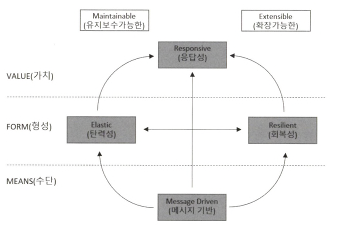

## 리액티브 시스템과 리액티브 선언문

리액티브 시스템은 클라이언트 요청에 즉각적으로 응답함으로써 지연 시간을 최소화하는 시스템을 말합니다.

다음은 리액티브 선언문을 그림으로 표현한 것입니다.



- MEANS : 리액티브 시스템에서 주요 통신 수단으로 무엇을 사용할 것인지 표현한 것입니다.
    - 메시지 기반의 통신을 통해서 구성요소들 간의 느슨한 결합, 격리성, 위치 투명성을 보장합니다.
- FORM : 메시지 기반 통신을 통해서 어떠한 형태를 지니는 시스템으로 형성되는지를 나타냅니다.
    - 탄력성 : 리액티브 시스템에서 탄력성이란 시스템의 작업량이 변화하더라도 일정한 응답을 유지하는 것을 의미합니다.
        - 일정한 응답을 유지하기 위해서 자원을 상황에 맞춰 추가하거나 감소시킬 수 있음
    - 회복성 : 리액티브 시스템에서 회복성이란 시스템에 장애가 발생하더라도 응답성을 유지하는 것을 의미합니다.
        - 메시지 기반 통신을 통해 각 요소들이 독립적으로 분리되어 장애가 발생하더라도 전체 시스템은 동작가능한 형태가 됩니다.
- VALUE : 비동기 메시지 기반 통신을 바탕으로 한 회복성과 예측 가능한 규모 확장 알고리즘을 통해 시스템의 처리량을 자동으로 확장하고 축소하는 탄력성을 확보함으로써 즉각적으로 응답 가능한 시스템을 구축할 수 있음을 의미합니다.

요약하면 **빠른 응답성을 바탕으로 유지보수와 확장이 용이한 시스템**을 만드는 것이 목표입니다.

## 리액티브 프로그래밍이란?

리액티브 프로그래밍은 리액티브 시스템을 구축하는 데 필요한 프로그래밍 모델입니다.

리액티브 시스템은 비동기 메시지 통신을 기반으로 하기 때문에 Non-Blocking I/O 방식으로 통신하게 됩니다.

- Block I/O 방식의 통신
    - 작업 중인 스레드가 작업을 처리할 때 까지 남아 있는 작업들은 해당 작업이 끝날 때 까지 차단되어 대기합니다.
    - 남아 있는 작업들을 대기 없이 처리하려면 별도의 추가 스레드를 할당해야 해서 그만큼의 비용이 더 들게 됩니다.
- Non-Block I/O 방식의 통신
    - 작업 중인 스레드가 작업을 처리할 때 까지 스레드가 차단되지 않습니다.

요약하면 리액티브 프로그래밍은 리액티브 시스템의 설계 원칙에 부합하는 비동기 Non-Blocking 통신을 위한 프로그래밍 모델이라고 할 수 있습니다.

## 리액티브 프로그래밍의 특징

### 선언형 프로그래밍(declarative programming)

실행할 동작을 구체적으로 명시하지 않고 어떤 동작을 하겠다는 목표만 선언하는 방식을 의미합니다. (ex. SQL)

### 선언형 프로그래밍과 함수형 프로그래밍

선언형 프로그래밍 : 어떤 동작을 하느냐에 집중하여 작성하는 방식으로 실제 구현은 내부적으로 처리됩니다. 이로 인해 세부 사항을 감추고, 명확한 목적을 중심으로 코드를 작성하는 것이 특징입니다.

함수형 프로그래밍 : 함수를 1급 객체로 다루는 프로그래밍 패러다임입니다.

**선언형 프로그래밍은 동작에 초점**을 맞추고 **함수형 프로그래밍은 동작을 해결할 때 함수 기반으로 처리**하는 식입니다.

### data streams와 the propagation of change

- data streams : 연속적으로 발생하는 데이터의 흐름을 의미합니다.
    - 실시간성 : 데이터를 생성과 동시에 처리함
    - 연속성 : 데이터가 지속적으로 생성되며, 끝이 없음
    - 대량의 데이터 : 대규모 데이터를 실시간으로 처리해야 하는 경우 많음
    - 저지연성 : 데이터 처리가 매우 짧은 지연 시간 내에 이루어져야 함

Data Streams와 관련있는  Apache Kafka, Apache Flink와 같은 라이브러리가 있습니다. (**연속적인 데이터의 흐름**을 저장 및 전송 하고 처리함)

- the propagation of change : 지속적으로 데이터가 발생할 때마다 이것을 변화하는 이벤트로 보고, 이 이벤트를 발생시키면서 데이터를 계속적으로 전달하는 것을 의미합니다.
    - 자동 갱신 : 데이터의 변경이 발생하면, 그 변경 사항이 자동으로 관련된 다른 부분에 전파됩니다.
    - 반응형 시스템 : 시스템은 변경 사항에 실시간으로 반응하여 상태를 갱신합니다.
    - 의존성 관리 : 데이터의 의존성을 추적하며, 변경이 필요한 부분만 갱신합니다.

대표적으로 스프레드 시트(셀의 값이 변경되면 의존하는 관련 셀이 변경됨), React(상태가 변경되면 변경된 상태를 기반으로 컴포넌트가 다시 렌더링 됨)가 있습니다.

## 코드로 보는 명령형 프로그래밍 vs 선언형 프로그래밍

### 명령형 프로그래밍

```java
List<Integer> numbers = Arrays.asList(1, 3, 21, 10, 8, 11);
int sum = 0;
for (int number : numbers) {
	if (numbers > 6 && (number % 2 != 0)) {
		sum += number;
	}
}
System.out.println("합계: " + sum);
```

### 선언형 프로그래밍

```java
List<Integer> numbers = Arrays.asList(1, 3, 21, 10, 8, 11);
int sum = numbers.stream()
                .filter(number -> number > 6 && (number % 2 != 0))
                .mapToInt(number -> number)
                .sum();
System.out.println("합계: " + sum);
```

위의 코드를 살펴보면 선언형 프로그래밍 방식을 사용하는 것이 코드가 간결해지고 가독성도 좋아집니다.

## 리액티브 프로그래밍 코드 구성

리액티브 프로그래밍 코드는 크게 Pulisher, Subscriber, Data Source, Operator 등으로 구성됩니다.

### Publisher

입력으로 들어오는 데이터를 제공하는 역할을 합니다.

### Subscriber

Publisher가 제공한 데이터를 전달받아서 사용하는 역할을 합니다.

### Data Source

Data Source는 Publisher의 입력으로 들어오는 데이터를 말하며 Data Stream으로 표현하기도 합니다.

```
💡 Data Source는 최초로 생성된 데이터 그 자체이며, 
    Data Stream은 Publisher의 입력으로 들어오는 데이터의 형태를 의미하므로 완전히 같은 의미는 아닙니다.
```

### Operator

Publisher와 Subscriber 사이에서 적절한 가공처리가 이루어지는데, 이 가공 처리를 담당하는 것이 Operator입니다.

Operator는 데이터 필터링, 데이터 변환, 데이터 생성 등 많은 작업을 처리합니다.

## 요약

- 리액티브 시스템의 설계
    - 비동기 메시지 기반 통신으로 동작해야 한다.
    - 탄력적이고 회복성을 지녀야 한다.
    - 높은 응답성을 지녀야 한다.
    - 유지보수와 확장이 용이해야 합니다.
- 리액티브 프로그래밍의 특징
    - 리액티브 프로그래밍은 선언형 프로그래밍 방식입니다. 그렇기 때문에 실행할 동작을 구체적으로 명시하지 않고 목표만 선언합니다.
    - 데이터 소스의 변경이 있을 때마다 데이터를 전파합니다.
    - 리액티브 프로그래밍 코드는 코드의 간결함과 가독성에 유리한 메서드 체인의 형태로 표현됩니다.
    - 리액티브 프로그래밍 코드에서 파라미터를 가지는 메서드는 함수형 프로그래밍 방식의 코드 형태의 파라미터를 가집니다.
- 리액티브 프로그래밍 코드의 구성요소
    - Publisher는 입력으로 들어오는 데이터를 Subscriber에 제공하는 역할을 합니다.
    - Subscriber는 Publisher로부터 전달받은 데이터를 사용하는 역할을 합니다.
    - Data Source는 Publisher의 입력드로 전달되는 데이터를 의미합니다.
    - Operator는 Publisher와 Subscriber 중간에서 데이터를 가공하는 역할을 합니다.