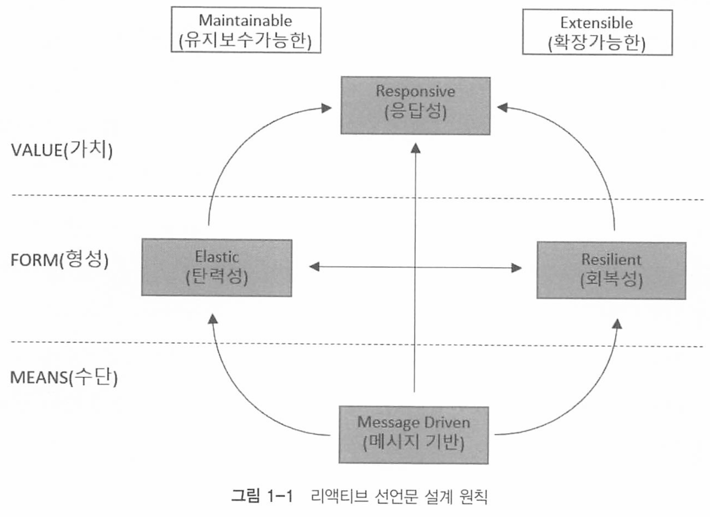

# Chapter 01 리액티브 시스템과 리액티브 프로그래밍

## 리액티브 시스템이란?

리액티브의 사전적 의미 : 반응. 반응형

리액티브란, 특정 조건이나 이벤트에 반응하여 동작하는 방식을 의미하며, 클라이언트의 요청에 즉각적으로 응답하는것을 의미한다.

리액티브 시스템은 이러한 특성을 통해 다양한 환경에서 안정적이고 효율적으로 동작할 수 있으며, 특히 다음과 같은 상황에서 유용하다.
- 대규모 분산 시스템
- 실시간 데이터 처리 요구 사항
- 고가용성과 고확장성이 중요한 시스템

리액티브라는 용어의 의미를 올바르게 정의하기 위해 선언한 리액티브 선언문이 있다. 

크게 수평으로 두개의 점선과 세개의 영역으로 나누어져 있다.

* MEANs : 리액티브 시스템의 주요통신 수단. 비동기 기반의 메시지를 통하여 구성요소들간의 느슨한 결합, 격리성,위치 투명성을 보장
* FORM : 메시지 기반을 통해서 어떤 형태를 지닌 시스템으로 형성되는지를 나타냄. 탄력성과 회복성을 가져야 함을 의미한다.
* VALUE : 비동기 메시지 기반을 통해서 회복성과 예측가능한 규모 확장 알고리즘을 통해 시스템의 처리량을 자동으로 확장하고 축소하는 탄력성을 확보한다는것을 의미

추가적인 4가지 특징은 다음과 같다.

* **응답성 (Responsive)**: 시스템은 사용자 요청에 빠르게 응답할 수 있어야 한다.

- **탄력성 (Resilient)**: 시스템은 실패에 대비하고, 자동으로 복구할 수 있어야 한다.
- **탄력적 확장성 (Elasticity)**: 부하 변화에 따라 유연하게 확장 및 축소가 가능해야 한다.
- **메시지 구동 (Message Driven)**: 비동기 메시지 패싱을 통해 구성 요소 간의 느슨한 결합을 유지해야 한다.

조금더 자세하게 보자.

### Responsive(응답성)

요구사항

- 문제를 신속하게 탐지하고 효과적으로 대처
- 신속하고 일관성 있는 응답 시간 제공
- 신뢰할 수 있는 상한선을 설정하여 일관된 서비스 품질을 제공

결과

- 가능한 한 즉각적으로 응답
- 사용자의 편의성과 유용성의 기초
- 오류 처리를 단순화
- 일반 사용자에게 신뢰를 조성하고, 새로운 상호작용 촉진

### Resilient(복원력)

요구사항

- 복제, 봉쇄, 격리, 위임에 의해 실현
- 장애는 각각의 구성 요소에 포함 (봉쇄)
- 구성 요소들은 서로 분리 (격리)
- 복구 프로세스는 다른(외부의) 구성 요소에 위임 (위임)
- 필요한 경우 복제를 통해 고가용성이 보장 (복제)

결과

- 장애에 직면하더라도 응답성을 유지
- 시스템이 부분적으로 고장이 나더라도, 전체 시스템 을 위험하게 하지 않고 복구 할 수 있도록 보장
- 구성 요소의 클라이언트는 장애를 처리하는데에 압 박을 받지 않습니다

### Elastic(유연성)

요구사항

- 경쟁하는 지점이나 중앙 집중적인 병목 현상이 존재 하지 않도록 설계
- 구성 요소를 샤딩하거나 복제하여 입력을 분산
- 실시간 성능을 측정하는 도구를 제공
- 응답성 있고 예측 가능한 규모 확장 알고리즘을 지원

결과

- 작업량이 변화하더라도 응답성을 유지
- 입력 속도의 변화에 따라 이러한 입력에 할당된 자 원을 증가시키거나 감소
- 상품 및 소프트웨어 플랫폼에 비용 효율이 높은 방 식으로 유연성 을 제공

### Message Driven(메시지 기반)

요구사항

- 비동기 메시지 전달에 의존
- 명시적인 메시지 전달
- 위치 투명 메시징을 통신 수단으로 사용
- 논블로킹 통신

결과

- 구성 요소 사이에서 느슨한 결합, 격리, 위치 투명성 을 보장하는 경계를 형성. 이 경계는 장애를 메시지 로 지정하는 수단을 제공
- 시스템에 메시지 큐를 생성하고, 모니터링하며 필요 시 배압(백프레셔)을 적용
- 유연성을 부여하고, 부하 관리와 흐름제어를 가능하 게
- 단일 호스트든 클러스터를 가로지르든 동일한 구성 과 의미를 갖고 장애를 관리
- 수신자가 활성화가 되어 있을 때만 자원 을 소비할 수 있기 때문에 시스템 부하를 억제

## 리액티브 프로그래밍

리액티브 시스템을 구축하는데 필요한 프로그래밍 ㅁ델.

리액티브 시스템에서는 NonBlocking I/O 기반의 비동기 메시지 통신을 한다.

* Blocking I/O : I/O 작업이 일어나면 응답이 오기전까지 해당 작업을 수행하던 스레드가 block 되는 작업
* NonBlockingI/O : 스레드가 block 되지 않고 다른 일을 이어서 함

## 리액티브 프로그래밍의 특징

### 1. declarative progamming

C, JAVA와 다른 명령형 프로그래밍이 아닌 선언형 프로그래밍이다.

실행할 동작을 구체적으로 명시하지 않고, 이러한 동작을 하겠다는 목표만 선언한다.

즉 어떻게가 아니라 무엇을 할 것인지 설명하는 방식.

문제의 최종 상태나 원하는 결과를 기술하고, 그 결과를 얻기 위한 방법을 추상화하는것이다. 

* "SELECT * FROM users WHERE age > 30;"는 데이터베이스에 원하는 결과를 기술하는 방식. 어떻게 데이터를 가져올지는 DBMS가 처리.

* ``"<h1>Hello World</h1>"``는 웹 페이지에서 "Hello World"를 보여주라는 명령이 아니라 결과를 기술

### 2. data streams와 propagation of change

데이터가 지속적으로 발생하며, 지속적으로 데이터가 발생할때마다 이것을 변화하는 이벤트로 보고 데이터를 전달하는것을 의미. 

## 리액티브 프로그래밍 구성

리액티브 코드는 크게 Publisher, Subscriber, Data Source, Operator로 구성된다

* Publisher: 발행자. 입력으로 들어오는 데이터들을 제공한다.
* Subscriber: 구독자. Publisher가 제공하는 데이터를 구독하고, 소비하는 주체이다. 
* Data Source : 원천 데이터. Publisher에 입력으로 들어오는 데이터를 의미한다. 
* Operator : Publisher로 부터 전달된 데이터가 Subscriber에게 도착하기 전까지 처리를 담당한다. 즉 Opreator(운영, 연산)을 통하여 데이터를 가공한다 

## 웹플럭스의 장단점

장점

- 효율적인 리소스 사용
- 요청이 순간적으로 늘어나도 유연하게 커버
- 동시성을 극한으로 이용해서 응답속도 단축
- Reactor, Coroutine으로 코드 가독성 유지

단점

- 비동기 로직 처리에 대한 고민
- 팀원들 모두의 러닝 커브가 필요
- 디버깅, 에러 핸들링의 어려움
- 충분하지만 완벽하지 않은 생태계

