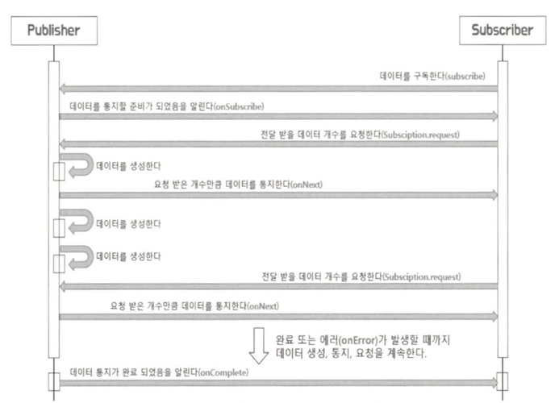

## 리액티브 스트림즈란?

리액티브 스트림즈란 데이터 스트림을 Non-Blocking이면서 비동기적인 방식으로 처리하기 위한 리액티브 라이브러리의 표준 사양을 의미합니다.

리액티브 스트림즈는 스트림 데이터 처리를 표준화하는 것을 목표로 하며, 데이터 흐름을 제어하고 백프레셔를 관리하는 것을 주된 목적으로 합니다.

```
💡 백프레셔란 비동기 스트림 처리 시스템에서 
데이터의 생산자와(Producer)와 소비자(Consumer)간의 속도 차이를 조절하기 위한 메커니즘입니다.

소비자가 생산자가 생성하는 데이터를 처리할 수 있는 속도보다 느리게 처리할 때 발생하는 문제를 해결하기 위해 사용합니다.

만약 생산자가 데이터를 매우 빠르게 생성하고 소비자가 이를 따라가지 못할 경우 다음의 문제가 발생할 수 있습니다.
1. 메모리 과부하
2. 성능 저하
3. 시스템 불안정

백프레셔는 소비자가 처리할 수 있는 데이터의 양을 제어하여 이러한 문제를 해결합니다.

백프레셔 메커니즘은 다음과 같은 방식으로 동작합니다.
1. 소비자는 자신이 처리할 수 있는 데이터의 양을 생산자에게 요청합니다.
2. 생산자는 소비자가 요청한 양만큼의 데이터를 전달합니다.
3. 소비자는 전달받은 데이터를 처리하고, 처리가 완료되면 새로운 데이터를 요청합니다.

```

## 리액티브 스트림즈 구성요소

리액티브 스트림즈를 통해 구현해야 하는 API 컴포넌트에는 Publisher, Subscriber, Subscription, Processor가 있습니다.

| 컴포넌트 | 설명 |
| --- | --- |
| Publisher | 데이터를 생성하고 통지(발행, 게시, 방출)하는 역할을 합니다. |
| Subscriber | 구독한 Publisher로 부터 통지(발행, 게시, 방출)된 데이터를 전달받아서 처리하는 역할을 합니다. |
| Subscription | Publicher에 요청할 데이터의 개수를 지정하고, 데이터의 구독을 취소하는 역할을 합니다. |
| Processor | Publisher와 Subscriber의 기능을 모두 가지고 있습니다. 즉, Subscriber로써, Publisher를 구독할 수 있고 Publisher로써 다른 Subscriber가 구독할 수 있습니다. |

다음은 컴포넌트들이 어떻게 동작하는지에 대한 과정입니다.



```
💡 동작과정중 Subscriber가 Subscribtion.request를 통해 데이터의 요청 개수를 지정하는 이유?

Publisher와 Subscriber가 다른 스레드에서 비동기적으로 상호작용하는 경우가 대부분이기 때문에 
Publisher로 부터 통지된 데이터를 Subscriber가 처리하는 속도보다 더 빠를 경우, 
데이터는 쌓이게 되고 시스템에 부하가 커질 수 있어 Subscription.request를 통해 데이터 개수를 제어하는 것입니다.

```

## 코드로보는 리액티브 스트림즈 컴포넌트

리액티브 스트림즈의 컴포넌트는 실제 코드에서 인터페이스 형태로 정의되며, 이 인터페이스들을 구현해서 해당 컴포넌트를 사용하게 됩니다.

### Publisher

```java
public interface Publisher<T> {
	public void subscribe(Subscriber<? super T s>; 
}
```

- Subscriber : 전달받은 Subscriber를 등록합니다.

```
💡 Publisher는 데이터를 생성하고 통지하는 역할을 하고, Subscriber는 Publisher가 통지하는 데이터를 전달받기 위해 구독을 하는 역할이라고 이해했는데 Publisher에 subscribe 메서드가 정의되어 있는 이유?

Kafka와 같은 메시지 기반 시스템에서 Pub/Sub 모델과 리액티브 스트림즈에서 Publisher/SubScriber의 의미가 다릅니다.

Kafka의 경우 중간에 메시지 브로커가 있고 브로커 내에 여러 개의 토픽이 존재하는데, 
Publisher와 Subscriber는 브로커에 있는 특정 토픽을 바라보는 구조로 이루어져 있습니다.

그래서 Kafka에서의 Publisher와 Subscriber는 각각 브로커 내의 특정 토픽만 바라보면 되기 때문에 
Publisher는 특정 토픽으로 메시지 데이터를 전송하기만 하면 되고, 
Subscriber는 특정 토픽을 구독하고 해당 토픽에 전달되는 메시지 데이터를 전달받기만 하면 됩니다.

이는 Publisher와 Subscriber의 느슨한 결합 구조라고 볼 수 있습니다.

리액티브 스트림즈에서 Publisher와 Subscriber는 개념상으로 Subscriber가 구독하는 것이 맞는데 
실제 코드상에서는 Publisher와 subscribe 메서드의 파라미터인 Subscriber를 등록하는 형태로 
구독이 이루어져 집니다.
```

### Subscriber

```java
public interface Subscriber<T> {
	public void onSubscribe(Subscription s);
	public void onNext(T t);
	public void onError(Throwable t);
	public void onComplelete();

}
```

Subscriber 인터페이스는 다음의 역할을 하는 메서드를 구현해야 합니다.

- onSubscribe : 구독 시작 시점에 어떤 처리를 할지 정의합니다.
    - 여기서 어떤 처리는 Publisher 에게 요청할 데이터의 개수를 지정하거나 구독을 해지하는 것을 의미하는데, 이것은 onSubscriber 메서드의 파라미터로 전달되는 Subscription 객체를 통해서 이루어집니다.
- onNext : 메서드는 Publisher가 통지한 데이터를 처리하는 역할을 합니다.
- onError : Publisher가 데이터 통지를 위한 처리 과정에서 에러가 발생했을 때 해당 에러를 처리하는 역할을 합니다.
- onComplete : Publisher가 데이터 통지를 완료했음을 알릴 때 호출되는 메서드입니다.

### Subscription

```java
public interface Subscription {
	public void request(long n);
	public void cancel();
}
```

Subscription 인터페이스는 Subscriber가 구독한 데이터의 개수를 요청하거나 또는 데이터 요청의 취소, 즉 구독을 해지하는 역할을 합니다.

Subscription 인터페이스는 두 개의 메서드를 구현해야 합니다.

- request : Publisher에게 데이터의 개수를 요청합니다.
- cancel : 구독을 해지할 수 있습니다.

### Publisher와 Subscriber의 동작 과정

- Publisher가 Subscriber 인터페이스 구현 객체를 subscribe 메서드의 파라미터로 전달합니다.
- Publisher 내부에서는 전달받은 Subscriber 인터페이스 구현 객체의 onSubscribe 메서드를 호출하면서 Subscriber의 구독을 의미하는 Subscription 인터페이스 구현 객체를 Subscriber에게 전달합니다.
- 호출된 Subscriber 인터페이스 구현 객체의 onSubscribe 메서드에서 전달 받은 Subscription 객체를 통해 전달받은 데이터의 개수를 Publisher에게 요청합니다.
- Publiusher는 Subscriber로부터 전달받은 요청 개수만큼의 데이터를 onNext 메서드를 호출해서 Subscriber에게 전달합니다.
- Publisher는 통지할 데이터가 더 이상 없을 경우 onComplete 메서드를 호출해서 Subscriber에게 데이터를 처리 종료를 알립니다.

### Processor

```java
public interface Processor<T, R> extends Subscriber<T> Publisher<R> {
}
```

Processor는 별도로 구현해야하는 메서드가 없습니다.

```
💡 Processor가 Publisher와 Subscriber의 기능을 모두 가지고 있기 때문입니다.
```

## 리액티브 스트림즈 관련 용어 정리

- Signal
    - publisher와 subscriber 간에 주고받는 상호작용을 의미합니다.
    - 예를 들어, onSubscribe, onNext, onComplete 등의 메서드를 Signal이라고 표현합니다.
- Demand
    - Subscriber가 Publisher에게 요청하는 데이터를 의미합니다.
    - 자세하게 말해서 Publisher가 Subscriber가 요청했지만 아직 전달하지 않은 데이터를 의미합니다.
- Emit
    - 입력으로 들어오는 데이터를 제공하는 의미로 사용됩니다.
    - Publisher가 데이터를 전달하기 위한 onNext Signal을 줄여서 데이터를 emit 한다라고 표현합니다.
- Upstream / Downstream
    - 현재 호출해서 반환된 Flux 위치에서 자신보다 더 상위에 있는 Flux는 Upstream, 하위에 있는 Flux는 Downstream이 됩니다.

        ```java
        // filter를 기준으로 just는 upstream, map은 downstream이라고 할 수 있음
        Flux
        	.just(1, 2, 3, 4, 5, 6)
        	.filter(n -> n % 2 == 0)
        	.map(n -> n * 2)
        	.subscribe(System.out::println);
        ```

- Sequence
    - 데이터의 연속적인 흐름을 정의해 놓은 것을 의미합니다.
- Operator
    - just, filter, map과 같이 데이터를 처리하기 위한 메서드들을 Operator(연산자)라고 부릅니다.
- Source
    - 최초에 가장 먼저 생성된 무언가를 의미하며, 원본이라는 의미로 이해하면 됩니다.

## 리액티브 스트림즈의 구현 규칙

### Publisher 구현을 위한 기본 규칙

1. Publisher가 Subscriber에게 보내는 onNext signal의 총 개수는 항상 해당 Subscriber의 구독을 통해 요청된 데이터의 총 개수보다 더 작거나 같아야 합니다.
    - Subscriber가 요청한 것보다 더 많은 개수의 데이터를 Publisher가 보낼 수 없음을 의미합니다.
2. Publisher는 요청된 것보다 적은 수의 onNext signal을 보내고 onComplete 또는 onError를 호출하여 구독을 종료할 수 있습니다.
    - Subscriber의 요청의 처리가 완료된 후 완료를 알려주기 위해 onComplete 또는 onError를 무조건 보내야한다는 의미입니다.
    - 만약, 무한 스트림의 경우 처리중 에러가 발생하기 전까지 종료할 수 없으므로 예외 상황입니다.
        - ex : IoT 디바이스 센서에서 발생하는 데이터처럼 끊임없이 발생하는 데이터를 떠올려 보면 됩니다.
3. Publisher의 데이터 처리가 실패하면 onError signal을 보내야 합니다.
    - Publisher가 처리를 진행할 수 없는 상황이 되면 Subscriber에게 알려서 처리할 수 있도록 알려주는 용도입니다.
4. Publisher의 데이터 처리가 성공적으로 종료되면 onComplete signal을 보내야 합니다.
    - 종료 상태임을 알려주어 리소스 정리 등의 후처리를 할 수 있도록 해줍니다.
5. Publisher가 Subscriber에게 onError 또는 onComplete signal을 보내는 경우 해당 Subscriber의 구독은 취소된 것으로 간주되어야 합니다.
    - Publisher가 전송한 onError 또는 onComplete 시그널은 구독 취소와 동일한 기능을 한다는 의미입니다.
6. 일단 종료 상태 signal을 받으면(onError, onComplete) 더 이상 signal이 발생되지 않아야 합니다.
    - 이미 상호작용이 끝난 상태에서 signal이 추가로 발생하지 않는 용도로 사용됩니다.
7. 구독이 취소되면 Subscriber는 결국 signal을 받는 것을 중지 해야 합니다.
    - 구독 취소를 위해 Subscription.cancle()이 호출되었을 때 Publisher가 구독 취소 요청을 준수해야 한다는 의미입니다.


### Subscriber 구현을 위한 주요 기본 규칙

1. Subscriber는 Publisher로 부터 onNext signal을 수신하기 위해 Subscription.request(n)를 통해 Demand signal을 Publisher에게 보내야 합니다.
    - 데이터를 언제, 얼마나 수신할 수 있는지를 결정하는 책임이 subscriber에게 있다는 것을 확립하는 것입니다.
    - 리액티브 스트림즈에서는 한 번에 하나의 데이터를 요청하기보다는 Subscriber가 처리할 수 있는 적절한 상한선만큼의 데이터 개수 요청을 권장합니다.
2. Subscriber.onComplete() 및 Subscriber.onError(Throwable t)는 Subscription 또는 Publisher의 메서드를 호출해서는 안됩니다.
    - Subscriber가 완료 signal 또는 에러 signal을 처리하는 동안 Publisher / Subscription과 Subscriber 간의 순환 및 경쟁 조건(Race Condition)을 방지하기 위함입니다.
        - 예를 들어 JPA 엔티티 간의 그래프 탐색에서 상호 재귀가 발생하는 상황을 생각해 보면 이해하기가 쉬울 것 같습니다.
3. Subscriber.onComplete() 및 Subscriber.onError(Throwable t)는 signal을 수신한 후 구독이 취소된것으로 간주해야 합니다.
    - onComplete 또는 onError 시그널이 수신되면 구독이 더 이상 유효하지 않게 된다는 것을 의미합니다.
4. 구독이 더 이상 필요하지 않은 경우 Subscriber는 Subscription.cancle()을 호출해야 합니다.
    - Subscriber가 구독이 더 이상 필요하지 않을 때 명시적으로 구독을 취소함으로써 해당 구독이 유지하고 있는 리소스를 적절한 시기에 안전하게 해제할 수 있도록 하는 것입니다.
5. Subscriber.onSubscribe()는 지정된 Subscriber에 대해 최대 한 번만 호출되어야 합니다.
    - 동일한 구독자가 최대 한 번만 구독할 수 있다는 의미와 같습니다.

### subscription 구현을 위한 주요 기본 규칙 추가 설명

1. 구독은 Subscriber가 onNext 또는 onSubscribe 내에서 동기적으로 Subscription.request를 호출하도록 허용해야 합니다.
    - request와 onNext 사이의 상호 재귀로 인해 발생할 수 있는 스택 오버플로우 문제를 피하기 위해 request가 다시 호출된다는 것을 분명히 하기 위함입니다.
    - onNext 또는 onSubscribe 내에서 동기적으로 Subscription.request를 호출한다는 의미는 request를 호출하는 스레드와 onNext signal을 보내는 스레드가 동일할 수 있다는 것 입니다.
2. 구독이 취소된 후 추가적으로 호출되는 Subscription.request(long n)는 효력이 없어야 합니다.
    - 구독이 취소된 후에는 더 이상 응답을 받을 수 없어야 합니다.
3. 구독이 취소된 후 추가적으로 호출되는 Subscription.cancel()은 효력이 없어야 합니다.
    - 구독이 취소된 후에는 더 이상 응답을 받을 수 없어야 합니다.
4. 구독이 취소되지 않은 동안 Subscription.request(long n)의 매개변수가 0보다 작거나 같으면 java.lang.IllegalArgumentException과 함께 onError signal을 보내야 합니다.
    - 잘못된 구현으로 인해 예외 발생 없이 계속 작업이 진행되는 것을 방지하기 위함입니다.
5. 구독이 취소되지 않은 동안 Subscription.cancel()은 Publisher가 Subscriber에게 보내는 signal을 결국 중지하도록 요청해야 합니다.
    - Subscription.cancel()의 의미가 구독을 취소한다는 의미에서 그치는 것이 아니라 구독 취소를 하니 시그널 보내는 것을 중지하라고 Publisher에게 요청하는 것 까지 포함한다는 의미입니다.
6. 구독이 취소되지 않은 동안 Subscription.cancel()은 Publisher에게 해당 구독자에 대한 참조를 결국 삭제하도록 요청해야 합니다.
    - Subscription.cancel()을 호출했을 때 구독 취소를 요청한 구독자에 대한 참조까지 삭제한다는 것을 의미합니다.
        - 이 규칙을 통해 가비지 컬렉터가 더 이상 유효하지 않은 구독자의 객체를 수집하여 메모리를 확보할 수 있도록 해줍니다.
7. Subscription.cancel(), Subscription.request() 호출에 대한 응답으로 예외를 던지는 것을 허용하지 않는다.
    - Subscription의 메서드를 호출했을 때 메서드 내부로 예외가 던져지지 않도록 규정합니다.
    - Java에서 일반적으로 어떤 메서드를 호출하여 예외가 발생하면 메서드를 호출한 쪽으로 예외를 던지는데, 리액티브 스트림즈에서는 예외가 발생하면 해당 예외를 onError 시그널과 함께 보내도록 규정합니다.
8. 구독은 무제한 수의 request 호출을 지원해야 하고 최대 2^63 - 1개의 Demand를 지원해야 합니다.
    - 구독자는 한번 요청할 때 무한한 개수의 데이터를 요청할 수 있고, 그 요청을 끝없이 호출할 수 있음을 알 수 있습니다.


## 리액티브 스트림즈 구현체

대표적으로 다음과 같은 구현체가 있습니다.

- RxJava
- Project Reactor (Spring WebFlux에서 사용)
- Akka Streams
- Java Flow API

## 정리

- 리액티브 스트림즈는 데이터 스트림을 Non-Blocking이면서 비동기적으로 방식으로 처리하기 위한 리액티브 라이브러리의 표준 사양입니다.
- 리액티브 스트림즈는 Publisher, Subscriber, Subscription, Processor라는 네 개의 컴포넌트로 구성되어 있는데, 리액티브 스트림즈의 구현체는 이 네 개의 컴포넌트를 사양과 규칙에 맞게 구현해야 합니다.
- Publisher와 Subscriber의 동작 과정과 리액티브 스트림즈 컴포넌트의 구현 규칙은 리액티브 프로그래밍을 큰 틀에서 이해하고 올바르게 사용하기 위해 기억해야 되는 중요한 내용입니다.
- 리액티브 스트림즈의 구현체 중에서 어떤 구현체를 학습하던지 핵심 동작원리는 같습니다.