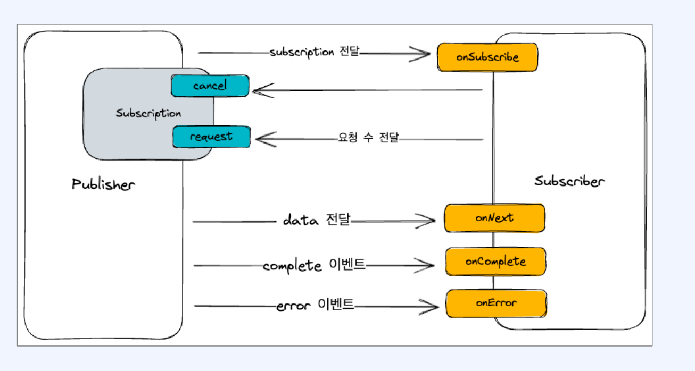
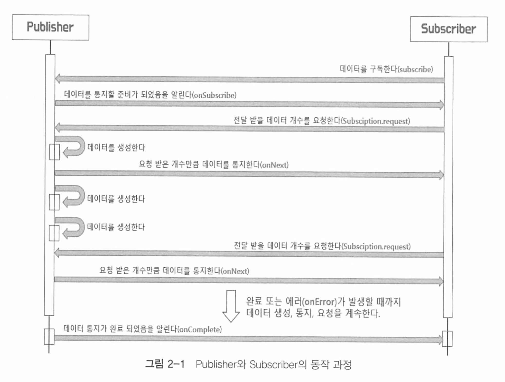

# Chapter 02 리액티브 스트림즈(Reactive Streams)

## 리액티브 스트림즈

리액티브 라이브러리가 있어야 의존성을 추가해서 코드를 작성할 수 있다.

이 라이브러리들은 여러개이고, 이 라이브러리들을 위한 표준이 있는데 이것이 리액티브 스트림즈이다(인터페이스, 표준, 명세)

* 대표적인 구현체로 RxJava, Reactor, 등등

## 리액티브 스트림즈 구성 요소

아래 컴포넌트들은 외우고 있는것이 좋다. 

| 컴포넌트         | 설명                                                         |
| ---------------- | ------------------------------------------------------------ |
| **Publisher**    | 데이터를 생성하고 통지(발행, 게시, 방출)하는 역할을 한다.    |
| **Subscriber**   | 구독한 Publisher로부터 통지(발행, 게시, 방출)된 데이터를 전달받아서 처리하는 역할을 한다. |
| **Subscription** | Publisher에 요청할 데이터의 개수를 지정하고, 데이터의 구독을 취소하는 역할을 한다. |
| **Processor**    | Publisher와 Subscriber의 기능을 모두 가지고 있다. 즉, Subscriber로서 다른 Publisher를 구독할 수 있고, Publisher로서 다른 Subscriber가 구독할 수 있다. |


- 데이터 혹은 이벤트를 제공하는 Publisher
    - subscribe 함수 제공해서 publisher에 `다수의 subscriber 등록 지원`
    - subscription을 포함하고 Subscriber가 추가되면 subscription 제공
- 데이터 혹은 이벤트를 제공받는 Subscriber
    - subscribe하는 시점에 publisher로부터 subscription을 받을 수 있는 인자 제공
    - onNext, onError, onComplete를 통해서 값 이나 이벤트를 받을 수 있다
    - onNext는 여러 번, onError이나 onComplete 는 딱 한 번만 호출된다
- 데이터 흐름을 조절하는 Subscription
    - back-pressure를 조절할 수 있는 request 함수
    - Publisher가 onNext를 통해서 값을 전달하는 것을 취소할 수 있는 cancel 함수




이들 컴포넌트들은 다음처럼 동작한다

1. Subscriber가 전달받을 데이터를 구독한다 (subscribe)
2. Publisher는 데이터를 발행할 준비가 되었음을 Subscribe에게 알린다 (onSubscribe)
3. 통지를 받은 Subscriber는 원하는 데이터 수를 publisher에게 요청한다 (Subscrition.request). 백프레셔가 뭘까?
4. Publishr는 요청받은 데이터 만큼 발행한다 (onNext)
5. 이렇게 반복하다가. 모든 데이터를 발행하게 되면 완료 라는 의미의 onComplete으로 알리고, 에러가 발생하면 Subscriber에게onError로 에러를 알린다.

왜 원하는 데이터 수를 요청할까?

이는, 퍼블리셔가 섭스크라이버의 처리량을 알지못하고 무한정 데이터를 보내게 되면 섭스크라이버가 부하가 걸릴수도 있기 때문이다. 


### Publisher Interface

```java
public interface Publisher<T> {
  void subscribe(Subscriber<? super T> s);
}
```

퍼블리셔가 섭스크라이버를 의존해서 구조가 약간 의아할 수도 있는데, 

리액티브에서는 개념상 subscriber가 구독하는것이 맞지만, 코드상에서는 Publisher가 Subcriber를 전달받아 등록하는 형태로 구독이 이루어진다. 

### Subscriber

```java
public interface Subscriber<T> {

    /**
     * {@link Publisher#subscribe(Subscriber)} 호출 후, 데이터 요청을 위한 {@link Subscription}을 받습니다.
     */
    public void onSubscribe(Subscription s);

    /**
     * {@link Publisher}가 {@link Subscription#request(long)} 요청에 응답하여 데이터를 전송합니다.
     */
    public void onNext(T t);

    /**
     * 오류 발생 시 호출되며, 이후 이벤트는 전송되지 않습니다.
     * 
     * @param t 전달된 오류
     */
    public void onError(Throwable t);

    /**
     * 성공적으로 완료되었을 때 호출되며, 이후 이벤트는 전송되지 않습니다.
     */
    public void onComplete();
}
```

* onSubscribe : 구독 시점에 publisher에게 요청할 데이터의 개수를 지정하거나, 구독을 해지함. Subscription 객체 이용
* onNext : 데이터를 처리
* onError : 에러 발생시에러 처리
* onComplete: Publisher가 데이터를 전송하다가 끝났음을 Subscriber에게 전달하는 역할

### Subscription

```java
public interface Subscription {

    /**
     * 이 메서드를 통해 요청 신호를 보낼 때까지 {@link Publisher}는 이벤트를 전송하지 않습니다.
     * 
     * @param n 요청할 요소의 양 (양의 정수)
     */
    public void request(long n);

    /**
     * {@link Publisher}에게 데이터 전송을 중지하고 자원을 정리하도록 요청합니다.
     */
    public void cancel();
}
```

* request를 통한 데이터 갯수 전달과, cancel 메서드를 통한 구독 해지를 지원한다.

Java의 익명 인터페이스의 특성을 잘 이용해서 Publisher와 Subscriber 간에 데이터를 주고 받을 수 있다

### Processor

```java
public interface Processor<T, R> extends Subscriber<T>, Publisher<R> {
}

```

publisher와 Subscriber를 상속하기 때문에 그 둘의 기능을 모두 갖고 체이닝을 하면서 처리할 수 있게 된다. 


즉 Reactive Programming은

- 비동기 데이터 stream을 사용하는 패러다임
- 모든 것이 이벤트로 구성되고 이벤트를 통해서 전파되어야 한다
    - event-driven 해야 한다
    - 데이터의 전달, 에러, 완료 까지 모두 이벤트로 취급
- Reactive manifesto의 Responsive, Resilient, Elastic, Message Driven 까지 모두 해당

### event-driven vs message-driven

- message: event, command, query 등 다양한 형태를 수용
- message-driven은 event, command, query 등 다양한 형태의 메시지를 비동기적으로, 가능하다면 배압을 적용해서, 전달하는 형태에 집중
- event-driven은 message의 형태를 event로제한

- completion, error 심지어 값 까지도 이벤트의 형태로 전달
- 따라서 reactive programming은 reactive manifesto의 원칙을 지킨다


## 리액티브 스트림즈 용어

### Signal

신호. 구독자와 발행자간의 상호작용을 신호라고 한다.

* onSubscribe, onNext... 등등 Signal이라고 표현

publisher가 subscriber의 메소드를 이용한다면 Publisher가 subscriber에게 시그널을 보낸다고 할 수 있는것이다.

* onSubscribe, onNext등을 사용하면

### Demand

Demands는 Subscriber가 Publisher에게 요청하는 데이터를 의미한다. 

이는 `Subscriber`가 소비할 수 있는 데이터의 양을 제어하기 위해 사용된다. 

### Emit

Publisher가 Subscriber에게 데이터를 발행할때를 의미한다

즉 데이터를 내보내는 행위를 Emit 이라고 한다. (ex sse emitter)

### Upstream / downstream

데이터가 흐르는 방향이다.

서버대 서버 간의 데이터 흐름과 비슷하다

업스트림은 클라 -> 서버로 데이터를 보내는 방향이다. 반대로 다운스트림은 서버 -> 클라로 데이터가 흐르는 방향이다

리액티브에서의 의미도 비슷하다.

업스트림은 퍼블리셔(발행자) -> 섭스크라이버(구독자)로 데이터가 흐르는 것이다. 

Publisher는 업스트림이라고하며 중간 연산자 역할을 하는 Processor가 데이터를 받아들일떄도 업스트림이라고 한다.

반대로 Subscriber는 다운스트림이며, Processor도 데이터를 전달할 때 다운스트림 역할을 한다.

* 즉 중간에 있는 Publisher나 Operator는 Downstream consumer도 될 수 있다. 

### Sequence( 중요!)

시퀀스는 순차 라는 의미이다. 데이터의 흐름과 처리 순서를 의미한다.

* Flux를 통해서 데이터 생성, emit 하고 map을 통해 변환하는 과정 자체가 sequence

즉 Operator의 데이터의 연속적인 흐름을 정의한것이라고도 말할 수 있다. 

## 리액티브 스트림즈의 구현 규칙

### Publisher 구현에 대한 규칙

1. **요청된 데이터 개수 준수**:
   - `Publisher`가 `Subscriber`에게 보내는 `onNext` signal의 총 개수는 항상 해당 `Subscriber`의 구독을 통해 요청된 데이터의 총 개수보다 더 작거나 같아야 한다.
   - 즉 Subscriber가 요청한 갯수를 초과하여 Publisher는 발행할 수 없다. 
2. **요청보다 적은 데이터 및 구독 종료**:
   - `Publisher`는 요청된 것보다 적은 수의 `onNext` signal을 보내고 `onComplete` 또는 `onError`를 호출하여 구독을 종료할 수 있다.
   - Publisher가 무한히 발생하는 무한 스트림인경우 처리 중 에러가 발생하기 전까지는 종료가 없다. 때문에 이경우 규치은 예외이다. 
3. **데이터 처리 실패 시**:
   - `Publisher`의 데이터 처리가 실패하면 `onError` signal을 보내야 한다.
4. **데이터 처리 성공 시**:
   - `Publisher`의 데이터 처리가 성공적으로 종료되면 `onComplete` signal을 보내야 한다.
5. **종료 신호 후 구독 취소**:
   - `Publisher`가 `Subscriber`에게 `onError` 또는 `onComplete` signal을 보내는 경우 해당 `Subscriber`의 구독은 취소된 것으로 간주되어야 한다.
6. **종료 상태 신호 후**:
   - 일단 종료 상태 signal을 받으면(`onError`, `onComplete`) 더 이상 signal이 발생되지 않아야 한다.
7. **구독 취소 시**:
   - 구독이 취소되면 `Subscriber`는 결국 signal을 받는 것을 중지해야 한다.

이것들은 Publisher가 구현될떄 고려해야 하는 규칙들이다.

### Subscriber

1. **데이터 요청**:
   - `Subscriber`는 `Publisher`로부터 `onNext` signal을 수신하기 위해 `Subscription.request(n)`를 통해 Demand signal을 `Publisher`에게 보내야 한다.
   - 즉 데이터를 얼마나 수신할 수 있는지 결정하는 책임은 Subscriber에게 있다는 의미. 

2. **종료 신호 후 메서드 호출 금지**:
   - `Subscriber.onComplete()` 및 `Subscriber.onError(Throwable t)`는 `Subscription` 또는 `Publisher`의 메서드를 호출해서는 안 된다.
   - 상호 재귀 호출이나, 레이스 컨디션 등이 발생할 수 있다.

3. **종료 신호 후 구독 취소**:
   - `Subscriber.onComplete()` 및 `Subscriber.onError(Throwable t)`는 signal을 수신한 후 구독이 취소된 것으로 간주해야 한다.

4. **구독 취소**:
   - 구독이 더 이상 필요하지 않은 경우 `Subscriber`는 `Subscription.cancel()`을 호출해야 한다.
   - 이렇게 해야 리소스를 적절하게 해제할 수 있다. 

5. **최대 한 번의 구독**:
   - `Subscriber.onSubscribe()`는 지정된 `Subscriber`에 대해 최대 한 번만 호출되어야 한다.
   - 동일한 구독자는 최대 한번만 구독할 수 있다. 

이는 Subscriber가 구현될떄 고려되야 하는 규칙이다

### Subscription

1. **동기적 요청 허용**:
   - 구독은 `Subscriber`가 `onNext` 또는 `onSubscribe` 내에서 동기적으로 `Subscription.request`를 호출하도록 허용해야 한다.
   - Subscription.request와 Subscriber.onNext 사이의 상호 재귀로 인해 스택 오버플로가 발생할 수 있으므로 주의해야 한다. 

2. **구독 취소 후 요청 무효**:
   - 구독이 취소된 후 추가적으로 호출되는 `Subscription.request(long n)`는 효력이 없어야 한다.

3. **구독 취소 후 취소 요청 무효**:
   - 구독이 취소된 후 추가적으로 호출되는 `Subscription.cancel()`은 효력이 없어야 한다.

4. **잘못된 요청 처리**:
   - 구독이 취소되지 않은 동안 `Subscription.request(long n)`의 매개변수가 0보다 작거나 같으면 `java.lang.IllegalArgumentException`과 함께 `onError` signal을 보내야 한다.

5. **신호 중지 요청**:
   - 구독이 취소되지 않은 동안 `Subscription.cancel()`은 `Publisher`가 `Subscriber`에게 보내는 signal을 결국 중지하도록 요청해야 한다.

6. **참조 삭제 요청**:
   - 구독이 취소되지 않은 동안 `Subscription.cancel()`은 `Publisher`에게 해당 구독자에 대한 참조를 결국 삭제하도록 요청해야 한다.
   - 이래야 signal 전송 중지뿐만아니라 GC가 구독자의 객체를 수집하여 메모리를 확보할 수 있다. 

7. **예외 허용 불가**:
   - `Subscription.cancel()`, `Subscription.request()` 호출에 대한 응답으로 예외를 던지는 것을 허용하지 않는다.

8. **무제한 요청 지원**:
   - 구독은 무제한 수의 `request` 호출을 지원해야 하고 최대 \(2^{63}-1\) 개의 Demand를 지원해야 한다.


https://github.com/reactive-streams/reactive-streams-jvm 에 더 많은 내용이 있다. 

## 요약

- 리액티브 스트림즈는 데이터 스트림을 Non-Blocking이면서 비동기적인 방식으로 처 리하기 위한 리액티브 라이브러리의 표준 사양이다.
- 리액티브 스트림즈는 Publisher, Subscriber, Subscription, Processor라는 네 개의 컴 포넌트로 구성되어 있다. 리액티브 스트림즈의 구현체는 이 네 개의 컴포넌트를 사양 과 규칙에 맞게 구현해야 한다.
- Publisher와 Subscriber의 동작 과정과 리액티브 스트림즈 컴포넌트 의 구현 규칙은 리액티브 프로그래밍을 큰 틀에서 이해하고 올바르게 사용하기 위해 기억해야 되는 중요한 내용이다.
- 리액티브 스트림즈의 구현체 중에서 어떤 구현체를 학습하든지 핵심 동작 원리는 같다.

