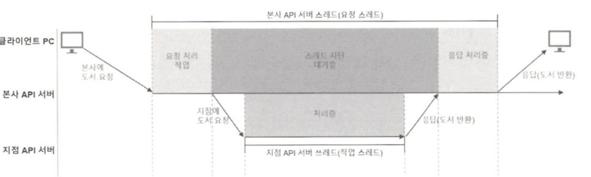

# Blocking I/O와 Non-Blocking I/O

## Blocking I/O

### 웹  애플리케이션 발생하는 I/O

- 파일에서 데이터를 읽어 들이거나 파일에 데이터를 기록하는 작업
- 데이터베이스에서 데이터를 조회하거나 추가하는 작업
- 웹 애플리케이션이 네트워크 통신을 하는 경우 발생하는 네트워크 I/O

### 웹 애플리케이션 I/O를 통해 Blocking I/O 알아보기


위의 그림을 보면 지점 API 서버로 요청에 대한 응답이 올때까지 클라이언트 요청이 대기하는 것을 알 수 있습니다.

이렇게 하나의 쓰레드가 I/O에 의해 차단되어 대기되어 있는 것을 Blocking I/O라고 합니다.

### Block I/O 방식의 문제점을 보완하기 위한 방법

Blocking I/O 방식의 문제점을 보완하기 위해서 멀티스레딩 기법으로 추가 스레드를 할당하여 차단된 시간을 효율적으로 사용할 수는 잇습니다.

그런데 이렇게 CPU 대비 많은 수의 스레드를 할당하는 멀티스레딩 기법은 몇 가지 문제점이 존재합니다.

1. 컨텍스트 스위칭으로 인한 스레드 전환 비용 발생

2. 컨텍스트 스위칭으로 인해 PCB에 저장하고 reload하는 과정에서 CPU가 다른 작업을 하지 못해 작업 대기 시간이 발생하게되어 성능 저하가 발생할 수 있습니다.

```
💡 스레드 역시 컨텍스트 스위칭이 일어나지만 쓰레드는 상대적으로 적은 공간을 차지하기 때문에 성능저하가 덜합니다.

물론, 스레드도 여러번 컨텍스트 스위칭이 일어난다면 문제가 발생할 가능성이 높습니다.
```

1.  과도한 메모리 사용으로 오버헤드가 발생할 수 있습니다.

일반적으로 새로운 쓰레드가 실행되면 JVM에서는 해당 스레드를 위한 스택 영역의 일부를 할당하며, 새로운 스레드 정보는 스택 영역에 개별 프레임에 형태로 저장됩니다.

JVM의 디폴트 스택 사이즈는 64비트의 경우 1024KB인데, 만약 64000명이 동시 접속을 한다면, 총 64GB 정도의 메모리가 추가로 필요하게 됩니다.

일반적으로 서블릿 컨테이너 기반의 Java 웹 애플리케이션은 요청당 하나의 스레드를 할당하는데 각각 스레드에서 **또 다른 작업 처리를 위해 스레드를 추가로 할당하게 된다면 시스템이 감당하기 힘들 정도로 메모리 사용량이 늘어날 가능성**이 있습니다.

1. 스레드 풀에서 응답 지연이 발생할 수 있습니다.

Spring Boot는 자체적으로 톰캣을 사용하는데 톰캣은 사용자의 요청을 효과적으로 처리하기 위해 스레드 풀을 사용합니다.

만약, 대량의 요청이 들어와 스레드 풀의 남는 유휴 스레드가 없는 경우 사용 가능한 스레드가 확보될 때까지 응답 지연이 발생하게 됩니다.

## Non-Blocking I/O

Non-Blocking I/O는 Blocking I/O와 반대로 스레드가 차단되지 않습니다.


Non-Blocking I/O 방식의 경우 작업 스레드의 종료 여부와 관계없이 요청한 스레드는 차단되지 않아 하나의 스레드로 많은 요청을 처리할 수 있습니다.

즉, Blocking I/O 방식보다 더 적은 수의 스레드를 사용하기 때문에 Blocking I/O에서 멀티스레딩 기법을 사용할 때 발생한 문제점들이 생기지 않습니다.

따라서 CPU 대기 시간 및 사용량에 있어서도 대단히 효율적입니다.

단, Non-Blocking 방식도 다음과 같은 단점이 존재합니다.

- 만약에 스레드 내부에 CPU를 많이 사용하는 작업이 포함된 경우 성능에 악영향을 줍니다.
- 사용자의 요청에서 응답까지의 전체 과정에 Blocking I/O 요소가 포함된 경우에는 Non-Blocking의 이점을 발휘하기 힘듭니다.

## Spring Framework에서의 Blocking I/O와 Non-Blocking I/O

Spring 프레임워크로 웹 애플리케이션을 개발할 때 보통 Spring MVC를 기반으로 개발되는 경우가 많습니다.

하지만 Spring MVC는 Blocking I/O 방식을 사용하기 때문에 애플리케이션이 감당하기 힘들 만큼 클라이언트 요청 트래픽이 발생하는 상황이 발생할 수 있습니다.

이러한 문제를 극복하기 위해 나온 것이 Spring WebFlux입니다.

### Spring MVC와 Spring WebFlux의 차이

- Spring MVC
    - Blocking I/O 방식
    - 요청당 하나의 스레드를 사용하기 때문에 대량의 요청을 처리하기 위해서 과도한 스레드를 사용해야함
        - CPU 대기시간이 늘어나고 메모리 사용 시 오버헤드 발생
- Spring WebFlux
    - Netty 같은 비동기 Non-Blocking I/O 기반의 서버 엔진 사용
    - 적은 수의 스레드로도 많은 수의 요청을 처리
        - CPU와 메모리를 효율적으로 사용할 수 있어 적은 컴퓨팅 파워로도 고성능의 애플리케이션 운영 가능

### Spring MVC 예시 테스트 코드

- 서버

```java
@RestController
@RequiredArgsConstructor
public class SpringMvcController {
    private final RestClient restClient = RestClient.create();

    @GetMapping
    public ResponseEntity<String> get() {
        ResponseEntity<String> response = restClient.get()
                .uri("http://localhost:8080/external-api")
                .retrieve()
                .toEntity(String.class);

        return ResponseEntity.status(HttpStatus.OK)
                .body(response.getBody());
    }

    @GetMapping("/external-api")
    public ResponseEntity<String> getExternalApi() throws InterruptedException {
        Thread.sleep(5000);
        return ResponseEntity.ok("Hello from external API");
    }

}

```

- 클라이언트

```java
    @Bean
    public CommandLineRunner runWithMvc() {
        return args -> {
            LocalDateTime start = LocalDateTime.now();
            log.info("> mvc 요청 시작 : {}", start);
            RestClient restClient = RestClient.create();

            for (int i = 0; i < 5; i++) {
                ResponseEntity<String> response = restClient.get()
                        .uri("http://localhost:8080/")
                        .retrieve()
                        .toEntity(String.class);
                log.info("응답 받음 : {} {}번째", response.getBody(), i + 1);
            }
            LocalDateTime end = LocalDateTime.now();
            log.info("> mvc 요청 종료 : {}", end);
        };
    }
```

총 걸린 시간이 25초가 나오는 것을 확인할 수 있습니다.

### Spring WebFlux 예시 테스트 코드

- 서버

```java
@RestController
@RequestMapping("/webflux")
public class WebFluxController {

    private final WebClient webClient = WebClient.create();

    @GetMapping
    public Mono<String> get() {
        return webClient.get()
                .uri("http://localhost:8080/webflux/external-api")
                .retrieve()
                .bodyToMono(String.class);
    }

    @GetMapping("/external-api")
    public Mono<String> getExternalApi() throws InterruptedException {
        Thread.sleep(5000);
        return Mono.just("Hello from external API");
    }
}
```

- 클라이언트

```java
    @Bean
    public CommandLineRunner runWithWebflux() {
        return args -> {
            log.info("> webflux 요청 시작 : {}", LocalDateTime.now());
            WebClient webClient = WebClient.create();

            for (int i = 0; i < 5; i++) {
                int finalI = i;
                webClient.get()
                        .uri("http://localhost:8080/webflux")
                        .retrieve()
                        .bodyToMono(String.class)
                        .subscribe(string -> log.info("응답 받음 : {} {}번째 시간 : {}", string, finalI + 1, LocalDateTime.now()));
            }
        };
    }
```

<aside>
💡 Mono는 Reactor에서 지원하는 Publisher 타입 중 하나로, 단 하나의 데이터만 emit하는 Publisher 타입입니다.

일반적으로 HTTP 요청에 대한 응답으로 JSON 형식의 응답을 많이 사용하는데, JSON 형식으로 전달되는 응답 내부에는 여러 가지 결과 값이 포함될 수 있지만 JSON 형식의 응답 자체는 하나의 문자열로 구성된 단 하나의 데이터이기 때문에 Mono를 사용하기 가장 적합하다고 볼 수 있습니다.

</aside>

약 5초정도 소요되는 것을 볼 수 있습니다.

## Non-Blocking I/O 방식의 통신이 적합한 시스템

### ⚠️ Spring WebFlux 도입시 고려해야할 상황

1. 학습 난이도
    - Spring WebFlux에 핵심이 되는 리액티브 스트림즈 표준 사양을 구현한 구현체를 능숙하게 사용하기까지 학습에 대한 노력과 시간이 상당이 필요함
2. 리액티브 프로그래밍 경험이 있는 개발 인력을 확보하는 것이 과연 쉬운가 하는 점
    - Spring MVC는 경험많고 숙련된 개발 인력을 확보하기 용이함 (긴 시간동안 사용되었기 때문)
    - 선언형 프로그래밍 방식의 Non-Blocking I/O 방식인 리액티브 프로그래밍 자식을 갖춘 숙련된 개발 인력을 확보하기 어려움

새로운 기술을 도입하는 것은 기술 부채를 갚는 하나의 방법이 될 수 있지만 철저한 준비 없이 성급하게 도입하는 것은 기술 부채보다 더 고통스러운 상황을 만들 수 있습니다.

### 1. 대량의 요청 트래픽이 발생하는 시스템

요청 트래픽이 충분히 감당할 수준이면 서블릿 기반의 Blocking I/O 방식의 애플리케이션으로 충분함

하지만 대량의 요청 트래픽으로 애를 먹는 시스템이라면 Spring WebFlux로의 전환을 고려해 볼만함

<aside>
💡 서버 증설이나 VM 확장들을 고려할 수 있지만 그만큼 높은 비용이 지불될 수 있음, Spring WebFlux를 사용하면 저비용으로 고수준의 성능을 이끌어 낼 수 있음

</aside>

### 2. 마이크로 서비스 기반 시스템

마이크로 서비스 기반의 시스템은 시스템의 특성상 서비스들 간의 많은 수의 I/O가 지속적으로 발생합니다.

따라서 특정 서비스들 간에 통신에서 Blocking으로 인한 응답 지연이 발생하게 된다면 해당 서비스 뿐만 아니라 다른 서비스들에도 영향을 미칠 가능성이 상당히 높습니다.

심지어 응답 지연의 연쇄 작용으로 시스템 자체가 마비될 수 있습니다.

그렇기 때문에 마이크로 서비스 기반 시스템에서는 Spring WebFlux와 같은 Non-Blocking I/O 방식의 기술이 필요합니다.

### 3. 스트리밍 또는 실시간 시스템

리액티브 프로그래밍은 HTTP 통신이나 데이터베이스 조회와 같은 일회성 연결뿐만 아니라 끊임 없이 들어오는 무한한 데이터 스트림을 전달받아서 효율적으로 처리할 수 있습니다.

Spring WebFlux를 이용하면 이러한 무한 데이터 스트림을 처리하기 위한 스트리밍 또는 실시간 시스템을 쉽게 구축할 수 있습니다.