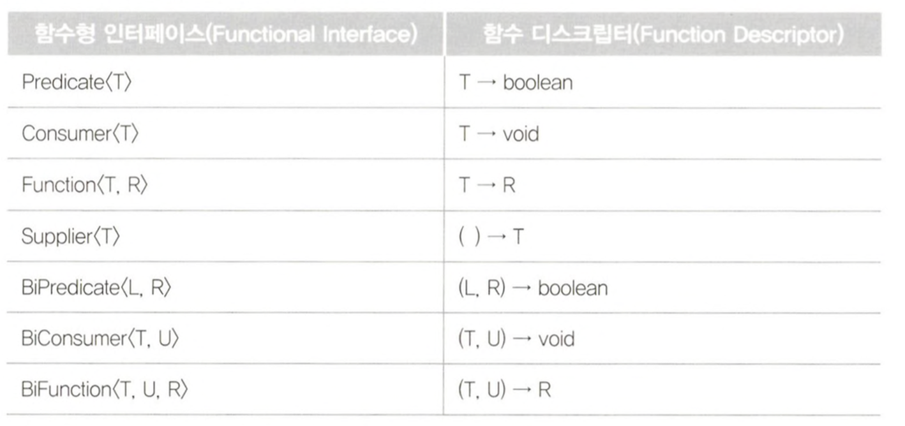

# 리액티브 프로그래밍을 위한 사전 지식

## 함수형 인터페이스 (Functional Interface)

함수형 인터페이스는 단 하나의 추상 메서드만 정의되어 있는 인터페이스입니다.

자바 8에서부터 함수를 값으로 취급할 수 있는 기능이 추가되었고 함수형 인터페이스를 활용하여 함수를 인자로 넘길 수 있게 되었습니다.

대표적인 예시로 Compatator 인터페이스를 들 수 있습니다.

```java
List<Person> people = new ArrayList<>();
people.add(new Person("Alice", 30));
people.add(new Person("Bob", 25));
people.add(new Person("Charlie", 35));

// 나이에 따라 오름차순 정렬
Collections.sort(people, new Comparator<Person>() {
    @Override
    public int compare(Person p1, Person p2) {
        return Integer.compare(p1.age, p2.age);
    }
});
```

## 람다 표현식(Lambda Expression)

람다 표현식은 자바 8에서 도입된 기능으로 익명 함수를 간결하게 표현할 수 있게 해줍니다.

```java
(paramerter) -> expression
```

다음은 람다 표현식을 사용하는 예시입니다.

```java
List<Person> people = new ArrayList<>();
people.add(new Person("Alice", 30));
people.add(new Person("Bob", 25));
people.add(new Person("Charlie", 35));

Collections.sort(people, (p1, p2) -> p1.getAge().compareTo(p2.getAge()));
```

## 메서드 레퍼런스(Method Reference)

메서드 레퍼런스는 자바 8에서 도입된 기능으로 람다 표현식보다 더 간결하게 특정 메서드를 참조하는 방법입니다.

```java
// 정적 메서드 참조
ClassName::staticMethodName
// 특정 객체의 인스턴스 메서드 참조
instance::instanceMethodName
// 특정 유형의 임의 객체의 인스턴스 메서드 참조
ClassName::instanceMethodName
// 생성자 참조
ClassName::new
```

다음은 메서드 레퍼런스를 사용하는 예시입니다.

```java
List<Person> people = new ArrayList<>();
people.add(new Person("Alice", 30));
people.add(new Person("Bob", 25));
people.add(new Person("Charlie", 35));

people.sort(Comparator.comparing(Person::getAge));
```

## 함수 디스크립터(Function Descriptor)

함수 디스크립터는 람다 표현식이나 메서드 레퍼런스를 정의할 때 해당 함수형 인터페이스의 기능을 설명할 때 사용되는 개념입니다.

함수형 인터페이스가 어떤 파라미터를 가지고, 어떤 값을 리턴하는지 설명해주는 역할을 합니다.


## 정리

- 함수형 인터페이스는 Java에서 함수형 프로그래밍 방식을 지원하기 위해 Java 8부터 지원하는 인터페이스입니다.
- 함수형 인터페이스는 단 하나의 추상 메서드를 가집니다.
- 람다 표현식은 함수형 인터페이스에 정의된 추상 메서드를 표현식으로 구현한 것입니다.
- 메서드 레퍼런스를 통해 람다 표현식을 조금 더 간결하게 표현할 수 있습니다.
- 함수 디스크립터를 통해 함수형 인터페이스의 파라미터 형식과 리턴 값의 형태를 알 수 있습니다.