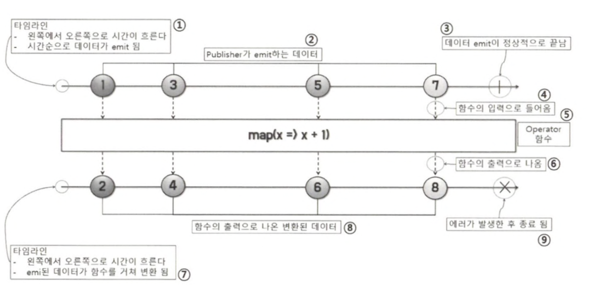
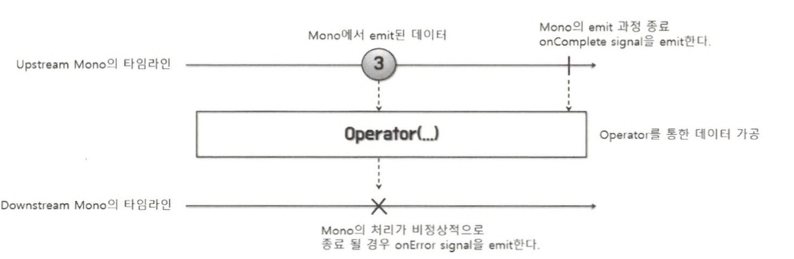
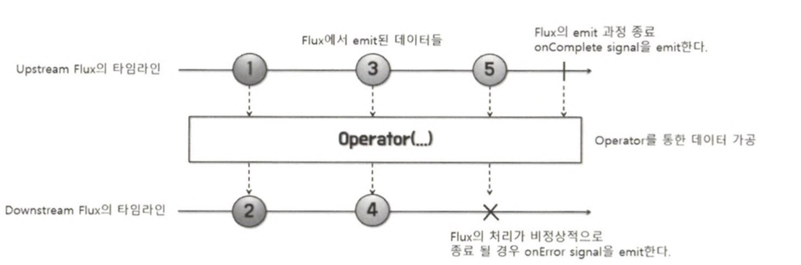
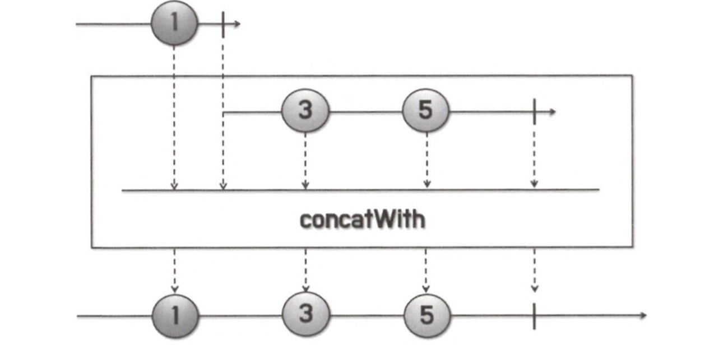

# 마블 다이어그램

## 마블 다이어그램 이란?

마블 다이어그램이란 여러 가지 구슬 모양의 도형으로 구성된 도표를 의미합니다.

Reactor에서 지원하는 Operator를 이해하는 데 중요한 역할을 합니다.

다음은 마블 다이어그램의 기본 구성을 설명한 그림입니다.

1. 다이어그램에는 두 개의 타임라인이 존재하는데, 첫째가 바로 1과 같이 Publisher가 데이터를 emit하는 타임라인입니다.

   그림에서는 단순히 Publisher의 타임 라인이라고 했지만 이 Publisher는 데이터 소스를 최초로 emit하는 Publisher일 수도 있고 그렇지 않을 수도 있습니다.

   Operator 함수를 기준으로 상위에 있는 즉, Upstream의 Publisher라고 보는 것이 적절할 것 같습니다.

2. Publisher가 emit하는 데이터를 의미합니다.

   타임라인은 왼쪽에서 오른쪽으로 시간이 흐르는 것을 의미하기 때문에 가장 왼쪽에 있는 1번 구슬이 시간상으로 가장 먼저 emit된 데이터입니다.

3. 수직으로 된 바는 데이터의 emit이 정상적으로 끝났음을 의미합니다.

   Signal로 표현하면 onComplete Signal에 해당됩니다.

4. Operator 함수 쪽으로 들어가는 점선 화살표는 Publisher로부터 emit된 데이터가 Operator 함수의 입력으로 전달되는 것을 의미합니다.
5. Publisher로 부터 전달받은 데이터를 처리하는 Operator 함수입니다.
6. Operator 함수에서 나가는 점선 화살표는 Publisher로 부터 전달받은 데이터를 가공 처리한 후에 출력으로 내보내는 것을 의미합니다.
7. Operator 함수에서 가공 처리되어 출력으로 내보내진 데이터의 타임라인입니다.
8. Operator 함수에서 가공 처리된 데이터를 의미합니다.
9. X 표시는 에러가 발생해 데이터 처리가 종료되었음을 의미하며, onError Signal에 해당됩니다.

마블 다이어그램을 보면 Operator를 올바르게 이해하고 사용하는데 도움을 줄 수 있습니다.

## 마블 다이어그램으로 Reactor의 Publisher 이해하기

### Reactor의 Mono 타입 마블 다이어그램


Mono는 단 하나의 데이터를 emit하는 Publisher이기 때문에 단 하나의 데이터만 표현합니다.

Mono는 0개 또는 1개의 데이터를 emit하는 Publisher이기 때문에 3이라고 적힌 구슬 데이터가 emit되지 않고 onComplete signal만 전송될 수 있습니다.

### Mono 사용 예시(1개 데이터 emit)

```java
public class MonoExample {
    public static void main(String[] args) {
        Mono.just("Hello Reactor")
                .subscribe(System.out::println);
    }
}

```

<aside>
💡 just Operator는 한 개 이상의 데이터를 emit하기 위한 Operator입니다.

2개 이상의 데이터를 파라미터로 전달할 경우 내부적으로 fromArray() Operator를 이용해서 데이터를 emit 합니다.

</aside>

```java
@SafeVarargs
public static <T> Flux<T> just(T... data) {
    return fromArray(data);
}
```

### Mono 사용 예시(데이터 0개)

```java
public class MonoNoDataExample {
    public static void main(String[] args) {
        Mono.empty()
                .subscribe(
                        none -> System.out.println("# emitted onNext siganl"),
                        error -> {
                        },
                        () -> System.out.println("# emitted onComplete signal")
                );
    }
}

```

위의 코드는 다음과 같이 실행됩니다.

```java
# emitted onComplete signal
```

이를 통해 알 수 있는 내용은 empty() Operator를 사용하면 내부적으로 emit할 데이터가 없는 것으로 간주하여 곧바로 onComplete Signal을 전송하는 것을 알 수 있습니다.

이처럼 데이터를 한 건도 emit하지 않는 empty() Operator는 주로 어떤 특정 작업을 통해 데이터를 전달받을 필요는 없지만 작업이 끝났음을 알리고 이에 따른 후처리를 하고 싶을 때 사용할 수 있습니다.

### Mono 활용 예시

```java
public class MonoUsageExample {
    public static void main(String[] args) throws InterruptedException {
        ObjectMapper objectMapper = new ObjectMapper();
        CountDownLatch latch = new CountDownLatch(1);

        WebClient restClient = WebClient.create();
        restClient.get()
                .uri("http://worldtimeapi.org/api/timezone/Asia/Seoul")
                .retrieve()
                .bodyToMono(String.class)
                .map(response -> {
                    try {
                        return objectMapper.readTree(response).get("datetime").asText();
                    } catch (JsonProcessingException e) {
                        throw new RuntimeException(e);
                    }
                })
                .subscribe(
                        data -> System.out.println("# emitted data : " + data),
                        error -> {
                            System.out.println("# emitted error signal");
                            latch.countDown();
                        },
                        () -> {
                            System.out.println("# emitted onComplete signal");
                            latch.countDown();
                        }
                );
        latch.await();
    }
}

```

위의 예제코드는 Non-Blocking I/O 방식의 통신이 아니기 때문에 Non-Blocking 통신의 이점은 얻을 수 없습니다.

하지만 Mono를 사용하여 HTTP 요청/응답을 처리하면 요청과 응답을 하나의 Operator 체인으로 깔끔하게 처리할 수 있는 장점이 있다는 사실을 기억하기 바랍니다.

### Reactor Flux 타입 마블 다이어그램


위의 그림을 보면 Flux는 여러 건의 데이터를 emit할 수 있는 Publisher 타입이라는 것을 알 수 있습니다.

물론, Flux도 0개 또는 1개 이상의 데이터를 emit할 수 있기 때문에 Mono의 데이터 emit 범위를 포함한다고 볼 수 있습니다.

- Mono와 Flux를 구분하는 이유?
    1. 특정 타입에 대해 명확한 표현 가능
        - Mono인 경우 0개 1개를 반환한다는 것이, Flux인 경우 0개 이상 다중 값이 반환된다는 것을 알 수 있기 때문에 처리 로직을 명확하게 표현할 수 있습니다.
    2. 리소스 관리 및 성능 최적화
        - 단일 값과 다중값 상황에 따라 적합한 처리 로직을 작성할 수 있습니다. Mono일때는 단일 값 처리에 초점을 맞추고 Flux일 때는 하나씩 스트리밍 방식으로 처리할 수 있어 메모리 사용을 최적화할 수 있습니다.
    3. 데이터의 흐름 제어와 오류 처리
        - 각 데이터 형식에 맞는 최적화된 흐름 제어 및 오류 처리가 가능합니다.
        - 예를 들어, Mono 같은 경우 오류 발생시 빈값을 반환하는 식으로, Flux인 경우에는 오류 발생시 이벤트를 건너뛰고 나머지 이벤트를 처리하는 식으로 처리할 수 있습니다.
    4. 응답시간 최적화
        - Flux의 경우 데이터를 처리되는데로 바로 반환하는 스트리밍 방식으로 처리할 수 있습니다.


### Flux 사용예시 (just)

```java
public class FluxSimpleExample {
    public static void main(String[] args) {
        Flux.just(6, 9, 13)
                .map(num -> num % 2)
                .subscribe(System.out::println);
    }
}

```

위의 코드는 Flux로 여러개의 숫자를 받아 map 연산을 통해 2로 나눈 나머지로 값을 변경하고 Subscriber에 전달하여 출력합니다.

### Flux 사용예시 (fromArray)

```java
public class FluxFromArrayExample {
    public static void main(String[] args) {
        Flux.fromArray(new Integer[]{6, 9, 13})
                .filter(num -> num > 6)
                .map(num -> num % 2)
                .subscribe(System.out::println);
    }
}

```

데이터 소스를 배열 데이터로 받는 경우 fromArray() Operator를 사용합니다.

### Flux 활용 예시(Mono 두개를 연결해서 Flux로 변환)

```java
public class Flux2MonoExample {
    public static void main(String[] args) {
        Flux<String> flux = Mono.justOrEmpty("steve")
                .concatWith(Mono.justOrEmpty("jobs"));

        flux.subscribe(System.out::println);
    }
}

```

concatWith Operator는 Publisher와 concatWith()의 파라미터로 전달되는 Publisher가 각각 emit하는 데이터들을 하나로 연결해서 새로운 Publisher의 데이터 소스로 만들어 주는 Operator 입니다.



마블 다이어그램을 보면 위쪽에 있는 Publisher의 데이터 소스와 concatWith 내부에 있는 Publisher의 데이터 소스를 연결하는 것을 볼 수 있습니다.

### Flux 활용 예시 (Concat 으로 연결)

```java
public class FluxConcatExample {
    public static void main(String[] args) {
        Flux.concat(
                        Flux.just("Mercury", "Venus", "Earth"),
                        Flux.just("Mars", "Jupiter", "Saturn"),
                        Flux.just("Uranus", "Neptune", "Pluto"))
                .collectList()
                .subscribe(System.out::println);
    }
}

```

concat Operator는 여러개의 데이터 소스를 원하는 만큼 연결할 수 있습니다.

collectList() Operator는 Upstream Publisher에서 emit하는 데이터를 모아서 List의 원소로 포함시킨 새로운 데이터 소스로 만들어 주는 Operator입니다.

- concat() Operator에서 리턴하는 Publisher의 값
    - Flux : 3번 라인은 총 3개의 Flux가 아홉개의 데이터를 데이터 소스로 연결하기 때문에 리턴 값은 Flux가 됩니다.
- collectList() Operator에서 리턴하는 Publisher의 값
    - Mono : List에 포함된 원소는 여러개지만 List 자체는 하나이기 때문에 한개의 데이터만 emit할 수 있는 Mono를 리턴합니다.
- 최종적으로 리턴되는 데이터
    - Mono : 리스트를 순회하면서 하나씩 출력하기 때문에 Mono를 리턴합니다.

## 정리

- 마블 다이어그램은 Reactor의 데이터 흐름을 이해하기 위한 중요한 도구입니다.
- Mono는 데이터를 0개 또는 1개만 emit할 수 있는 Reactor의 Publisher 타입입니다.
- Flux는 데이터를 0개 또는 1개 이상 emit할 수 있는 Reactor의 Publisher 타입입니다.