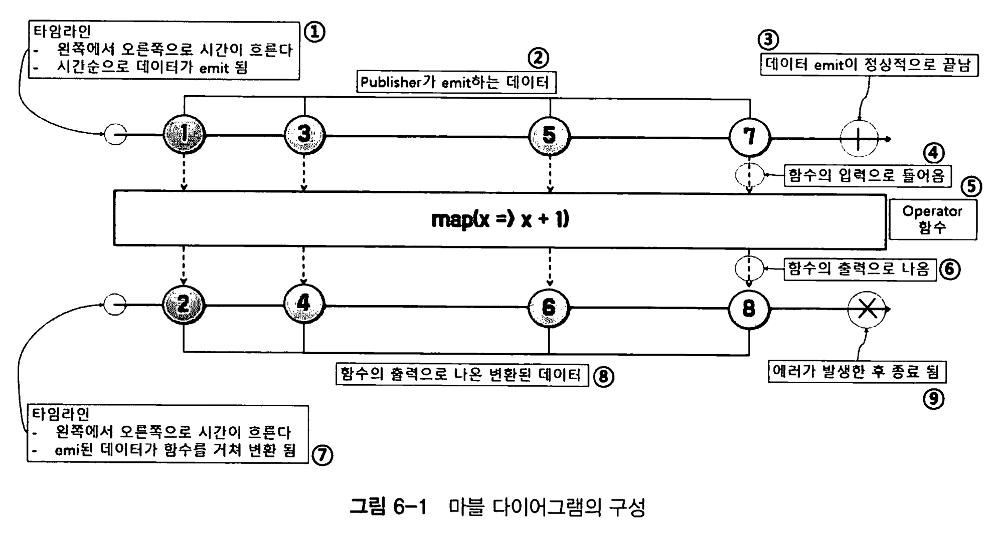
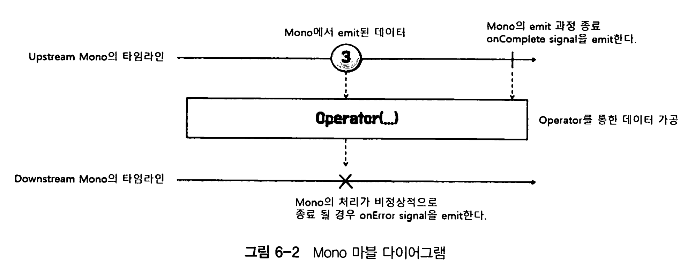
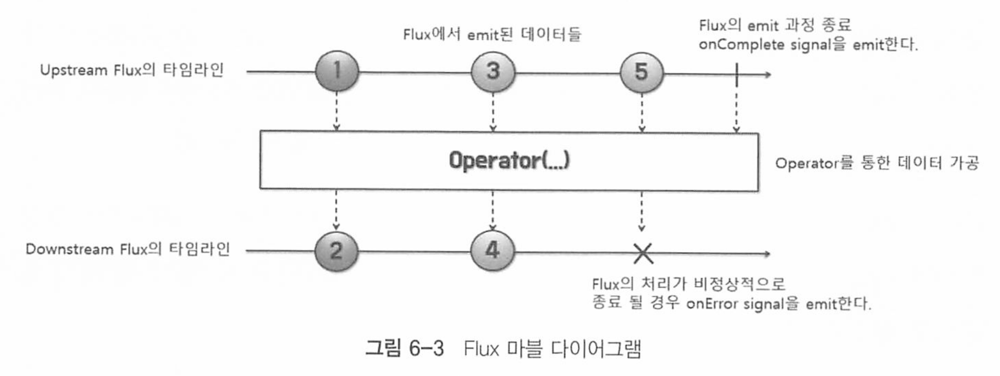
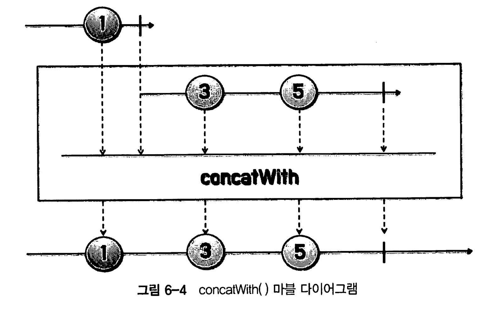

# Chapter 06 마블 다이어그램(Marble Diagram)

## Marble Diagram

마블 다이어그램(Marble Diagram)은 리액티브 프로그래밍에서 데이터 스트림의 동작을 시각적으로 표현한 다이어그램.

리액티브 연산자들이 데이터 스트림을 어떻게 변환하고 처리하는지 이해하는 데 도움을 주는 그림이다.

### 주요 요소

마블 다이어그램은 다음과 같은 요소로 구성됩니다:

1. **데이터 스트림**: 일련의 시간 축을 따라 이동하는 원(마블)들로 표시됩니다. 각 원은 스트림의 데이터 요소를 나타낸다.
2. **시간 축**: 왼쪽에서 오른쪽으로 진행되는 수평선으로 표시되며. 데이터 요소가 시간의 흐름에 따라 스트림을 통해 이동하는 것을 나타낸다.
3. **연산자**: 스트림을 변환하는 연산자는 다양한 기호와 형태로 표시됩니다. 예를 들어, `map`, `filter`, `flatMap` 등의 연산자가 있다.
4. **완료 신호**: 스트림의 끝을 나타내는 기호로, 일반적으로 수직선 또는 `|` 기호로 표시된다.
5. **오류 신호**: 오류를 나타내는 기호로, 일반적으로 `X` 기호로 표시된다.

### 예시

#### 1. 기본 스트림

```
--1--2--3--|
```

- 데이터 스트림: `1`, `2`, `3`
- 완료 신호: `|`

#### 2. `map` 연산자

`map` 연산자는 각 데이터 요소를 변환한다.

```
--1--2--3--|
  map(x => x * 2)
--2--4--6--|
```

- 원래 데이터 스트림: `1`, `2`, `3`
- 변환된 데이터 스트림: `2`, `4`, `6`

#### 3. `filter` 연산자

`filter` 연산자는 조건을 만족하는 데이터 요소만 통과시킨다. 

```
--1--2--3--4--|
  filter(x => x % 2 == 0)
-----2-----4--|
```

- 원래 데이터 스트림: `1`, `2`, `3`, `4`
- 필터링된 데이터 스트림: `2`, `4`

#### 4. `flatMap` 연산자

`flatMap` 연산자는 각 데이터 요소를 스트림으로 변환하고, 이 스트림들을 하나의 스트림으로 평탄화한다. 

```
--A--B--|
  flatMap(x => [x1, x2])
--A1-A2-B1-B2--|
```

- 원래 데이터 스트림: `A`, `B`
- 변환된 데이터 스트림: `A1`, `A2`, `B1`, `B2`



다이어그램에는 두개의 타임라인이 존재한다. (시간 흐름 순)

1. 1번(작은 동그라미)의 Publisher가 데이터를 emit(발행, 푸시)하는 타임라인 
2. 2번(작은동그라미)는 Publisher가 emit하는 데이터
3. 3번((작은동그라미)는 데이터의 emit이 끝남을 의미하며, onComplete 상태이다. 
4. 4와 같이 점선 화살표는 Opertator 함수로 입력이 전달되는것을 의미한다
5. 5는 전달받은 emit 데이터를 연산하는 Opertator 함수이다.
6. 6은 Operator를 통해 가공 처리한 후 출력으로 보낸것을 의미한다. 즉 다운스트림으로 흐르는것 
7. 7의 타임라인은 Operator를 통해 가공된후 내보내진 데이터의 타임라인이다. 1번과 다르다
8. 9와 같은 X 표시는 에러가 발생하여 onError 시그널이 발행된것을 의미한다.

 

주석으로 마블 다이어그램이 포함되어 있는 경우가 많으니 마블 다이어그램은 읽을줄 알아야 한다.


## 마블 다이어그램으로 Publisher 이해하기

### Mono



Mono는 0개 또는 1개의 데이터를 emit하는 Publisher이기때문에 하나의 데이터만 표현한다.

```java
public class Example6_1 {
    public static void main(String[] args) {
        Mono.just("Hello Reactor")
                .subscribe(System.out::println);
    }
}
```

* Mono.just로 데이터소스를 생성하고 구독하고 나서, sout으로 출력 연산을 한다.

```java
public class Example6_2 {
    public static void main(String[] args) {
        Mono
            .empty()
            .subscribe(
                    none -> System.out.println("# emitted onNext signal"),// consumer
                    error -> {},
                    () -> System.out.println("# emitted onComplete signal") // completeConsumer
            );
    }
}
```

* Mono.empty는 데이터를 1건도 emit하지 않는다. 바로 onComplete Signal을 전송한다.
* none->은 onNext 핸들러이다.  
* () -> 은 complete handler이다. 때문에 맨 마지막 () -> 가 실행된다. 

### Flux



Flux는 0개 또는 N개의 데이터를 emit하는 publiser이다

```java
public class Example6_4 {
    public static void main(String[] args) {
        Flux.just(6, 9, 13)
                .map(num -> num % 2)
                .subscribe(System.out::println);
    }
}
```

* Flux.just로 데이터 소스를 생성하고, map 오퍼레이터 연산을 한 후 구독하여 onComplete 시그널을 받으면 sout으로 출력한다.

또한 Flux는 Mono의 범위를 포함하기 때문에, 두개의 Mono를 연결해서 Flux를 생성할 수 있다.

```java
public class Example6_6 {
    public static void main(String[] args) {
        Flux<String> flux =
                Mono.justOrEmpty("Steve")
                        .concatWith(Mono.justOrEmpty("Jobs"));
        flux.subscribe(System.out::println);
    }
}
```

just() Operator의 경우 null을 허용하지 않지만, justOrEmpty()는 null을 허용한다.

* 내부적으로 null을 전달받으면 empty() Operator가 호출된다.

concatWith()는 Publisher(Mono.justOrEmpty("Steve"))와 concatWith의 파라미터로 전달되는 Publiser(Mono.justOrEmpty("Jobs"))가 각각 emit하느 데이터들을 하나로 연결해서 새로운 Publisher의 데이터 소스로 만들어주는 오퍼레이터다.



concatWith의 마블 다이어그램이다.

위쪽에있는 Publisher 데이터소스와 concatWith 내부에 있는 Publisher 데이터 소스를 연결해 새 데이터 소스를 만든다(가장 아래)

또한 Flux는 또다른 Flux들로 데이터 소스 스트림을 만들 수 있다.

```java
public class Example6_7 {
    public static void main(String[] args) {
        Flux.concat(
                        Flux.just("Mercury", "Venus", "Earth"),
                        Flux.just("Mars", "Jupiter", "Saturn"),
                        Flux.just("Uranus", "Neptune", "Pluto"))
                .collectList()
                .subscribe(planets -> System.out.println(planets));
    }
}
```

* `Flux.concat` 연산자는 여러 개의 `Flux`를 순서대로 연결하여 하나의 `Flux`로 만들어주는데, 정의된 순서로 발행되므로 순서가 보장된다. 
* concat에서 리턴하는 publisher는 Flux다. 여러개를 연결해서 하나의 Flux를 생성한다.
* collectList()는 Mono이다 하나의 List<...>로 수집한 후 List를 발행하는 Mono를 출력한다. 
* 그러므로 마지막 subscribe로 출력하는 데이터는 `List<String>`이 된다 