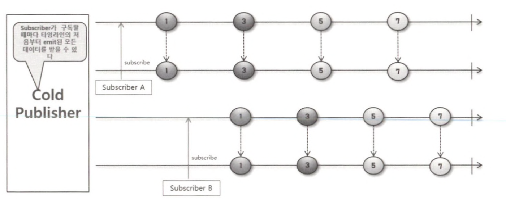
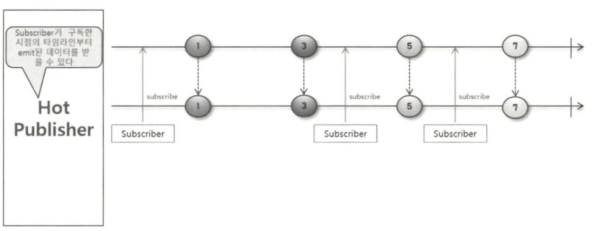

# Cold Sequence와 Hot Sequence

## Cold와 Hot의 의미

- cold
    - 자주 접근되지 않거나 사용되지 않는 데이터, 메모리 페이지, 또는 코드 경로를 의미합니다.
    - 무언가를 새로 시작하는 경우가 많음
        - 서버나 시스템을 부팅할 때마다 초기화 작업 시작
        - 암호 화폐 Cold Wallet을 사용하기 위해 인터넷을 연결
- hot
    - 자주 접근되거나 사용되는 데이터, 메모리 페이지, 또는 코드 경로를 의미합니다.
    - 무언가를 새로 시작하지 않는 경우가 많음
        - 서버나 시스템을 재가동할 필요가 없음
        - 인터넷에 다시 연결할 필요없이 바로 사용 가능

## Cold Sequence

Cold Sequecne는 Subscriber가 구독할 때마다 데이터 흐름이 처음부터 다시 시작되는 Sequence 입니다.



Cold Sequence는 Subscriber의 구독시점이 다르더라도 Publisher가 데이터를 emit하는 과정을 처음부터 다시 시작하게 됩니다.

```java
@Slf4j
public class ColdSequenceExample {
    public static void main(String[] args) {
        Flux<String> coldFlux = Flux.fromIterable(List.of("KOREA", "JAPAN", "CHINA"))
                .map(String::toLowerCase);

        coldFlux.subscribe(country -> log.info("Subscriber 1: {}", country));
        System.out.println("----------------------------------------------");
        coldFlux.subscribe(country -> log.info("Subscriber 2: {}", country));
    }
}

```

## Hot Sequence

Hot Sequence는 구독이 발생한 시점 이전에 Publisher로부터 emit된 데이터는 Subscriber가 전달받지 못하고 구독이 발생한 시점 이후에 emit된 데이터만 전달받을 수 있습니다.


Publisher가 데이터를 emit하는 과정이 한번만 일어나고, Subscriber가 각각의 구독 시점 이후에 emit된 데이터만 전달받는 데이터의 흐름을 Hot Sequence라고 합니다.

```java
 public static void main(String[] args) throws Exception {
        String[] singers = {"Michael Jackson", "Madonna", "Queen"};

        log.info("# Begin concert : ");
        Flux<String> concertFlux = Flux.fromArray(singers)
                .delayElements(Duration.ofSeconds(1))
                .share();

        concertFlux.subscribe(singer -> log.info("Subscriber 1: {}", singer));

        Thread.sleep(2000);

        concertFlux.subscribe(singer -> log.info("Subscriber 2: {}", singer));

        Thread.sleep(3000);
    }
```

위의 코드를 실행시키면 다음과 같은 결과가 나옵니다.

```java
22:36:23.038 [main] INFO org.example.webfluxplayground.sequence.hot.HotSequenceExample -- # Begin concert : 
22:36:24.111 [parallel-1] INFO org.example.webfluxplayground.sequence.hot.HotSequenceExample -- Subscriber 1: Michael Jackson
22:36:25.117 [parallel-2] INFO org.example.webfluxplayground.sequence.hot.HotSequenceExample -- Subscriber 1: Madonna
22:36:25.118 [parallel-2] INFO org.example.webfluxplayground.sequence.hot.HotSequenceExample -- Subscriber 2: Madonna
22:36:26.123 [parallel-3] INFO org.example.webfluxplayground.sequence.hot.HotSequenceExample -- Subscriber 1: Queen
22:36:26.123 [parallel-3] INFO org.example.webfluxplayground.sequence.hot.HotSequenceExample -- Subscriber 2: Queen
```

결과를 보면 2번째 Subscriber는 Michael Jackson이 안나오는 것을 볼 수 있습니다.

- delayElements()
    - 데이터 소스로 입력된 각 데이터의 emit을 일정시간 동안 지연시키는 Operator 입니다.
- share()
    - Cold Sequence를 Hot Sequence로 동작하게 해주는 Operator 입니다.
    - 공식 문서에서는 원본 Flux를 멀티캐스트하는 새로운 Flux를 리턴한다. 라고 나와있습니다.
        - 원본 Flux는 Operator를 통해 가공되지 않은 원본 데이터 소스를 처음으로 emit하는 Flux를 의미합니다.

위의 코드에서 fromArray()에서 처음으로 Flux를 리턴하고, 이어서 deplayElements()도 Flux를 리턴하며, share() 역시도 Flux를 리턴합니다.

이렇게 Operator 체인 형태로 리턴되는 Flux들은 모두 다른 참조 값을 가지는 객체입니다.

이렇게 리턴되는 Flux 중에서 fromArray()에서 처음으로 리턴하는 Flux가 바로 원본 Flux가 됩니다.

이 원본 Flux를 멀티캐스트한다는 의미는 여러 Subscriber가 하나의 원본 Flux를 공유한다는 의미입니다.

그렇기 때문에 하나의 원본 Flux를 공유해서 사용하면서 다른 Subscriber가 원본 Flux를 먼저 구독하게 되면 데이터 emit이 시작하게 되고 이후에 다른 Subscriber가 구독하는 시점에는 원본 Flux에서 이미 emit된 데이터를 전달받을 수 없게 됩니다.

## HTTP 요청과 응답에서의 Cold Sequence와 Hot Sequence의 동작 흐름

### Cold Sequence

```java
public static void main(String[] args) throws Exception {
        URI worldTimeUri = UriComponentsBuilder.newInstance().scheme("http")
                .host("worldtimeapi.org")
                .path("/api/timezone/Asia/Seoul")
                .build()
                .encode()
                .toUri();

        Mono<String> mono = getWorldTime(worldTimeUri);
        mono.subscribe(dateTime -> log.info("# dateTime 1: {}", dateTime));
        Thread.sleep(2000);
        mono.subscribe(dateTime -> log.info("# dateTime 2: {}", dateTime));
        Thread.sleep(2000);
    }

    private static Mono<String> getWorldTime(URI worldTimeUri) {
        return WebClient.create()
                .get()
                .uri(worldTimeUri)
                .retrieve()
                .bodyToMono(String.class)
                .map(response -> {
                    DocumentContext jsonContext = JsonPath.parse(response);
                    return jsonContext.read("$.datetime");
                });
    }
```

구독이 발생할 때마다 데이터의 emit 과정이 처음부터 새로 시작되는 Cold Sequence로 인해 두 번의 구독이 발생했으므로 두번의 새로운 HTTP 요청이 발생하게 됩니다.

### Hot Sequence

```java
    public static void main(String[] args) throws InterruptedException {
        URI worldTimeUri = UriComponentsBuilder.newInstance()
                .scheme("http")
                .host("worldtimeapi.org")
                .port(80)
                .path("/api/timezone/Asia/Seoul")
                .build()
                .encode()
                .toUri();

        Mono<String> mono = getWorldTime(worldTimeUri).cache();
        mono.subscribe(dateTime -> System.out.println("# dateTime 1: " + dateTime));
        Thread.sleep(2000);
        mono.subscribe(dateTime -> System.out.println("# dateTime 2: " + dateTime));
        Thread.sleep(2000);
    }

    private static Mono<String> getWorldTime(URI worldTimeUri) {
        return WebClient.create()
                .get()
                .uri(worldTimeUri)
                .retrieve()
                .bodyToMono(String.class)
                .map(response -> {
                    DocumentContext jsonContext = JsonPath.parse(response);
                    return jsonContext.read("$.datetime");
                });
    }
```

위의 코드에서는 cache() Operator를 추가함으로써 Cold Sequence가 Hot Sequence로 동작하게 됩니다.

cache() 오퍼레이터는 Cold Sequence로 동작하는 Mono를 Hot Sequence로 변경해주고 emit된 데이터를 캐시한 뒤 구독이 발생할 때마다 캐시된 데이터를 전달합니다.

결과적으로 캐시된 데이터를 전달하기 때문에 구독이 발생할 때마다 Subscriber는 동일한 데이터를 전달받게 됩니다.

### cache() 오퍼레이터 활용 예시

- REST API 요청을 위해 인증 토큰이 필요한 경우
    - API 서버로부터 인증 토큰을 전달받을 때 토큰이 만료되기 전까지 해당 인증 토큰을 사용해 인증이 필요한 API 요청에 사용할 수 있습니다.
    - 매번 새로운 인증 토큰을 전송하지 않고 cache() 오퍼레이터를 사용해서 캐시된 인증 토큰을 사용하여 효율적인 동작 과정을 구성할 수 있을 것 입니다.

### Reactor에서의 Hot 두 가지 의미

- 최초 구독이 발생하기 전까지는 데이터의 emit이 발생하지 않는 것 (warm up이라고도 함)
- 구독 여부와 상관없이 데이터가 emit되는 것

## 정리

- Subscriber의 구독 시점이 달라도 구독을 할 때마다 Publisher가 데이터를 처음부터 emit하는 과정을 Cold Sequence라고 합니다.
- Cold Sequence 흐름으로 동작하는 Publisher를 Cold Publisher라고 합니다.
- Publisher가 데이터를 emit하는 과정이 한 번만 일어나고 Subscriber가 각각의 구독 시점 이후에 emit된 데이터만 전달받는 것을 Hot Sequence라고 합니다.
- Hot Sequence 흐름으로 동작하는 Publisher를 Hot Publisher라고 합니다.
- share(), cache() 등의 Operator를 사용해서 Cold Sequence를 Hot Sequence로 변환할 수 있습니다.
- Hot Sequence는 Subscriber의 최초 구독이 발생하여 Publisher가 데이터를 emit하는 Warm up과 Subscriber의 구독 여부와 상관없이 데이터를 emit하는 Hot 으로 구분할 수 있습니다.