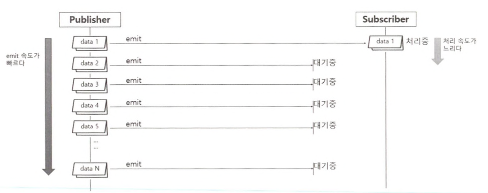
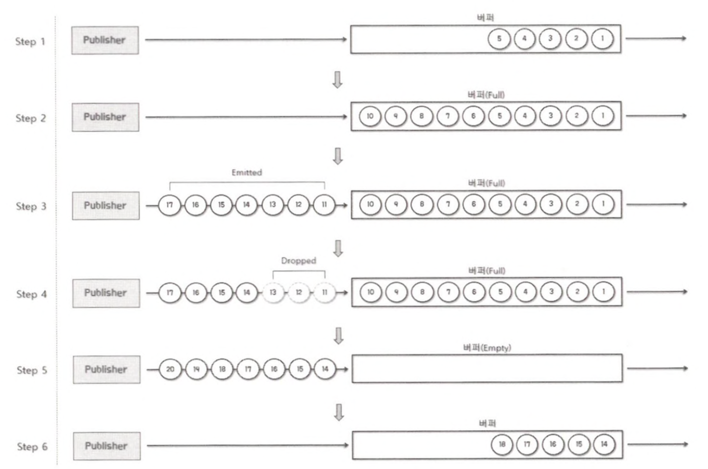
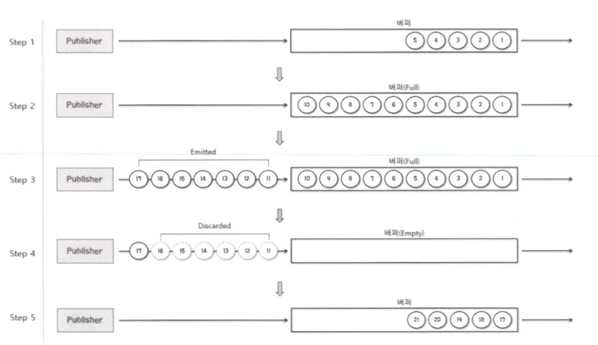
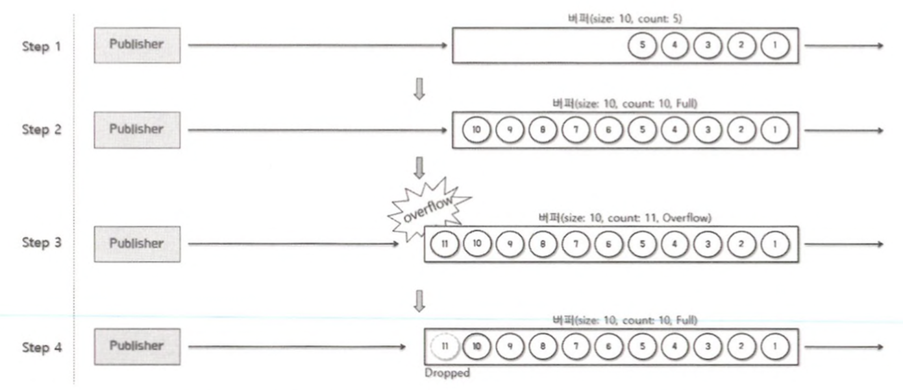
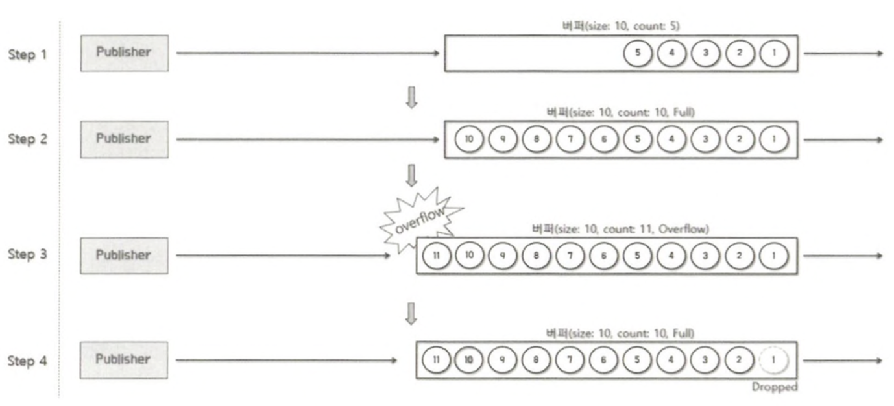

# Backpressure

## Backpressure 란?

리액티브 프로그래밍에서의 Backpressure는 Publisher가 끊임 없이 emit하는 무수히 많은 데이터를 적절하게 제어하여 데이터 처리에 과부하가 걸리지 않도록 제어하는 역할을 합니다.

### Publisher와 Subscriber간에 데이터를 주고 받는 방식



먼저 Publisher가 data1을 Subscriber에게 emit합니다.

이때, Subscriber가 data 1을 처리하는 속도가 느려서 처리가 끝나기도 전에 Publisher가 data 2부터 N까지 계속해서 emit하는 것을 볼 수 있습니다.

이 경우, emit된 데이터들은 Subscriber가 data 1을 처리 완료하기 전까지 대기하게 됩니다.

이게 지속되는 경우 오버플로우가 발생하거나 시스템이 다운되는 문제가 발생할 수 있습니다.

이런 문제를 해결하기 위한 수단이 Backpressure 입니다.

## Reactor에서의 Backpressure 처리 방식

### 데이터의 개수 제어

Subscriber가 적절히 처리할 수 있는 수준의 데이터 개수를 Publisher에게 요청하는 방식입니다.

다음은 Subscriber가 데이터의 요청 개수를 조절하는 Backpressure에 대한 예제 코드입니다.

```java
    public static void main(String[] args) {
        Flux.range(1, 5)
                .doOnRequest(data -> log.info("doOnequest: {}", data))
                .subscribe(new BaseSubscriber<Integer>() {
                    @Override
                    protected void hookOnSubscribe(Subscription subscription) {
                        request(1);
                    }

                    @SneakyThrows
                    @Override
                    protected void hookOnNext(Integer value) {
                        Thread.sleep(2000L);
                        log.info("# hookOnNext: {}", value);
                        request(1);
                    }
                });
    }
```

Reactor에서는 Subscriber가 데이터 요청 개수를 직접 제어하기 위해서 Subscriber 인터페이스의 구현 클래스인 BaseSubscriber를 사용할 수 있습니다.

- subscribe() 메서드의 파라미터로 람다 표현식 대신에 BaseSubscrbier 객체를 전달하는 것을 볼 수 있습니다.
- hookOnSubscribe() 메서드는 Subscriber 인터페이스에 정의된 onSubscribe() 메서드를 대신해 구독 시점에 request() 메서드를 호출해서 최초 데이터 요청 개수를 제어하는 역할을 합니다.
- hookOnNext 메서드는 Subscriber 인터페이스에 정의된 onNext() 메서드를 대신해 Publisher가 emit한 데이터를 전달받아 처리한 후에 Publisher에게 또 다시 데이터를 요청하는 역할을 합니다.

  이 때 역시 request() 메서드를 호출해서 데이터 요청 개수를 제어합니다.


range() Operator를 사용하여 숫자 1부터 1씩 증가한 다섯개의 데이터를 emit하도록 정의되었으며, BaseSubscriber가 데이터를 1개씩 보내주기를 Publisher에게 요청합니다.

그리고 Publisher의 데이터 emit 속도보다 Subscriber의 데이터 처리 속도가 더 느린것을 시뮬레이션 하기위해 hookOnNext() 메서드 내부에 2초 정도의 지연시간을 주었습니다.

실행해보면 1부터 5까지 다섯개의 숫자를 출력하는 것을 볼 수 있습니다.

### BackPressure 전략 사용

Reactor에서 제공하는 Backpressure 전략을 사용하는 방법입니다.

Reactor에서는 Backpressure를 위한 다양한 전략을 제공합니다.

| 종류 | 설명 |
| --- | --- |
| IGNORE 전략 | Backpressure를 적용하지 않습니다. |
| ERROR 전략 | Downstream으로 전달할 데이터가 버퍼에 가득 찰 경우 Exception을 발생시키는 전략 |
| DROP 전략 | Downstream으로 전달할 데이터가 버퍼에 가득찰 경우, 버퍼 밖에서 대기하는 먼저 emit된 데이터부터 Drop 시키는 전략 |
| LATEST 전략 | Downstream으로 전달할 데이터가 버퍼에 가득 찰 경우, 버퍼 밖에서 대기하는 가장 최근에 emit된 데이터부터 버퍼에 채우는 전략 |
| BUFFER 전략 | Downstream으로 전달할 데이터가 버퍼에 가득 찰 경우, 버퍼 안에 있는 데이터부터 Drop 시키는 전략 |
- IGNORE 전략
    - Backpressure를 사용하지 않는 전략입니다.
    - IGNORE 전략을 사용할 경우 Downstream에서의 Backpressure 요청이 무시되기 때문에 IllegalStateException이 발생할 수 있습니다.
- ERROR 전략
    - Downstream의 데이터 처리 속도가 느려서 Upstream의 emit 속도를 따라가지 못할 경우 IllegalStateException을 발생시킵니다.
        - 이 경우 Publisher는 ErrorSignal을 Subscriber에게 전송하고 삭제한 데이터를 폐기합니다.

    ```java
        public static void main(String[] args) throws InterruptedException {
            Flux.interval(Duration.ofMillis(1))
                    .onBackpressureError()
                    .doOnNext(data -> log.info("# doOnNext: {}", data))
                    .publishOn(Schedulers.parallel())
                    .subscribe(data -> {
                        try {
                            Thread.sleep(5L);
                        } catch (InterruptedException ignore) {}
                            log.info("# onNext : {}", data);
                        },
                        error -> log.error("# onError"));
            Thread.sleep(2000L);
        }
    ```

    - interval() Operator를 사용하여 0부터 1씩 증가한 숫자를 0.001초에 한 번씩 아주 빠른 속도로 emit하도록 정의했습니다.
    - Subscriber가 전달받은 데이터를 처리하는 데 0.005초 시간이 걸리도록 시뮬레이션 했습니다.
        - 이렇게 코드를 구성하면 Publisher에서 데이터를 emit하는 속도와 Subscriber가 전달받은 데이터를 처리하는 속도에 차이가 나기 때문에 Backpressure 전략의 테스트가 가능해집니다.
    - ERROR 전략을 사용하기 위해 onBackpressureError() Operator를 사용했습니다.
    - doOnNext() Operator는 Publisher가 emit한 데이터를 확인하거나 추가적인 동작을 정하는 용도로 사용되는데, 주로 디버깅 용도로 사용할 수 있습니다.
    - publishOn() Operator는 Reactor Sequence 중 일부를 별도의 스레드에서 실행할 수 있도록 해주는 Operator 입니다.

- DROP 전략
    - DROP 전략은 Publisher가 Downstream으로 전달할 데이터가 버퍼에 가득 찰 경우, 버퍼 밖에서 대기 중인 데이터 중에서 먼저 emit된 데이터부터 Drop 시키는 전략입니다.
    - Drop된 데이터는 폐기됩니다.
    
    - Step1에서는 Publisher가 emit한 데이터가 버퍼에 채워지고 있습니다.
    - Step2에서 버퍼가 가득 찼습니다.
    - Step3에서는 데이터가 계속 emit되고 있으며, 버퍼가 가득 찼기 때문에 버퍼 밖에서 대기하는 상황이 됩니다.
    - Step4에서는 Downstream에서 데이터 처리가 아직 끝나지 않아 버퍼가 비어 있지 않은 상태이기 때문에 버퍼 밖에서 대기 중인 먼저 emit된 숫자 11, 12, 13이 Drop되고 있습니다.
    - Step5에서는 Downstream에서 데이터 처리가 끝나서 버퍼를 비운 상태입니다. 버퍼가 비었기 때문에 숫자 14는 Drop되지 않고 버퍼에 채워질 것입니다.
    - Step6에서는 Drop되지 않은 14부터 버퍼에 채워지고 있는 것을 볼 수 있습니다.

    ```java
        public static void main(String[] args) throws InterruptedException {
            Flux.interval(Duration.ofMillis(1))
                    .onBackpressureDrop(dropped -> log.info("# dropped: {}", dropped))
                    .publishOn(Schedulers.parallel())
                    .subscribe(data -> {
                        try {
                            Thread.sleep(5L);
                        } catch (InterruptedException ignore) {
                        }
                        log.info("# onNext : {}", data);
                    },
                            error -> log.error("# onError"));
            Thread.sleep(2000L);
        }
    ```
    
    - onBackpressureDrop() Operator는 Drop된 데이터를 파라미터로 전달받을 수 있기 때문에 Drop된 데이터가 폐기되기 전에 추가 작업을 수행할 수 있습니다.
- LATEST 전략
    - Publisher가 Downstream으로 전달할 데이터가 버퍼에 가득찰 경우, 버퍼 밖에서 대기 중인 데이터 중에서 가장 최근에 emit된 데이터부터 버퍼에 채우는 전략입니다.
    - 새로운 데이터가 들어오는 시점에 가장 최근에 데이터만 남겨 두고 나머지 데이터를 폐기합니다.
    
    - Step 1에서 Publisher가 emit한 데이터가 버퍼에 채워지고 있습니다.
    - Step 2에서 버퍼가 가득 찼습니다.
    - Step 3에서는 버퍼가 가득 찬 상태에서 데이터가 계속 emit 되어 버퍼 밖에서 대기합니다.
    - Step 4에서는 Downstream에서 데이터 처리가 끝나서 버퍼를 비운 상태입니다.
    - Step 5에서는 숫자 17부터 버퍼에 채워지고 있는 것을 볼 수 있습니다.

  ```java
    public static void main(String[] args) throws Exception {
        Flux.interval(Duration.ofMillis(1L))
                .onBackpressureLatest()
                .publishOn(Schedulers.parallel())
                .subscribe(data -> {
                            try {
                                Thread.sleep(5L);
                            } catch (InterruptedException e) {
                            }
                            log.info("# onNext : {}", data);
                        },
                        error -> log.error("# onError"));
        Thread.sleep(2000L);
    }
    ```
  nBackpressureLatest() Operator를 사용하여 LATEST 전략을 적용한 것을 확인할 수 있습니다.

코드를 실행해보면 숫자 255를 출력하고 곧바로 숫자 1037을 출력하게 됩니다.

이는 버퍼가 가득 찼다가 버퍼가 다시 비워지는 시간 동안 emit되는 데이터가 가장 최근에 emit된 데이터가 된 후 다음 데이터가 emit되면 다시 폐기되는 과정을 반복하기 때문입니다.

<aside>
💡 DROP 전략은 emit된 데이터를 폐기하는 것이고 LATEST 전략은 최신의 emit된 데이터를 폐기하는 것입니다.
</aside>

- BUFFER 전략
    - 버퍼의 데이터를 폐기하지 않고 버퍼링을 하는 전략
    - 버퍼가 가득 차면 버퍼 내의 데이터를 폐기하는 전략
    - 버퍼가 가득차면 에러를 발생시키는 전략
- BUFFER DROP_LATEST 전략
    - Publisher가 Downstream으로 전달할 데이터가 버퍼에 가득 찰 경우, 가장 최근에 버퍼 안에 채워진 데이터를 Drop 하여 폐기한 후, 이렇게 확보된 공간에 emit된 데이터를 채우는 전략입니다.
  
- Step 1에서 Publisher가 emit한 데이터가 버퍼에 채워지고 있습니다.
- Step 2에서 버퍼가 가득 찼습니다.
- Step 3에서는 숫자 11이 emit되어 버퍼에 채워집니다. 그런데 버퍼가 이미 가득 찬 상태에서 숫자 하나가 더 들어왔기 때문에 버퍼 오버플로가 발생합니다.
- 따라서 Step 4에서는 오버플로 일으킨 숫자 11이 Drop되어 폐기됩니다.

```java
    public static void main(String[] args) throws InterruptedException {
        Flux.interval(Duration.ofMillis(300L))
                .doOnNext(data -> log.info("# emitted by original Flux: {}", data))
                .onBackpressureBuffer(2,
                        dropped -> log.info("# overflow & dropped: {}", dropped),
                        BufferOverflowStrategy.DROP_LATEST)
                .doOnNext(data -> log.info("[ # emitted by Buffer : {} ]", data))
                .publishOn(Schedulers.parallel(), false, 1)
                .subscribe(data -> {
                            try {
                                Thread.sleep(1000L);
                            } catch (InterruptedException ignore) {
                            }
                            log.info("# onNext : {}", data);
                        },
                        error -> log.error("# onError", error));
        Thread.sleep(3000L);
    }
```

- onBackpressureBuffer() Operator를 사용하여 BUFFER 전략을 적용했는데, 첫번째 파라미터는 버퍼의 최대 용량을 나타냅니다.
- 두 번째 파라미터를 통해 버퍼 오버플로우가 발생했을 때 Drop 되는 데이터를 전달받아 후처리를 할 수 있습니다.
- 마지막 파라미터는 적용할 Backpressure 전략을 나타냅니다.
- publisheOn() Operator를 사용해서 스레드를 하나 더 추가하는데 세 번째 파라미터에서 prefetch 수를 1로 지정했습니다
    - prefetch?

      Scheduler가 생성하는 스레드의 비동기 경계 시점에 미리 보관할 데이터 개수를 의미하며, 데이터 요청 개수에 영향을 미칩니다.
- BUFFER DROP_OLDEST 전략
    - Publisher가 Downstream으로 전달할 데이터가 버퍼에 가득 찰 경우, 버퍼 안에 채워진 데이터 중에서 가장 오래된 데이터를 Drop 하여 폐기한 후, 확보된 공간에 emit된 데이터를 채우는 전략입니다.
  
- Step 1에서 Publisher가 emit한 데이터가 버퍼에 채워지고 있습니다.
- Step 2에서 버퍼가 가득 찼습니다.
- Step 3에서는 숫자 11이 emit되어 버퍼에 채워집니다. 그런데 버퍼가 이미 가득 찬 상태에서 숫자 하나가 더 들어왔기 때문에 버퍼 오버플로가 발생합니다.
- Step 4에서는 숫자 11이 Drop되는 것이 아니라 버퍼 제일 앞쪽에 숫자 1이 Drop 됩니다.
```java
    public static void main(String[] args) throws InterruptedException {
        Flux.interval(Duration.ofMillis(300L))
                .doOnNext(data -> log.info("# emitted by original Flux: {}", data))
                .onBackpressureBuffer(2,
                        dropped -> log.info("# overflow & dropped: {}", dropped),
                        BufferOverflowStrategy.DROP_OLDEST)
                .doOnNext(data -> log.info("[ # emitted by Buffer : {} ]", data))
                .publishOn(Schedulers.parallel(), false, 1)
                .subscribe(data -> {
                            try {
                                Thread.sleep(1000L);
                            } catch (InterruptedException ignore) {
                            }
                            log.info("# onNext : {}", data);
                        },
                        error -> log.error("# onError", error));
        Thread.sleep(2500L);
    }
```

## 정리

- Backpressure는 Publisher가 끊임없이 emit하는 무수히 많은 데이터를 적절하게 제어하여 데이터 처리에 있어 과부하가 걸리지 않도록 제어하는 데이터 처리 방식입니다.
- Reactor에서 지원하는 Backpressure 처리 방식에는 데이터 요청 개수를 제어하는 방식, Backpressure 전략을 사용하는 방식 등이 있습니다.
- Backpressure IGNORE 전략은 Backpressure를 적용하지 않는 전략입니다.
- Backpressure ERROR 전략은 Downstream의 데이터 처리 속도가 느려서 Upstream의 emit 속도를 따라가지 못할 경우 에러를 발생시키는 전략입니다.
- Backpressure DROP 전략은 Publisher가 Downstream으로 전달할 데이터가 버퍼에 가득 찰 경우, 버퍼 밖에서 대기 중인 데이터 중에서 먼저 emit된 데이터부터 Drop하는 전략입니다.
- Backpressure LATEST 전략은 Publisher가 Downstream으로 전달할 데이터가 버퍼에 가득 찰 경우, 버퍼 밖에서 대기 중인 데이터 중에서 가장 최근에 emit된 데이터부터 버퍼에 채우는 전략입니다.
- Backpressure BUFFER 전략은 버퍼의 데이터를 폐기하지 않고 버퍼링을 하는 전략, 버퍼가 가득 차면 버퍼 내의 데이터를 폐기하는 전략, 버퍼에 가득 차면 에러를 발생시키는 전략 등으로 구분할 수 있습니다.
    - Backpressure BUFFER DROP_LATEST 전략은 Publisher가 Downstream으로 전달할 데이터가 버퍼에 가득 찰 경우, 가장 최근에(나중에) 버퍼 안에 채워진 데이터를 Drop하는 전략입니다.
    - Backpressure BUFFER DROP_OLDEST 전략은 Publisher가 Downstream으로 전달할 데이터가 버퍼에 가득 찰 경우, 버퍼 안에 채워진 데이터 중에서 가장 오래된 데이터를 Drop하는 전략입니다.