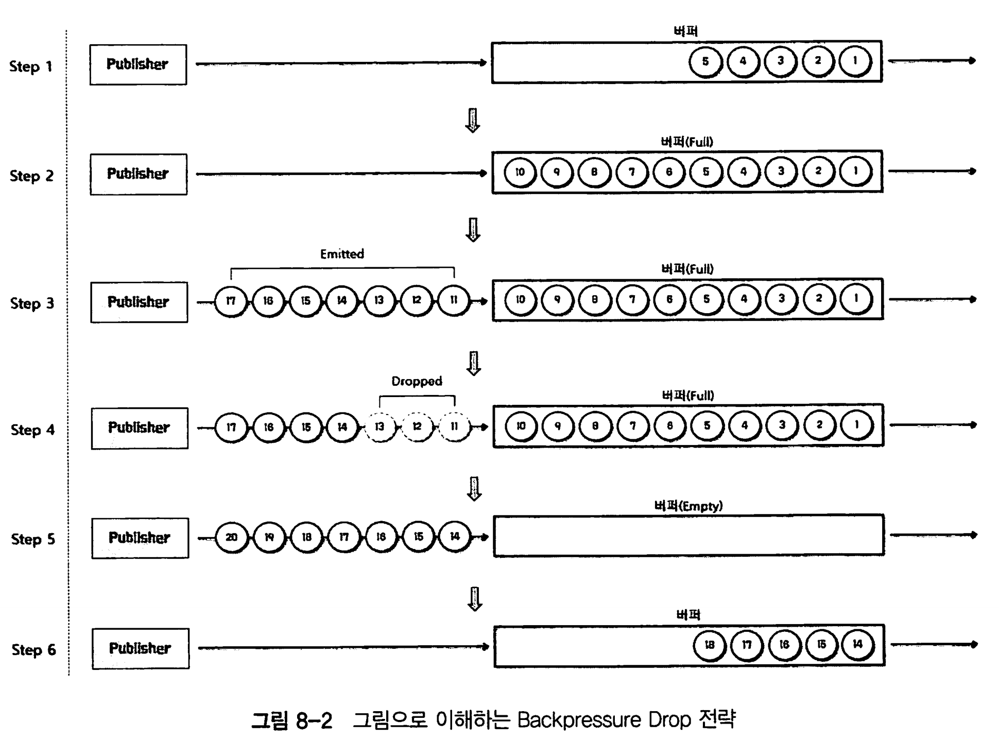
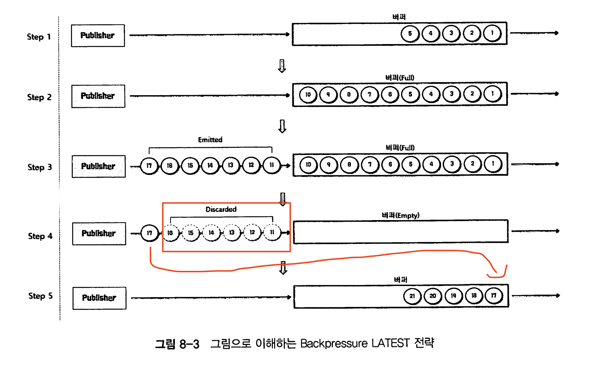

# Chapter 08 Backpressure

backpressure : Publisher로부터 전달받은 데이터를 안정적으로 처리하기 위한 수단

## Backpressure란?

배압, 또는 억압이라고 한다. 

리액티브 프로그래밍에서는 데이터가 스트림형태로 끊임없이 흐르는데 

Backpressure는 publisher가 emit하는 데이터스트림의 처리량을 조절하여 과부하가 걸리지 않도록 하는것이다.

생산속도가 소비속도보다 빠르면 과부하가 걸릴 수 있기 때문에, 소비자가 처리할 수 있는 데이터 양을 제어하여 안정성을 유지하고 메모리 부족이나 과부하를 방지하도록 한다. 

## Reactor에서 Backpressure 처리 방식

## 1. 데이터 개수 제어

Subscriber가 request() 메소드를 통해서 적절한 데이터 개수를 요청하는 방식이 있따. 

```java
@Slf4j
public class Example8_1 {
    public static void main(String[] args) {
        Flux.range(1, 5)
            .doOnRequest(data -> log.info("# doOnRequest: {}", data))
            .subscribe(new BaseSubscriber<>() {
				@Override
				protected void hookOnSubscribe(Subscription subscription) {
					request(1);
				}

				@SneakyThrows
				@Override
				protected void hookOnNext(Integer value) {
					Thread.sleep(2000L);
					log.info("# hookOnNext: {}", value);
					request(1);
				}
			});
    }
}


```

* 예제. publisher 데이터 emit 속도보다 subscriber 처리속도가 느린것을 재현하기 위해 sleep 추가.

1. **`hookOnSubscribe`**: 구독 시점에 호출되며, 첫 번째 데이터를 요청 (`request(1)`).

2. **`hookOnNext`**: 데이터를 받을 때마다 호출되며, 각 데이터를 처리한 후 다음 데이터를 하나씩 요청 (`request(1)`).

데이터 개수를 다음처럼 제어한다

- **초기 요청**: `request(1)`로 시작하여 하나의 데이터를 요청.
- **후속 요청**: 각 데이터 처리 후 (`hookOnNext`에서), 다음 데이터를 하나씩 추가로 요청.

이 방식으로 한 번에 하나의 데이터만 요청하고 처리하여, 소비자가 처리할 수 있는 속도로 데이터를 받아오게 된다 .

데이터 요청개수를 제안하고 싶다면 BaseSubscriber의 request(n)를 사용해서 데이터 요청 갯수를 제한할 수 있다.

## 2. BackPressure 전략 사용

### Reactor에서 제공하는 Backpressure 전략 종류

| 종류        | 설명                                                         |
| ----------- | ------------------------------------------------------------ |
| IGNORE 전략 | Backpressure를 적용하지 않는다.                              |
| ERROR 전략  | Downstream으로 전달할 데이터가 버퍼에 가득 찰 경우, Exception을 발생시키는 전략. |
| DROP 전략   | Downstream으로 전달할 데이터가 버퍼에 가득 찰 경우, 버퍼 밖에서 대기하는 먼저 emit된 데이터부터 Drop시키는 전략. |
| LATEST 전략 | Downstream으로 전달할 데이터가 버퍼에 가득 찰 경우, 버퍼 밖에서 대기하는 가장 최근에(나중에) emit된 데이터부터 버퍼에 채우는 전략. |
| BUFFER 전략 | Downstream으로 전달할 데이터가 버퍼에 가득 찰 경우, 버퍼 안에 있는 데이터부터 Drop시키는 전략. |

* IGNORE 사용시 Downstream(Subscriber 또는 중간 Operator)이 데이터를 처리할 수 없을 때 무시되므로, 버퍼가 가득 차거나 초과하여 `IllegalStateException`이 발생할 수 있다.

```java
Flux<Integer> flux = Flux.range(1, 10)
  .onBackpressureIgnore() // 이렇게 설정 
  .doOnNext(data -> System.out.println("Emitting: " + data));

```


ERROR 전략은 Downstream의 처리 속도가 느려서 Upstream을 따라가지 못할 경우 `IllegalStateException`이 발생할 수 있다. 이경우 Error Signal을 Subscriber에게 전송하고 삭제한 데이터는 **폐기한다**

```java
/**
 * Unbounded request 일 경우, Downstream 에 Backpressure Error 전략을 적용하는 예제
 *  - Downstream 으로 전달 할 데이터가 버퍼에 가득 찰 경우, Exception을 발생 시키는 전략
 */
@Slf4j
public class Example8_2 {
    public static void main(String[] args) throws InterruptedException {
        Flux
            .interval(Duration.ofMillis(1L))
            .onBackpressureError() // 전략 
            .doOnNext(data -> log.info("# doOnNext: {}", data)) // 처리하다가 터져버림 
            .publishOn(Schedulers.parallel())
            .subscribe(data -> {
                        try {
                            Thread.sleep(5L);
                        } catch (InterruptedException e) {}
                        log.info("# onNext: {}", data);
                    },
                    error -> log.error("# onError", error));

        Thread.sleep(2000L);
    }
}
```

* interval Operator로 0.001초마다 대량 데이터 emit
* Subscriber는 처리하는데 0.005초 걸림. 즉 결국에 과부하 발생 

Drop 전략은, Publisher가 전달한 데이터가 버퍼에 가득 찬 경우, 버퍼 밖에서 대기중인 먼저 Emit된 데이터부터 삭제하는 전략이며 페기된다.



* 그림을 보면 스텝3에서 대기중인 11, 12,13이 버퍼가 가득 차서 버려지고 그사이에 스텝5에서 버퍼가 비워져서 버퍼로 옮겨간다. 

```java
Flux.range(1, 100)
    .onBackpressureDrop()
    .subscribe(System.out::println);
```


LATEST 전략은 데이터가 버퍼에 가득 찬 경우, 새로운 데이터가 들어 오는 시점에 가장 최근의 데이터만 남겨 두고 나머지 데이터를 폐기한다. 즉 가장 뒤 데이터만 남겨두고, 앞에 버퍼 앞에서 대기하던 애들은 폐기한다. 



```java
Flux.range(1, 100)
    .onBackpressureLatest()
    .subscribe(System.out::println);
```


Buffer 전략은 버퍼가 가득 차면 버퍼 안의 데이터를 폐기한다. 즉 이전까지 전략과는 다르게, 버퍼 밖이 아닌 버퍼 내부를 폐기하는 것을 의미한다. 전략은 2가지로 나뉜다

1. DROP_LATEST전략

DROP_LATEST 전략은 가장 나중에 버퍼에 채워진(가장 바깥쪽 즉 최신) 데이터부터 DROP하면 폐기한 후, 이 공간에 emit된 데이터를 채우는 전략이다.

```java
Flux
    .interval(Duration.ofMillis(300L))
    .doOnNext(data -> log.info("# emitted by original Flux: {}", data))
    .onBackpressureBuffer(2,
            dropped -> log.info("** Overflow & Dropped: {} **", dropped),
            BufferOverflowStrategy.DROP_LATEST) // here
```

2. DROP_ORDEST

DROP_ORDEST전략은, 가장 오래된 데이터를 폐기한 후 이 공간에 emit된 새 데이터를 채우는 전략이다. 

```java
Flux
    .interval(Duration.ofMillis(300L))
    .doOnNext(data -> log.info("# emitted by original Flux: {}", data))
    .onBackpressureBuffer(2,
            dropped -> log.info("** Overflow & Dropped: {} **", dropped),
            BufferOverflowStrategy.DROP_OLDEST)
```


### 각 전략은 언제 적절할까? - 적절한 때와 부적절한 때 정리

- **IGNORE**: Downstream이 빠르게 처리할 수 있을 때 적절, 느릴 때 부적절.
- **ERROR**: 오류를 통해 Backpressure를 처리하고자 할 때 적절, 오류를 피하고 싶을 때 부적절.
- **DROP**: 최신 데이터만 중요한 경우 적절, 모든 데이터가 중요한 경우 부적절.
- **LATEST**: 최신 데이터만 중요하고 이전 데이터가 덜 중요한 경우 적절, 모든 데이터가 중요한 경우 부적절.
- **BUFFER**: 데이터 손실을 최소화하고자 할 때 적절, 버퍼를 넘어서면 데이터 손실이 발생할 때 부적절.

