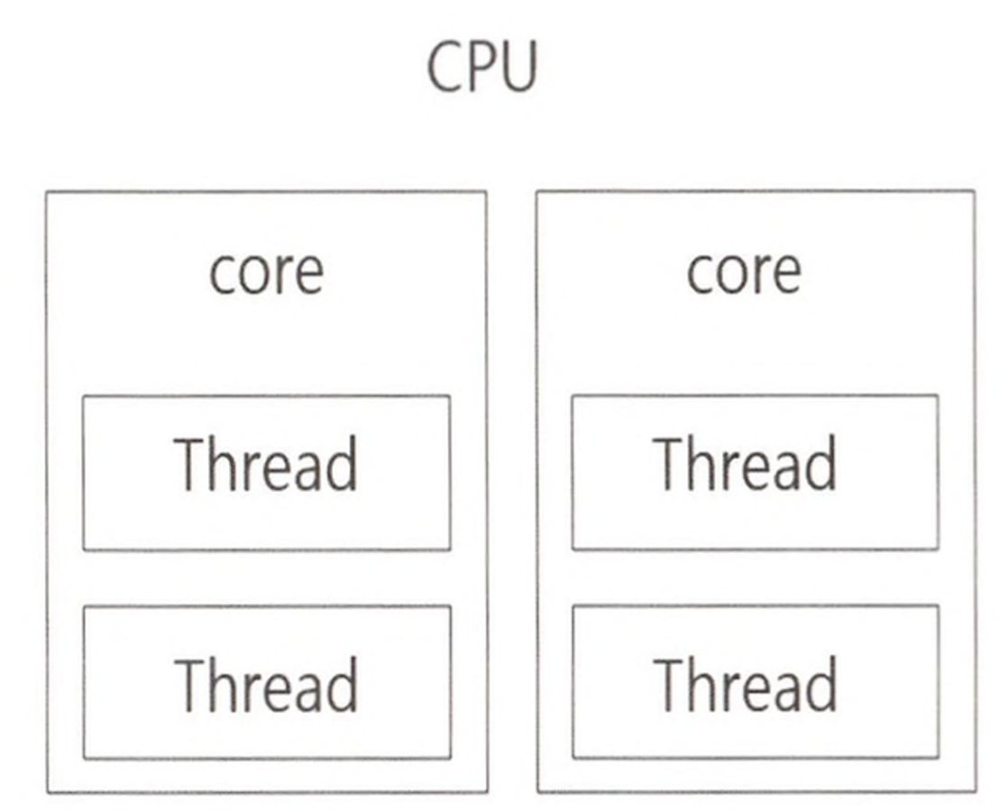
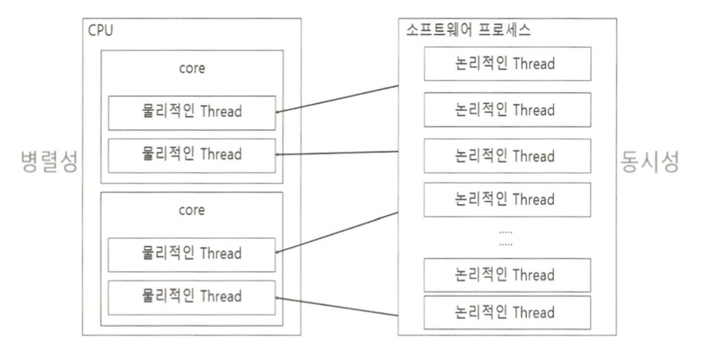
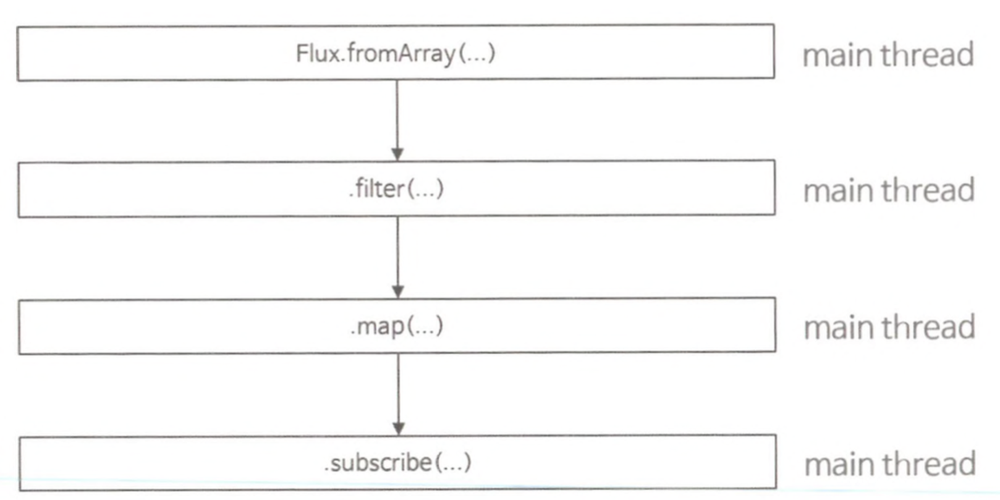
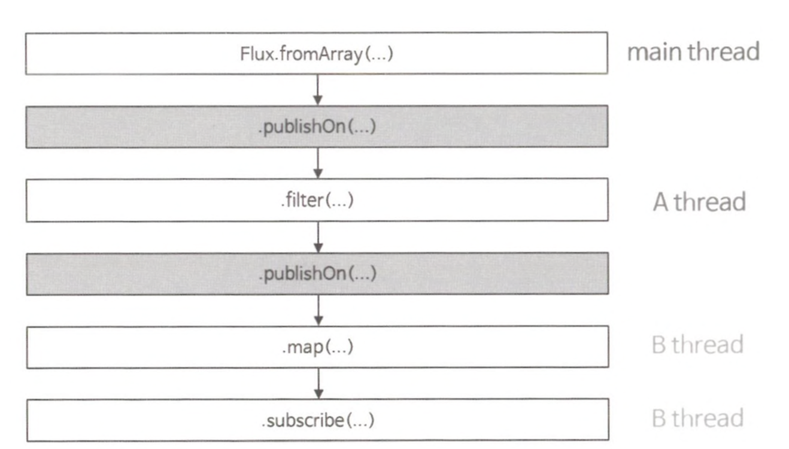
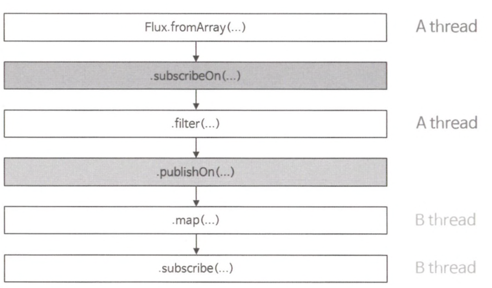

# Scheduler

## 스레드(Thread)의 개념 이해

Reactor에서 사용되는 Scheduler는 Reactor Sequence에서 사용되는 스레드를 관리해 주는 관리자 역할을 합니다.

컴퓨터 시스템에서 스레드는 크게 물리적인 스레드와 논리적인 스레드로 구분합니다.

### 물리적인 스레드



물리적인 코어를 논리적으로 나눈 것을 물리적인 스레드라고 합니다.

### 논리적인 스레드

논리적인 스레드는 소프트웨어 적으로 생성되는 스레드를 의미하며, Java 프로그래밍에서 사용되는 스레드가 이러한 논리적인 스레드라고 볼 수 있습니다.

논리적인 스레드는 우리가 프로그램이라 부르는 프로세스 내에서 실행되는 세부 작업의 단위가 됩니다.

논리적인 스레드는 이론적으로는 메모리가 허용하는 범위 내에서 얼마든지 만들 수 있지만 물리적인 스레드의 가용 범위 내에서 실행될 수 있습니다.

### 물리적인 스레드와 논리적인 스레드의 관계


위의 그림과 같이 물리적인 스레드는 병렬성과 관련이 있으며, 논리적인 스레드는 동시성과 관련이 있습니다.

병렬성은 물리적인 스레드가 실제로 동시에 실행되기 때문에 여러 작업을 동시에 처리함을 의미합니다.

동시성은 동시에 실행되는 것처럼 보이는 것을 의미합니다. (무수히 많은 논리적인 스레드가 물리적인 스레드를 빠른 속도로 번갈아 가며 사용하면서 마치 동시에 사용하는 것 처럼 보이게 함)

## Scheduler 란?

Reactor에서의 Scheduler는 운영체제에서 사용되는 Scheduler의 의미와 비슷합니다.

<aside>
💡 운영체제에서 Scheduler는 실행되는 프로그램인 프로세스를 선택하고 실행하는 등 프로세스의 라이프 사이클을 관리해 주는 관리자 역할을 합니다.

</aside>

Reactor에서도 Scheduler를 사용하여 어떤 스레드에서 무엇을 처리할지 제어하게 됩니다.

Scheduler를 사용하면 코드 자체가 매우 간결해지고 Scheduler가 스레드의 제어를 대신해 주기 때문에 개발자가 직접 스레드를 제어해야 하는 부담에서 벗어나게 됩니다.

## Scheduler를 위한 전용 Operator

### subscribeOn()

구독이 발생한 직후 실행될 스레드를 지정하는 오퍼레이터입니다.

구독이 발생하면 원본 Publisher가 데이터를 최초로 emit하게 되는데, subscribeOn() Operator는 구독 시점 직후에 실행되기 때문에 원본 Publisher의 동작을 수행하기 위한 스레드라고 볼 수 있습니다.

```java
    public static void main(String[] args) {
        Flux.fromArray(new Integer[]{1, 3, 5, 7})
                .subscribeOn(Schedulers.boundedElastic())
                .doOnNext(data -> log.info("# doOnNext : {}", data))
                .doOnSubscribe(subscription -> log.info("# doOnSubscribe"))
                .subscribe(data -> log.info("# onNext : {}", data));
    }
```

- subscribeOn() Operator를 추가했기 때문에 구독이 발생한 직후에 원본 Publisher의 동작을 처리하기 위한 스레드를 할당합니다.
- doOnNext() Operator를 사용해 원본 Flux에서 emit되는 데이터를 로그로 출력합니다.
- doOnSubscribe() Operator를 사용해 구독이 발생한 시점에 추가적인 어떤 처리가 필요할 경우 해당 처리 동작을 추가할 수 있습니다.

### publishOn()

Downstream으로 Signal을 전송할 때 실행되는 스레드를 제어하는 역할을 하는 Operator입니다.

publisherOn() Operator는 코드상에서 publishOn()을 기준으로 아래쪽인 Downstream의 실행 스레드를 변경합니다.

```java
    public static void main(String[] args) throws Exception {
        Flux.fromArray(new Integer[]{1, 3, 5, 7})
                .doOnNext(data -> log.info("# doOnNext : {}", data))
                .doOnSubscribe(subscription -> log.info("# doOnSubscribe"))
                .publishOn(Schedulers.parallel())
                .subscribe(data -> log.info("# onNext : {}", data));

        Thread.sleep(500L);
    }
```

### parallel()

subscribeOn() Operator와 publishOn() Operator의 경우, 동시성을 가지는 논리적인 스레드에 해당되지만 parallel() Operator는 병렬성을 가지는 물리적인 스레드에 해당됩니다.

parallel()의 경우 라운드 로빈 방식으로 CPU 코어 개수만큼의 스레드를 병렬로 실행합니다.

```java
    public static void main(String[] args) throws Exception {
        Flux.fromArray(new Integer[]{1, 3, 5, 7, 9, 11, 13, 15, 17, 19})
                .parallel()
                .runOn(Schedulers.parallel())
                .subscribe(data -> log.info("# onNext : {}", data));

        Thread.sleep(100L);
    }
```

<aside>
💡 Parallel() Operator만 추가한다고 해서 emit 되는 데이터를 병렬로 처리하지는 않습니다.
parallel() Operator는 emit되는 데이터를 CPU의 논리적인 코어 수에 맞게 사전에 골고루 분배하는 역할만 하며, 실제로 병렬 작업을 수행할 스레드의 작업은 runOn() Operator가 담당합니다.

</aside>

### 정리

- Reactor에서의 Scheduler는 비동기 프로그래밍을 위해 사용되는 스레드를 관리해주는 역할을 합니다.
- subscribeOn() Operator는 구독이 발생한 직후에, 실행될 스레드를 지정하는 Operator입니다.
- publishOn() Operator는 Downstream으로 Signal을 전송할 때 실행되는 스레드를 제어하는 역할을 하는 Operator입니다.
- parallel() Operator는 라운드 로빈 방식으로 CPU 코어 개수만큼의 스레드를 병렬로 실행합니다.

## PublishOn()과 subscribeOn()의 동작 이해

### publishOn()과 subscribeOn을 사용하지 않는 경우

publishOn()과 subscribeOn을 사용하지 않는 경우 Operator 체인은 다음과 같이 실행됩니다.


Operator 체인에 publishOn()을 추가하면 publishOn()에서 지정한 해당 Scheduler 유형의 스레드가 실행됩니다.

### publishOn()을 두 번 사용할 경우

publishOn()을 두 번 사용할 경우 Operator 체인은 다음과 같이 실행됩니다.



첫 번째 publishOn을 추가했을 때는 A thread에서 실행되고 두 번째 publishOn을 추가하게 되면 이후의 Operator 체인은 B 스레드에서 실행됩니다.

### subscribeOn()과 publishOn()을 함께 사용하는 경우

subscribeOn()과 publishOn()을 함께 사용하는 경우 Operator 체인은 다음과 같이 실행됩니다.


subscribeOn() Operator는 구독이 발생한 직후에 실행될 스레드를 지정하는 스레드이기 때문에 fromArray()는 A 스레드에서 실행됩니다.

그리고 별도의 publishOn()이 추가되지 않았기 때문에 filter() Operator는 여전히 A 스레드에서 실행됩니다.

마지막으로 publishOn()이 추가된 이후의 Operator 체인은 B 스레드에서 실행됩니다.

### 정리

- publsihOn()과 subscribeOn()의 특징
    - publishOn() Operator는 한 개 이상 사용할 수 있으며, 실행 스레드를 목적에 맞게 적절하게 분리할 수 있습니다.
    - subscribe() Operator와 publishOn() Operator를 함께 사용해서 원본 Publisher에서 데이터를 emit하는 스레드와 emit된 데이터를 가공 처리하는 스레드를 적절하게 분리할 수 있습니다.
    - subscribeOn()은 Operator 체인상에서 어떤 위치에 있든 간에 구독 시점 직후, 즉 Publisher가 데이터를 emit하기 전에 실행 스레드를 변경합니다.

## Scheduler의 종류

### Schedulers.immediate()

별도의 스레드를 추가적으로 생성하지 않고 현재 스레드에서 작업을 처리하고자 할 때 사용합니다.

Scheduler가 필요한 API가 있지만 별도의 스레드를 추가로 할당하고 싶지 않을 때 사용합니다.

### Schedulers.single()

스레드 하나만 생성해서 Scheduler가 제거되기 전까지 재사용하는 방식입니다.

Schedulers.single()을 통해 하나의 스레드를 재사용하면서 다수의 작업을 처리할 수 있는데, 하나의 스레드로 다수의 작업을 처리해야 하므로 지연 시간이 짧은 작업을 처리하는 것이 효과적입니다.

### Schedulers.newSingle()

Schedulers.newSingle()은 호출할 때마다 매번 새로운 스레드를 하나 생성하여 사용합니다.

Schedulers.newSingle()은 두번째로 인자로 데몬스레드 여부를 전달받습니다.

<aside>
💡 데몬 스레드는 보조 스레드라고도 불리며, 주 스레드가 종료되면 자동으로 종료됩니다.

</aside>

### Schedulers.boundedElastic()

ExecutorService 기반의 스레드 풀을 생성한 후, 그 안에서 정해진 수 만큼의 스레드를 사용하여 작업을 처리하고 작업이 종료된 스레드는 반납하여 재사용하는 방식입니다.

기본적으로 CPU 코어 수 x 10 만큼의 스레드를 생성하며, 풀에 있는 모든 스레드가 작업을 처리하고 있다면 이용 가능한 스레드가 생길 때까지 최대 100,000개의 작업이 큐에서 대기할 수 있습니다.

데이터 베이스를 통한 질의나 HTTP 요청 같은 Blocking I/O 작업을 통해 전달받은 데이터를 데이터 소스로 사용하는 경우가 많습니다.

Schedulers.boundedElastic()은 바로 이러한 Blocking I/O 작업을 효과적으로 처리하기 위한 방식입니다.

실행 시간이 긴 Blocking I/O 작업이 포함된 경우, 다른 Non-Blocking 처리에 영향을 주지 않도록 전용 스레드를 할당해서 Blocking I/O 작업을 처리하기 때문에 처리 시간을 효율적으로 사용할 수 있습니다.

### Schedulers.parallel()

Non-Blocking I/O에 최적화 되어 있는 Scheduler로서 CPU 코어 수 만큼의 스레드를 생성합니다.

### Schedulers.fromExecutorService()

기존에 이미 사용하고 있는 ExecutorService가 있다면 이 ExecutorService로 부터 Scheduler를 생성하는 방식입니다.

ExecutorService로 부터 직접 생성할 수 있지만 Reactor에서는 이 방식을 권장하지 않습니다.

### Schedulers.newXXX()

Scheduler.single(), Schedulers.boundedElastic(), Schedulers.parallel()은 Reactor에서 제공하는 디폴트 Scheduler 인스턴스를 사용합니다.

하지만 필요하다면 newXXX()와 같은 형식으로 새로운 Scheduler 인스턴스를 생성할 수 있습니다.

이때 스레드 이름, 생성 가능한 디폴트 스레드의 개수, 스레드의 유휴 시간, 데몬 스레드로의 동작 여부 등을 직접 지정해서 커스텀 스레드 풀을 새로 생성할 수 있습니다.