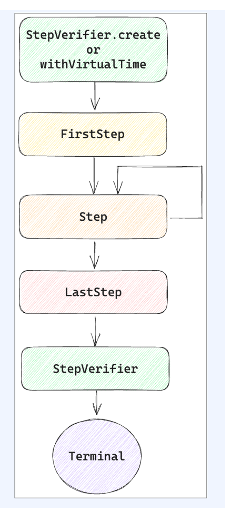

# Chapter 13 Testing

reactor는 테스트하기 어렵다.

비동기적으로 동작하기 때문에, 테스트 스레드보다 늦게 종료될 수 있기도 하고 실행을 예측할 수 없기 때문이다.
blocking하게 동작하지 않기 때문에 함수를 실행하고 기다리는 것이 애매..
그래서 도구들을 사용해야 한다.

먼저 다음 의존성을 추가한다

```groovy
dependencies {
    implementation 'io.projectreactor.addons:reactor-extra:3.4.8'
}
```


## StepVerifier를 사용한 테스팅

일반적인 테스트 방식. 

구독시점에 해당 Operator 체인이 시나리오대로 동작하는지를 테스트 하는것이다.

* ex) 다음에 발생할 signal이 무엇인지, 기대하던 데이터가 emit되었는지 등등

StepVerifier를 사용하면 Publisher가 제공하는 다양한 이벤트를 차례로 검증 가능하다.

```java
public interface StepVerifier {
  StepVerifier log ();
	Duration verify() throws AssertionError:
	Duration verify(Duration duration) throws AssertionError:
	Assertions verifyThenAssertThat();
	Assertions verifyThenAssertThat (Duration duration);
}
```

- verify: 호출되는 시점부터 Publisher에 대한 검증 시작.
  -  onComplete, onError 이벤트가 발생하거나 cancel 되면 block 해제
- 기본적으로 timeout 없이 계속 기다린다
  -  Duration을 제공하여 특정 시간동안만 block하게 만들 수 있다
- verifyThenAssertThat: verify와 동일하게Publisher를 검증하고 Assertions를 반환하여 모든 이벤트가 종료된 시점에서 추가 검증 가능
  - Duration을 제공하여 특정 시간동안만 block하게

자세히보면 다음과 같은 단계로 이루어져 있음.



- StepVerifier는 FirstStep, Step, LastStep 으 로 구성
- Firststep은 처음 받는 이벤트인 onSubscription과 관련
    - 0..1
- Step은 이후에 들어오는 이벤트들을 순차적으로 검증
    - 0..N
- Laststep은 최종 결과를 검증
    - 1

*  검증에 실패한다면 테스트 실패

### Signal Event 테스트

Signal 이벤트가 발생했는지 테스트한다.

```java
public class ExampleTest13_1 {
    @Test
    public void sayHelloReactorTest() {
        StepVerifier
                .create(Mono.just("Hello Reactor")) // 테스트 대상 Sequence 생성
                .expectNext("Hello Reactor")    // emit 된 데이터 검증
                .expectComplete()   // onComplete Signal 검증
                .verify();          // 검증 실행.
    }
}
```

* create를 통해 시퀀스 생성
* expectXXX를 통해 예상되는 Signal의 emit 값을 검증
* verify() 호출하여 검증 실행

### expectXXX의 검증 메소드 종류

| 메서드                                               | 설명                                                         |
| ---------------------------------------------------- | ------------------------------------------------------------ |
| `expectSubscription()`                               | 구독이 이루어짐을 기대한다.                                  |
| `expectNext(T t)`                                    | `onNext` 신호를 통해 전달되는 값이 파라미터로 전달된 값과 같음을 기대한다. |
| `expectComplete()`                                   | `onComplete` 신호가 전송되기를 기대한다.                     |
| `expectError(Class<? extends Throwable> error)`      | `onError` 신호가 전송되기를 기대한다.                        |
| `expectNextCount(long count)`                        | 구독 시점 또는 이전 `expectNext()`를 통해 기댓값이 평가된 데이터 이후부터 emit된 수를 기대한다. |
| `expectNoEvent(Duration duration)`                   | 주어진 시간 동안 신호 이벤트가 발생하지 않았음을 기대한다.   |
| `expectAccessibleContext()`                          | 구독 시점 이후에 Context가 전파되었음을 기대한다.            |
| `expectNextSequence(Iterable<? extends T> iterable)` | emit된 데이터들이 파라미터로 전달된 `Iterable`의 요소와 일치함을 기대한다. |

### verifyXXX 의 검증 메소드 종류 

| 메서드                                          | 설명                                                         |
| ----------------------------------------------- | ------------------------------------------------------------ |
| `verify()`                                      | 검증을 트리거한다.                                           |
| `verifyComplete()`                              | 검증을 트리거하고, `onComplete` 신호를 기대한다.             |
| `verifyError(Class<? extends Throwable> error)` | 검증을 트리거하고, `onError` 신호를 기대한다.                |
| `verifyTimeout(Duration duration)`              | 검증을 트리거하고, 주어진 시간이 초과되어도 Publisher가 종료되지 않음을 기대한다. |

### 시간 기반(time-based) 테스트

StepVerifier는 가상의 시간을 이용해 미래에 실행되는 ReactorSequence의 시간을 앞당겨 테스트할 수 있는 기능을 지원한다. 

```java
public class TimeBasedTestExample {
    public static Flux<Tuple2<String, Integer>> getCOVID19Count(Flux<Long> source) {
        return source
                .flatMap(notUse -> Flux.just(
                                Tuples.of("서울", 10),
                                Tuples.of("경기도", 5),
                                Tuples.of("강원도", 3),
                                Tuples.of("충청도", 6),
                                Tuples.of("경상도", 5),
                                Tuples.of("전라도", 8),
                                Tuples.of("인천", 2),
                                Tuples.of("대전", 1),
                                Tuples.of("대구", 2),
                                Tuples.of("부산", 3),
                                Tuples.of("제주도", 0)
                        )
                );
    }

    public static Flux<Tuple2<String, Integer>> getVoteCount(Flux<Long> source) {
        return source
                .zipWith(Flux.just(
                                Tuples.of("중구", 15400),
                                Tuples.of("서초구", 20020),
                                Tuples.of("강서구", 32040),
                                Tuples.of("강동구", 14506),
                                Tuples.of("서대문구", 35650)
                        )
                )
                .map(Tuple2::getT2);
    }
}
```

* Tuples는 서로 다른 타입의 데이터를 저장할 수 있는 Collection

위 코드는 아래처럼 테스트할 수 있다.

```java
/**
 * StepVerifier 활용 예제
 * - 주어진 시간을 앞당겨서 테스트 한다.
 */
public class ExampleTest13_7 {
    @Test
    public void getCOVID19CountTest() {
        StepVerifier
                // 가상 시간(Virtual Time)을 사용하여 테스트를 수행
                .withVirtualTime(() -> TimeBasedTestExample.getCOVID19Count(
                                // Flux.interval을 사용하여 1시간 간격으로 값을 생성
                                Flux.interval(Duration.ofHours(1)).take(1)
                        )
                )
                // 구독 기대
                .expectSubscription()
                // VirtualTimeScheduler를 사용하여 시간을 1시간 앞으로 이동
                .then(() -> VirtualTimeScheduler
                                    .get()
                                    .advanceTimeBy(Duration.ofHours(1)))
                // 11개의 onNext 신호가 emit되는 것을 기대
                .expectNextCount(11)
                // onComplete 신호가 전송되기를 기대
                .expectComplete()
                // 검증을 트리거
                .verify();
    }
}

```

`TimeBasedTestExample.getCOVID19Count` 메서드가 특정 시간 간격(여기서는 1시간)마다 값을 생성하고, 일정 수의 값을 생성한 후 완료되는지를 검증하는 테스트이다.

이런 테스트도 가능하다.

3초 내에 검증이 끝나지 않으면 실패한것으로 간주한다.

```java
public class ExampleTest13_8 {
    @Test
    public void getCOVID19CountTest() {
        StepVerifier
                .create(TimeBasedTestExample.getCOVID19Count(
                                Flux.interval(Duration.ofMinutes(1)).take(1)
                        )
                )
                .expectSubscription()
                .expectNextCount(11)
                .expectComplete()
                .verify(Duration.ofSeconds(3));
    }
}

```

* Duration.ofSeconds로 바꿔서 테스트하면 통과한다. 왜? 3초내로 통과했으니까 

`Flux.interval(Duration.ofMinutes(1)).take(1)`을 입력으로 받아서, 1분 간격으로 값을 생성하고, 총 11개의 값을 생성한 후 완료되는지를 검증하려는 것


시간과 관련된 기능을 지원하기 위해 withVirtualTime을 제공한다.

withVirtualTime으로 FirstStep을 생성하면 기존의 Scheduler를 VirtualTimeScheduler로 대체한다.

VirtualTimeScheduler는 delay와 관련된 함 수들을 실제로 대기하는 대신 건너뛸 수 있는 기능을 제공한다. 

```java
public class FirstStepWithVirtualTimeExampleTest {
    @Test
    void test2() {   // 제대로 동작 안함. 5초 걸림 
        var flux = Flux.range(0, 5)
                        .delayElements(Duration.ofSeconds(1));

        StepVerifier.withVirtualTime(() -> flux)
                .thenAwait(Duration.ofSeconds(5))
                .expectNextCount(5)
                .verifyComplete();
    }
    
    @Test
    void test3() {  // 제대로 동작. 금방 끝남 
        // var flux = Flux.range(0, 5)
        //     .delayElements(Duration.ofSeconds(1));

        StepVerifier.withVirtualTime(() ->  Flux.range(0, 5)
                .delayElements(Duration.ofSeconds(1)))
            .thenAwait(Duration.ofSeconds(5))
            .expectNextCount(5)
            .verifyComplete();
    }
}
```

* 만약 Supplier 바깥에서 FluX를 만들고 생성 된 flux를 전달하면 제대로 동작하지 않는다

```java
interface Step<T> extends LastStep {
	Step<T> thenAwait (Duration timeshift);
	Step<T> expectNoEvent (Duration duration):
}
```

-  thenAwait: 주어진 시간을 대기
    -  withVirtualTime와 함께 사용되어 실제 시간을 기다리는 대신 건너뛴다
-  expectNoEvent: 주어진 시간동안 이벤트가 발생하지 않기를 기대
    -  실제 시간을 기다리는 대신 주어진 시간을 건너뛰고 그동안 이벤트가 발생했는지 검증

```java
public class WithVirtualTimeTest {
    @Test
    void test1() {
        StepVerifier.withVirtualTime(() -> {
                    return Flux.range(0, 5)
                            .delayElements(Duration.ofHours(1));
                })
                .thenAwait(Duration.ofHours(2))
                .expectNextCount(2)
                .thenAwait(Duration.ofHours(3))
                .expectNextCount(3)
                .verifyComplete();
    }

    @Test
    void test2() {
        StepVerifier.withVirtualTime(() -> {
                    return Mono.delay(Duration.ofDays(10));
                })
                .expectSubscription()
                .expectNoEvent(Duration.ofDays(9))
                .thenAwait(Duration.ofDays(1))
                .expectNext(0L)
                .verifyComplete();
    }
}
```

* 1시간 간격으로 0부터 4까지 값을 생성하는 Flux 생성
  * thenAwait을 이용해서 2시간 대기 -> 2시간이므로 2개 요소 방출
  * 다시 thenAwait을 이용해서 3시간 대기 후 -> 3개 요소 방출
  * 실제 테스트시간은 1초도 걸리지않음

* 10일도 똑같다. 


### Backpressure 테스트

백프레셔는 데이터 생산자와 소비자 사이의 데이터 흐름을 조절하는 메커니즘. 소비자가 과부하 걸리지 않게 조절(배압)하는것

```java
public class BackpressureTestExample {
    public static Flux<Integer> generateNumber() {
        return Flux
                .create(emitter -> {
                    for (int i = 1; i <= 100; i++) {
                        emitter.next(i);
                    }
                    emitter.complete();
                }, FluxSink.OverflowStrategy.ERROR);
    }
}
```

* 100개의 숫자를 emit. 처리하지 못하고 오버플로가나면 OverFlowException이 발생한다. 

아래 테스트로 에러가 나는것을 검증할 수 있다.

```java
public class ExampleTest13_12 {
    @Test
    public void generateNumberTest() {
        StepVerifier
                .create(BackpressureTestExample.generateNumber(), 1L)
                .thenConsumeWhile(num -> num >= 1)
                .expectError()
                .verifyThenAssertThat()
                .hasDroppedElements();
    }
}
```

* 왜 에러가 나냐고? 100개 중 1개만 요청했으니까.

성공하는 테스트를 하고싶다면?

```java
// 실패하는 테스트
public class ExampleTest13_11 {
    @Test
    public void generateNumberTest() {
        StepVerifier
                .create(BackpressureTestExample.generateNumber(), 1L)
                .thenConsumeWhile(num -> num >= 1)
                .verifyComplete();
    }
}

// 성공하는 테스트
public class ExampleTest13_11 {
    @Test
    public void generateNumberTest() {
        StepVerifier
            .create(BackpressureTestExample.generateNumber(), 1L) // 초기 요청량을 1로 설정
            .thenRequest(99) // 추가로 99개의 아이템을 요청하여 총 100개를 요청
            .expectNextCount(100) // 100개의 아이템이 올 것을 기대
            .verifyComplete(); // onComplete 신호가 올 것을 기대
    }
}

```

### Context 테스트

값, 상태 등을 저장하는 Context도 테스트가 가능하다.

### 

```java
interface Step<T> extends LastStep {
	ContextExpectations<T> expectAccessibleContext();
	
	Step<T> expectNoAccessibleContext();
}
```

- Publisher에 전파되는 Context를 검증
- expectAccessibleContext: onSubscribe  이벤트 이후 전파된 Context가 있는지 검증
    - 전파된 Context가 없다면 테스트 실패
- ContextExpectations를 반환하여 Context와 관련된 추가 검증 가능
- expectNoAccessibleContext:  onSubscribe 이벤트 이후 전파되는 Context가 없는지 검증
    - 전파된 Context가 있다면 테스트 실패

```java
interface ContextExpectations<T> {
    ContextExpectations<T> hasKey(Object key);
    ContextExpectations<T> hasSize(int size);
    ContextExpectations<T> contains(Object key, Object value);
    ContextExpectations<T> containsAllOf(Context other);
    ContextExpectations<T> containsAllOf(Map<?, ?> other);
    ContextExpectations<T> containsOnly(Context other);
    ContextExpectations<T> containsOnly(Map<?, ?> other);
    ContextExpectations<T> assertThat(Consumer<Context> assertingConsumer);
    ContextExpectations<T> matches(Predicate<Context> predicate);
    ContextExpectations<T> matches(Predicate<Context> predicate, String description);
    Step<T> then();
}
```

- haskey: Context에 특정한 key을 갖는지 검증
- hassize: Context에 특정한 size를 갖는지 검증
- contains: Context에 특정한 key에 특정한 값을 가지 고 있는지 검증
- containsAllof: 다른 Context 혹은 Map에 포함된 값 들을 모두 포함하는지 검증
- containsonly: 다른 Context, Map에 포함된 값들을 모두 포함하는지 검증. 그 이외의 값은 가지면 안된다 
- assertThat: Consumer를 통해서 Context를 인자 로 전달받고 JUnit의 Assertions 등을 통해서 비교 matches: Context를 인자로 전달받고 기대와 일치하 는 경우 true를 반환하는 Predicate을 통해 검증
- then: ContextExpectations를 종료하고 Step으로 복귀

```java
public class StepContextExampleTest {
    @Test
    void test1() {
        var flux = Flux.range(0, 5);

        StepVerifier.create(flux)
                .expectNoAccessibleContext()
                .expectNextCount(5)
                .verifyComplete();
    }

    @Test
    void test2() {
        var flux = Flux.range(0, 5)
                .contextWrite(Context.of("foo", "bar"));

        StepVerifier.create(flux)
                .expectAccessibleContext()
                .contains("foo", "bar").then()
                .expectNextCount(5)
                .verifyComplete();
    }

    @Test
    void test3() {
        var flux = Flux.range(0, 5);

        var options = StepVerifierOptions.create()
                .withInitialContext(Context.of("foo", "bar"));

        StepVerifier.create(flux, options)
                .expectAccessibleContext()
                .contains("foo", "bar").then()
                .expectNextCount(5)
                .verifyComplete();
    }
}
```

- test1에서는 Context가 전파되지 않기 때문에 expectNoAccessibleContext 
- test2에서는 contextwrite을 통해서 Context 생성
    - expectAccessibleContext가 통과되고 contains를 통해서 기대하는 값이 존재하는지확인 
- test3에서는 StepVerifierOptions를 통해Context를 주입
- StepVerifierOptions를 통해 Context를 주 입하는 것은 subscribe에서 Conntext 주입과 비슷

```java
public class ContextTestExample {
	public static Mono<String> getSecretMessage(Mono<String> keySource) {
		return keySource
			.zipWith(Mono.deferContextual(ctx ->
				Mono.just((String)ctx.get("secretKey"))))
			.filter(tp ->
				tp.getT1().equals(decode(tp.getT2()))
			)
			.transformDeferredContextual(
				(mono, ctx) -> mono.map(notUse -> ctx.get("secretMessage"))
			);
	}

	private static String decode(String key) {
		return new String(Base64.getDecoder()
			.decode(key));
	}

}
```

다른 예시.

* 하나는 base64로 인코딩된 secret key, 하나는 secret message 저장.

```java
public class ExampleTest13_14 {

    @Test
    public void getSecretMessageTest() {
        // Mono<String> 타입의 소스를 생성
        Mono<String> source = Mono.just("hello");

        // StepVerifier로 Mono의 동작을 검증
        StepVerifier
                .create(
                    // getSecretMessage 메소드 호출로 Mono 생성
                    ContextTestExample
                        .getSecretMessage(source)
                        // contextWrite로 context에 "secretMessage" 추가
                        .contextWrite(context ->
                                        context.put("secretMessage", "Hello, Reactor"))
                        // contextWrite로 context에 "secretKey" 추가
                        .contextWrite(context -> context.put("secretKey", "aGVsbG8="))
                )
                .expectSubscription() // 구독 검증
                .expectAccessibleContext() // 컨텍스트 접근 검증
                .hasKey("secretKey") // "secretKey" 존재 검증
                .hasKey("secretMessage") // "secretMessage" 존재 검증
                .then() // 다음 검증 단계로 이동
                .expectNext("Hello, Reactor") // "Hello, Reactor" 값 방출 검증
                .expectComplete() // 완료 검증
                .verify(); // 검증 실행
    }

}
```

- **contextWrite**: Reactor 컨텍스트를 수정하는 데 사용.  "secretMessage"와 "secretKey"라는 키-값 쌍을 컨텍스트에 추가
- **expectSubscription**: Mono가 정상적으로 구독되는지 확인
- **expectAccessibleContext**: 컨텍스트에 접근할 수 있는지 확인
- **hasKey**: 컨텍스트에 특정 키가 존재하는지 검증
- **expectNext**: Mono가 특정 값을 방출하는지 확인
- **expectComplete**: Mono의 작업이 정상적으로 완료되는지 확인
- **verify**: 설정된 모든 검증 단계를 실행

### Record 기반 테스트

구체적인 조건으로 Assertion 해야 한다면? ex -> assertThat


* 방출된 아이템의 첫번째 문자가 대문자인지 검증 

```java
public class RecordTestExample {
    public static Flux<String> getCapitalizedCountry(Flux<String> source) {
        return source
            .map(country -> country.substring(0, 1).toUpperCase() + country.substring(1))
            .doOnNext(country -> System.out.println("Capitalized Country: " + country));
    }
}
// 검증
public class ExampleTest13_16 {
    @Test
    public void getCountryTest() {
        StepVerifier
                .create(RecordTestExample.getCapitalizedCountry(
                        Flux.just("korea", "england", "canada", "india")))
                .expectSubscription()
                .recordWith(ArrayList::new)
                .thenConsumeWhile(country -> !country.isEmpty())
                .consumeRecordedWith(countries -> {
                    assertThat(
                            countries
                                    .stream()
                                    .allMatch(country ->
                                            Character.isUpperCase(country.charAt(0))),
                            is(true)
                    );
                })
                .expectComplete()
                .verify();
    }
}
```

-  expectSubscription()으로 구독이 발생함을 기대
-  recordWith()로 emit된 데이터에 대한 기록을 시작
-  thenConsumeWhile()로 파라미터로 전달한 Predicate과 일치하는 데이터 는 다음 단계에서 소비할 수 있도록 한다.
-  consumeRecordedWith()로 컬렉션에 기록된 데이터를 소비
    - 여기서는 모든 데이터의 첫 글자가 대문자인지 여부를 확인함으로써 getCapitalizedCountry() 메서드를 Assertion 합니다.
-  expectComplete()으로 onComplete Signal이 전송됨을 기대


### StepVerifier를 사용한 테스트 유형 정리

-  Reactor Sequence에서 발생하는 Signal 이벤트를 테스트할 수 있다.
-  withVirtualTime()과 VirtualTimeScheduler() 등을 이용해서 시간 기반 테스트를 진행할 수 있다.
-  thenConsumeWhile)을 이용해서 Backpressure 테스트를 진행할 수 있다.
-  expectAccessibleContext()를 이용해서 Sequence에 전파되는 Context를 테스트 할 수 있다.
-  recordWith(), consumeRecordedWth(), expectRecordedMatches) 등을 이용해서 Record 기반 테스트를 진행할 수 있다.


## TestPublisher를 사용 한 테스팅

reactor-test 모듈에서 지원하는 테스트 전용 Publisher인 TestPublisher를 이용할 수 있다.


### Well behaved TestPublisher (정상 동작하는 퍼블리셔)

개발자가 직접 Signal을 발생시켜 원하는 상황을 미세하게 재연할 수 있다.

```java
public class ExampleTest13_18 {
    @Test
    public void divideByTwoTest() {
        TestPublisher<Integer> source = TestPublisher.create();

        StepVerifier
                .create(GeneralTestExample.divideByTwo(source.flux()))
                .expectSubscription()
                .then(() -> source.emit(2, 4, 6, 8, 10))
                .expectNext(1, 2, 3, 4)
                .expectError()
                .verify();
    }
}
```

* TestPublisher.create()로 생성
* source.flux()로 테스트 대상 메소드에 파라미터를 전달
* emit()을 사용해 필요한 데이터를 emit

**TestPublisher가 발생시키는 Signal 유형**

-  next(T) 또는 next(T, T...): 1개 이상의 onNext Signal을 발생시킵니다.
-  emit(T..): 1개 이상의 onNext Signal을 발생시킨 후, onComplete Signal을 발생시킵
-  complete(): onComplete Signal을 발생시킵니다.
-  error(Throwable): onError Signal을 발생시킵니다

### Misbehaving TestPublisher (오동작하는 퍼블리셔)

오동작하는 TestPublisher를 생성하여 리액티브의 Spec을 위반하는 상황이 발생하는지 테스트할 수 있다.

즉 주로 테스트 환경에서 의도적으로 비정상적인 동작을 유발하기 위해 사용한다.

이를 통해 애플리케이션의 에러 처리 및 예외 상황에 대한 반응을 확인하고, 해당 코드가 예상대로 작동하는지 검증할 수 있다. 

```java
public class ExampleTest13_19 {
    @Test
    public void divideByTwoTest() {
        TestPublisher<Integer> source = TestPublisher.create();
//        TestPublisher<Integer> source =
//                TestPublisher.createNoncompliant(TestPublisher.Violation.ALLOW_NULL);

        StepVerifier
                .create(GeneralTestExample.divideByTwo(source.flux()))
                .expectSubscription()
                .then(() -> {
                    getDataSource().stream()
                            .forEach(data -> source.next(data));
                    source.complete();
                })
                .expectNext(1, 2, 3, 4, 5)
                .expectComplete()
                .verify();
    }

    private static List<Integer> getDataSource() {
        return Arrays.asList(2, 4, 6, 8, null);
    }
}

```

* 실행 결과를 보면, TestPublisher가 OnNext Signal을 전송하는 과정에서 NulPointerException이 발생했다는 것을 알 수 있다.

**오통작하는(Misbehaving) TestPublisher를 생성하기 위한 위반(Violation) 조건**

-  ALLOW NULL : 전송할 데이터가 nuill이어도 NullpointerException을 발생시키지 않고 다음 호출을 진행할 수 있도록 한다.
-  CLEANUP_ON_TERMINATE: onComplete, onError, emit 같은 Terminal Signal을 연달아 여러 번 보낼 수 있도록 한다.
-  DEFER_CANCELLATION: cancel Signal을 무시하고 계속해서 Signal을 emit할 수 있도록 한다.
-  REQUEST_OVERFLOW: 요청 개수보다 더 많은 Signal이 발생하더라도 IlegaStateException을 발생시키지 않고 다음 호출을 진행할 수 있도록 한다.


## PublisherProbe를 사용한 테스팅

reactor-test 모듈은 PublisherProbe를 이용해 Sequence의 실행 경로를 테스트할 수 있다.

주로 조건에 따라 Sequence가 분기되는 경우, Sequence의 실행 경로를 추적해 서 정상적으로 실행되었는지 테스트할 수 있다.

1. **조건부 분기 검증**:
   - 리액티브 시퀀스가 조건에 따라 다른 경로로 분기될 때, 각 경로가 올바르게 실행되는지 확인할 수 있다.
   - 예를 들어, 조건에 따라 다른 Publisher를 구독하는 상황에서 어떤 경로가 실행되었는지 검증한다.
2. **실행 경로 추적**:
   - `PublisherProbe`를 사용하여 특정 리액티브 시퀀스가 실행되었는지 추적할 수 있다.
   - 이를 통해 원하는 실행 경로를 테스트하고, 기대한 대로 동작하는지 확인한다.

예시

```java
public class PublisherProbeTestExample {
  // supplyMainPower 메소드는 메인 전력을 공급하는 리액티브 시퀀스를 반환
    public static Mono<String> processTask(Mono<String> main, Mono<String> standby) {
        return main.flatMap(Mono::just)
                .switchIfEmpty(standby); // publisher가 emit없이 종료되면 대체  publisher가 emit함 
    }

  // supplyStandbyPower 메소드는 스탠바이 전력을 공급하는 리액티브 시퀀스를 반환
    public static Mono<String> supplyMainPower() {
        return Mono.empty();
    }

  // supplyStandbyPower 메소드는 스탠바이 전력을 공급하는 리액티브 시퀀스를 반환
    public static Mono supplyStandbyPower() {
        return Mono.just("# supply Standby Power");
    }
}

public class ExampleTest13_21 {

    // publisherProbeTest 메소드는 PublisherProbe를 사용하여 리액티브 시퀀스의 동작을 검증
    @Test
    public void publisherProbeTest() {
        // PublisherProbe를 생성. supplyStandbyPower()는 스탠바이 전력을 제공하는 리액티브 시퀀스
        PublisherProbe<String> probe = PublisherProbe.of(PublisherProbeTestExample.supplyStandbyPower());

        // StepVerifier를 사용하여 리액티브 시퀀스를 검증
        StepVerifier
                .create(PublisherProbeTestExample
                        .processTask(
                                PublisherProbeTestExample.supplyMainPower(), // 메인 전력 공급
                                probe.mono()) // 스탠바이 전력 공급
                )
                .expectNextCount(1) // 하나의 아이템 방출 기대
                .verifyComplete(); // 시퀀스 완료 검증

        // PublisherProbe 검증
        probe.assertWasSubscribed(); // 구독되었는지 확인
        probe.assertWasRequested(); // 요청되었는지 확인
        probe.assertWasNotCancelled(); // 취소되지 않았는지 확인
    }
}
```

다른 예제를 보자. 

```java
public class PublisherProbeExample {
    public static void main(String[] args) {
        // 성공 시 시퀀스
        PublisherProbe<String> successProbe = PublisherProbe.of(Flux.just("Success"));
        
        // 실패 시 시퀀스
        PublisherProbe<String> failureProbe = PublisherProbe.of(Flux.just("Failure"));

        // 조건에 따라 분기하는 메소드
        Flux<String> flux = someConditionalMethod(true, successProbe.flux(), failureProbe.flux());

        // StepVerifier로 검증
        StepVerifier.create(flux)
            .expectNext("Success")
            .verifyComplete();

        // PublisherProbe를 사용하여 성공 시퀀스가 호출되었는지 검증
        successProbe.assertWasSubscribed();
        failureProbe.assertWasNotSubscribed();
    }

    // 조건에 따라 다른 Flux를 반환하는 메소드
    public static Flux<String> someConditionalMethod(boolean condition, Flux<String> success, Flux<String> failure) {
        return condition ? success : failure;
    }
}
```


# WebTestClient
스프링 MVC의 MockMvc와 비슷한 역할을 하지만, 리액티브 프로그래밍에 맞게 설계되어 테스트하기 위한 도구.
웹 플럭스 핸들러, 라우터 함수, 그리고 컨트롤러를 테스트할 수 있다.
WebTestClient는 별도의 생성 메소드와, body, cookie, header, status 검증 메소드를 제공

-  

```java
public class WebTestClient {

    // controller들을 제공하여 WebTestClient 생성
    public static ControllerSpec bindToController(Object... controllers) {
        return new DefaultControllerSpec(controllers);
    }

    // RouterFunction들을 제공하여 WebTestClient 생성
    public static RouterFunctionSpec bindToRouterFunction(RouterFunction<?> routerFunction) {
        return new DefaultRouterFunctionSpec(routerFunction);
    }

    // Application Context 내의 bean들을 기반으로 WebTestClient 생성
    public static MockServerSpec<?> bindToApplicationContext(ApplicationContext applicationContext) {
        return new ApplicationContextSpec(applicationContext);
    }

    // WebHandler를 직접 제공하여 WebTestClient 생성
    public static MockServerSpec<?> bindToWebHandler(WebHandler webHandler) {
        return new DefaultMockServerSpec(webHandler);
    }

    // reactor netty client를 사용해서 떠있는 서버에 직접 연결
    public static Builder bindToServer() {
        return new DefaultWebTestClientBuilder();
    }

    // reactor netty client를 사용해서 떠있는 서버에 직접 연결
    public static Builder bindToServer(ClientHttpConnector connector) {
        return new DefaultWebTestClientBuilder(connector);
    }
}
```

MockServerSpec

```java
// webFilter, webSessionManager, MockServerConfigurer 등을 지원
// configureClient를 통해 WebTestClient의 Builder를 반환
// 혹은 build를 호출하여 바로 WebTestClient 생성
interface MockServerSpec<B extends MockServerSpec<B>> {

    // webFilter를 설정
    <T extends B> T webFilter(WebFilter... filter);

    // webSessionManager를 설정
    <T extends B> T webSessionManager(WebSessionManager sessionManager);

    // MockServerConfigurer를 적용
    <T extends B> T apply(MockServerConfigurer configurer);

    // WebTestClient의 Builder를 반환
    Builder configureClient();

    // 바로 WebTestClient 생성
    WebTestClient build();
}
```

다음과 같이 생성 가능

```java
public class CreateWebTestClientByApplicationContextExampleTest {
    @MockBean
    GreetingService mockGreetingService;

    @Autowired
    ApplicationContext applicationContext;

    WebTestClient webTestClient;
    
    @Autowired
    GreetingController greetingController;

    @Autowired
    GreetingControllerAdvice greetingControllerAdvice;
  
    // 1 
    @BeforeEach
    void setup() {
        webTestClient = WebTestClient.bindToApplicationContext(
                        applicationContext
                ).build();
    }
  
    // 2
    @BeforeEach
    void setup() {
        webTestClient = WebTestClient.bindToController(
                        greetingController
                ).corsMappings(cors ->
                        cors.addMapping("/api/**"))
                .controllerAdvice(greetingControllerAdvice)
                .build();
    }
    
    // 3
    @BeforeEach
    void setup() {
        webTestClient = WebTestClient.bindToServer()
                .baseUrl("http://localhost:8080")
                .build();
    }
}
```


## WebTestClient 검증

-  status, header, cookie, body에 대한 assertions들을 제공
-  returnResult를 통해서 결과를  FluxExchangeResult 형태로 반환 가능


```java
public class StatusAssertions {

	private final ExchangeResult exchangeResult;

	private final WebTestClient.ResponseSpec responseSpec;

	public WebTestClient.ResponseSpec isEqualTo(HttpStatusCode status) {
		HttpStatusCode actual = this.exchangeResult.getStatus();
		this.exchangeResult.assertWithDiagnostics(() -> AssertionErrors.assertEquals("Status", status, actual));
		return this.responseSpec;
	}

	public WebTestClient.ResponseSpec isEqualTo(int status) {
		return isEqualTo(HttpStatusCode.valueOf(status));
	}

	public WebTestClient.ResponseSpec isOk() {
		return assertStatusAndReturn(HttpStatus.OK);
	}

	public WebTestClient.ResponseSpec isCreated() {
		return assertStatusAndReturn(HttpStatus.CREATED);
	}

	public WebTestClient.ResponseSpec isAccepted() {
		return assertStatusAndReturn(HttpStatus.ACCEPTED);
	}
  ...
	public WebTestClient.ResponseSpec isBadRequest() {
		return assertStatusAndReturn(HttpStatus.BAD_REQUEST);
	}

	public WebTestClient.ResponseSpec isUnauthorized() {
		return assertStatusAndReturn(HttpStatus.UNAUTHORIZED);
	}

	public WebTestClient.ResponseSpec isForbidden() {
		return assertStatusAndReturn(HttpStatus.FORBIDDEN);
	}
  
	public WebTestClient.ResponseSpec isNotFound() {
		return assertStatusAndReturn(HttpStatus.NOT_FOUND);
	}

	/**
	 * Assert the response error message.
	 */
	public WebTestClient.ResponseSpec reasonEquals(String reason) {
		String actual = getReasonPhrase(this.exchangeResult.getStatus());
		this.exchangeResult.assertWithDiagnostics(() ->
				AssertionErrors.assertEquals("Response status reason", reason, actual));
		return this.responseSpec;
	}

	public WebTestClient.ResponseSpec is1xxInformational() {
		return assertSeriesAndReturn(HttpStatus.Series.INFORMATIONAL);
	}

	public WebTestClient.ResponseSpec is2xxSuccessful() {
		return assertSeriesAndReturn(HttpStatus.Series.SUCCESSFUL);
	}

	public WebTestClient.ResponseSpec is3xxRedirection() {
		return assertSeriesAndReturn(HttpStatus.Series.REDIRECTION);
	}

	public WebTestClient.ResponseSpec is4xxClientError() {
		return assertSeriesAndReturn(HttpStatus.Series.CLIENT_ERROR);
	}

	public WebTestClient.ResponseSpec is5xxServerError() {
		return assertSeriesAndReturn(HttpStatus.Series.SERVER_ERROR);
	}


webTestClient.get()
        .uri("/greeting?who=grizz")
        .exchange()
        .expectStatus()
        .isOk()
        .expectStatus()
        .is2xxSuccessful();
```


헤더 검증

```java
webTestClient.get()
        .uri("/greeting/header?who=grizz&age=20")
        .exchange()
        .expectHeader()
        .contentType("text/plain;charset=UTF-8")
        .expectHeader()
        .exists("X-WHO")
        .expectHeader()
        .doesNotExist("X-EMAIL")
        .expectHeader()
        .value("X-WHO", header -> {
            assertEquals("grizz", header);
        })
        .expectHeader()
        .valueEquals("X-AGE", 20L);
```

쿠키 검증

```java
webTestClient.get()
        .uri("/greeting/cookie?who=grizz")
        .exchange()
        .expectCookie().exists(cookieName)
        .expectCookie().valueEquals(cookieName, "grizz")
        .expectCookie().domain(cookieName, "grizz.kim")
        .expectCookie().httpOnly(cookieName, true)
        .expectCookie().path(cookieName, "/")
        .expectCookie().secure(cookieName, true)
        .expectCookie()
        .maxAge(cookieName, Duration.ofSeconds(3600));
```

*  Cookie의 값, maxAge, path, domain, secure, httponly. sameSite 등을 검증


Body 검증

```java
var expected = new GreetingResponse(message, "grizz", 20);

webTestClient.get()
        .uri("/greeting/body?who=grizz&age=20")
        .exchange()
        .expectHeader()
        .contentType(MediaType.APPLICATION_JSON)
        .expectBody(GreetingResponse.class)
        .isEqualTo(expected)
        .value(greetingResponse -> {
            assertTrue(greetingResponse.age > 0);
        });
```

-  BodyContentSpec은 body + decode되지 않은 상황에서 검증할 수 있는 메소드 제
-  consumeWith의 경우, body를 byte[] 형태 로 제공
-  returnResult를 통해서 body를 byte[] 형태로 직접 접근 가능

## @WebFluxTest

```java
@Target(ElementType.TYPE)
@Retention(RetentionPolicy.RUNTIME)
@Documented
@Inherited
@BootstrapWith(WebFluxTestContextBootstrapper.class)
@ExtendWith(SpringExtension.class)
@OverrideAutoConfiguration(enabled = false)
@TypeExcludeFilters(WebFluxTypeExcludeFilter.class)
@AutoConfigureCache
@AutoConfigureJson
@AutoConfigureWebFlux
@AutoConfigureWebTestClient
@ImportAutoConfiguration
public @interface WebFluxTest {

  String[] properties() default {};

	@AliasFor("controllers")
	Class<?>[] value() default {};

	@AliasFor("value")
	Class<?>[] controllers() default {};
  
}
```

필 요한 auto-configuration들만 import

-  WebFluxTypeExcludeFilter를 통해 WebFlux에 필요한 컴퍼넌트만 bean으로 등 록
-  다른 auto-configuration은 import하지 않 고 불필요한 컴퍼넌트도 bean으로 등록하지않기 때문에 WebFlux에 대해서만 테스트 가능

-  properties를 통해서 테스트에 필요한 system properties를 설정
-  controllers를 통해서 테스트를 진행할 Controller 클래스 명시
-  만약 controllersL value가 비어있다면 모든 @Controller를 scan하여 등록
- @Component, @Service, @Repository 는 scan 대상에서 제외


# @DataR2DbcTest

properties를 기반으로 DatabaseClient를 생성

- DatabaseClient를 기반으로 R2dbcEntityTemplate을 생성
- R2dbcEntityTemplate을 기반으로 Repository를 생성
- TransactionManager를 생성하고 transaction을 관리

```java
@EnableR2dbcAuditing
@EnableR2dbcRepositories(
        basePackages = "com.grizz.wooman.test.app.repository.user"
)
@TestConfiguration
public class TestR2dbcMysqlConfig {
}


@ActiveProfiles("mysql")
@Import(TestR2dbcMysqlConfig.class)
@ContextConfiguration(
        classes = TestApplication.class
)
@DataR2dbcTest
public class R2dbcExampleTest {
  
     @Autowired
    UserR2dbcRepository userR2dbcRepository;

    @Autowired
    DatabaseClient databaseClient;

    @Autowired
    R2dbcEntityTemplate r2dbcEntityTemplate;
 
}
```


### @DataR2dbcTest
데이터 액세스 레이어를 테스트하기 위한 애너테이션
스프링 데이터 R2DBC 리포지토리와 같은 R2DBC 관련 구성 요소의 슬라이스 테스트를 지원한다.

* R2DBC 관련 빈만 로드: 리액티브 데이터베이스 연결, 리액티브 트랜잭션 관리, 리액티브 데이터 리포지토리 등 R2DBC 관련 빈만 로드
* 테스트 데이터베이스 구성: 테스트에서 임베디드 데이터베이스를 사용하거나, 테스트 전용 데이터베이스 설정을 사용. 실 디비 연결시 다른 설정이 필요함.
* 롤백(트랜잭셔널): 각 테스트가 완료된 후 데이터베이스 변경 사항을 자동으로 롤백하여 테스트 간의 데이터 격리를 유지

```java
@ActiveProfiles("mysql")
@Import(TestR2dbcMysqlConfig.class)
@ContextConfiguration(
        classes = TestApplication.class
)
@DataR2dbcTest
public class R2dbcExampleTest {
    @Autowired
    UserR2dbcRepository userR2dbcRepository;

    @Autowired
    DatabaseClient databaseClient;

    @Autowired
    R2dbcEntityTemplate r2dbcEntityTemplate;

    @BeforeEach
    void setup() {
        databaseClient.sql("CREATE TABLE IF NOT EXISTS USERS (" +
                        "id INT AUTO_INCREMENT PRIMARY KEY," +
                        "name VARCHAR(255) NOT NULL," +
                        "age INT NOT NULL," +
                        "profile_image_id VARCHAR(255) NOT NULL," +
                        "password VARCHAR(255) NOT NULL," +
                        "created_at       DATETIME     NOT NULL," +
                        "updated_at       DATETIME     NOT NULL" +
                        ");")
                .fetch()
                .rowsUpdated()
                .block();
    }

    @Test
    void when_save_then_it_should_save_it() {
        // given
        UserEntity user = new UserEntity(
                "grizz", 30, "1234", "1q2w3e4r!"
        );

        // when
        var result = userR2dbcRepository.save(user);

        // then
        StepVerifier.create(result)
                .assertNext(it -> {
                    assertEquals(user.getName(), it.getName());
                    assertEquals(user.getAge(), it.getAge());
                    assertEquals(
                            user.getProfileImageId(),
                            it.getProfileImageId());
                    assertEquals(
                            user.getPassword(),
                            it.getPassword());
                    assertNotNull(it.getId());
                })
                .verifyComplete();
    }
    
    @Test
    void when_find_by_name_should_return_result() {
        // given
        var name = "grizz";
        UserEntity user = new UserEntity(
                name, 30, "1234", "1q2w3e4r!"
        );
        r2dbcEntityTemplate.insert(UserEntity.class)
                .using(user)
                .block();

        // when
        var result = userR2dbcRepository.findByName(name);

        // then
        StepVerifier.create(result)
                .expectNextCount(1)
                .verifyComplete();
    }
}
```


## @DataR2dbcTest initializer

ConnectionFactoryinitializer를 활용하여 sql을 실행 가능

- 최초에 bean이 등록되는 시점에 initialize를 실행

```java
@Slf4j
@TestConfiguration
public class TestR2dbcMysqlInitConfig {

	@Bean
	public ConnectionFactoryInitializer r2dbcInitializer(ConnectionFactory connectionFactory) {
		
		ConnectionFactoryInitializer initializer =
			new ConnectionFactoryInitializer();
		
		initializer.setConnectionFactory(connectionFactory);
		initializer.setDatabasePopulator(
			new ResourceDatabasePopulator(
				new ClassPathResource("sql/mysql.sql")
			)
		);

		return initializer;
	}
	
}
```

