# Chapter 14 Operators

## Operator란?

리액터 Operator(연산자)는 리액터에서 데이터 스트림을 변환하거나 조작하기 위한 함수형 인터페이스다. 연산자를 사용하여 데이터 스트림을 다양한 방식으로 처리할 수 있다. 

* just, create, filter, map 등등

Operator는 너무 많기 때문에 Reactor 공식 문서에서 어떤 상황에 어떤 유형의 Operator가 적합한지 정의해서 도와준다.

* reactor docs: https://projectreactor.io/docs/core/release/reference/
* operator docs : https://projectreactor.io/docs/core/release/reference/#which-operator

또한 Operator는 마블 다이어그램으로 같이 해석할 수 있다.


## Sequence 생성을 위한 Operator


### justOrEmpty

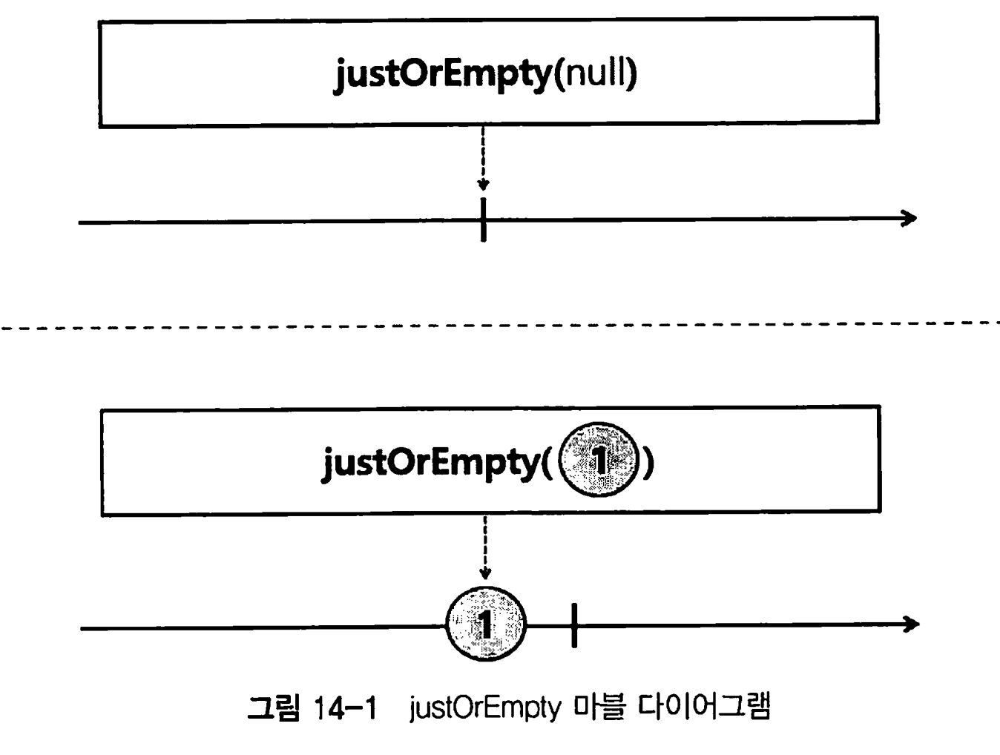

* just의 확장 Operator로써, null이여도 NPE가 발생하지 않고 onComplete 시그널을 전송한다. 
* Optional로 null을 감싸도 결과는 같다

```java
Mono.justOrEmpty(null)
  .subscribe(data -> {}, 
            error -> {},
             () -> log.info ("# onComplete"));
```

### fromIterable & fromStream

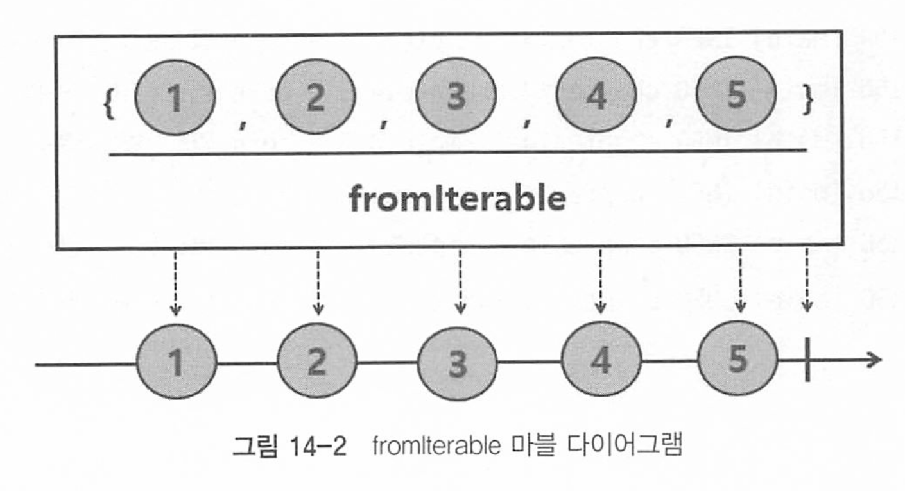

* Iterable에 포함된 데이터를 emit하는 Flux를 생성한다.

* List, queue, set, 컬렉션은 다 가능하단 소리임

```java
Flux.fromIterable(anyList)
  .subscribe(~~)
```

자매품으로 Stream을 받아 Stream에 포함된 데이터를 emit하는 fromStream도 있다. 

* 자바 스트림 특성상 재사용 불가능

```java
Flux.fromStream(() -> anyList.stream())
```

### range

range(n, m) 오퍼레이터는 n부터 1씩 증가한 연속된 수를 m개 emit하는 플럭스를 생성한다.

* for문 등과 같이 사용하기에 유리하다. 

```java
Flux.range(5, 10)
  .subscribe(data -> log.info(data))
```

### defer

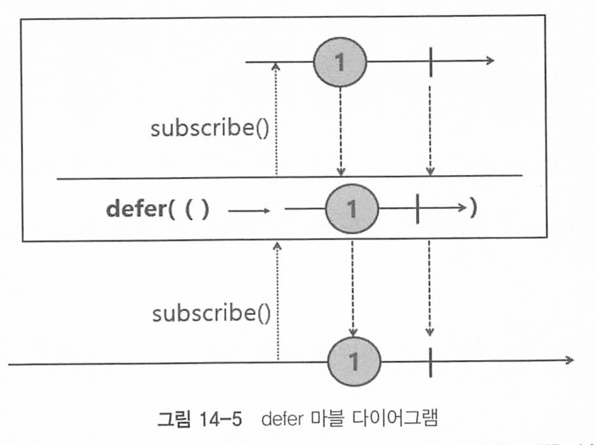

> defer는 연기하다 미루다라는 뜻이다. 지연이라는 의미 

defer()는 Operator를 선언한 시점에 emit하는 것이 아닌, 구독하는 시점에 Flux 또는 Mono를 생성한다.

지연 평가(lazy evaluation)를 통해 특정 작업을 필요할 때까지 미루기 위해 사용된다.

이를 통해 연산을 호출할 때마다 새로운 Publisher(Flux 또는 Mono)를 생성할 수 있다.

* 이는 `defer()` 블록 안에 정의된 코드를 구독할 때마다 실행한다는 것을 의미하는것. 

활용 예 

- **동적 데이터 생성**:  데이터베이스에서 동적으로 데이터를 가져와야 하는 경우, `defer()`를 사용하면 각 구독 시점에 데이터베이스 쿼리가 실행되도록 할 수있다.
- **다양한 환경 설정**: 설정이나 환경에 따라 Publisher의 동작이 달라져야 하는 경우, `defer()`를 사용하여 이를 유연하게 처리할 수 있다.

단점

* 코드 복잡도 증가 가능. 이는 디버깅 어려움으로 이어짐 
* 구독시점마다 퍼블리셔 생성하므로 구독/해지가 자주 발생하면 성능문제 일으킬 수 있다

예시를 보자

```java
@Slf4j
public class Example14_7 {
    public static void main(String[] args) throws InterruptedException {
        log.info("# start: {}", LocalDateTime.now());
        Mono
            .just("Hello")
            .delayElement(Duration.ofSeconds(3))
            .switchIfEmpty(sayDefault())
//            .switchIfEmpty(Mono.defer(() -> sayDefault()))
            .subscribe(data -> log.info("# onNext: {}", data));

        Thread.sleep(3500);
    }

    private static Mono<String> sayDefault() {
        log.info("# Say Hi");
        return Mono.just("Hi");
    }
}
//
[main] INFO - # start: 2024-06-07T13:26:41.438537
[main] DEBUG- Using Slf4j logging framework
[main] INFO - # Say Hi
[parallel-1] INFO - # onNext: Hello
```

* 데이터가 없으면 switchIfEmpty()내부에서 sayDefault를 호출해서 디폴트값으로 HI를 출력하려고 한다.
* 그런데, 현재는 Hello가 무조건 있으니까 sayDefault메소드가 실행될 필요가 없다.
* 그런데 결과를 보면 불필요하게 log.info Say Hi를 출력하는것이 보인다.
* 이걸 주석친 Mono.defer()를 이용하게 되면, 실제 데이터가 없을때에만 호출하게 된다. 

### using

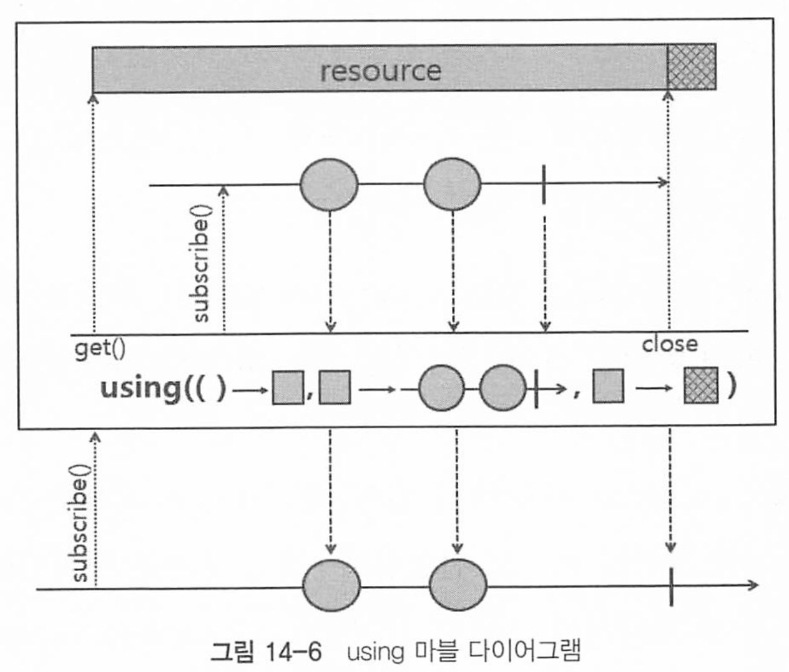

 using Operator는 파라미터로 전달받은 resource를 emit하는 Flux를 생성한다.

Reactor 및 RxJava 라이브러리에서 리소스를 안전하게 관리하고 해제하는 데 사용되는 연산자로 주로 파일, 데이터베이스 연결, 네트워크 소켓 등과 같은 외부 리소스를 사용할 때 유용하다.

```java
@Slf4j
public class Example14_8 {
    public static void main(String[] args) {
        Path path = Paths.get("D:\\resources\\using_example.txt");

        Flux
            .using(() -> Files.lines(path), Flux::fromStream, Stream::close)
            .subscribe(log::info);
    }
}
```

* 첫번째 파라미터 : 읽어올 resource
* 두번째 : emit하는  publisher
* 세번쨰 : 종료 시그널시 resource 해제 등 후처리 

### generate

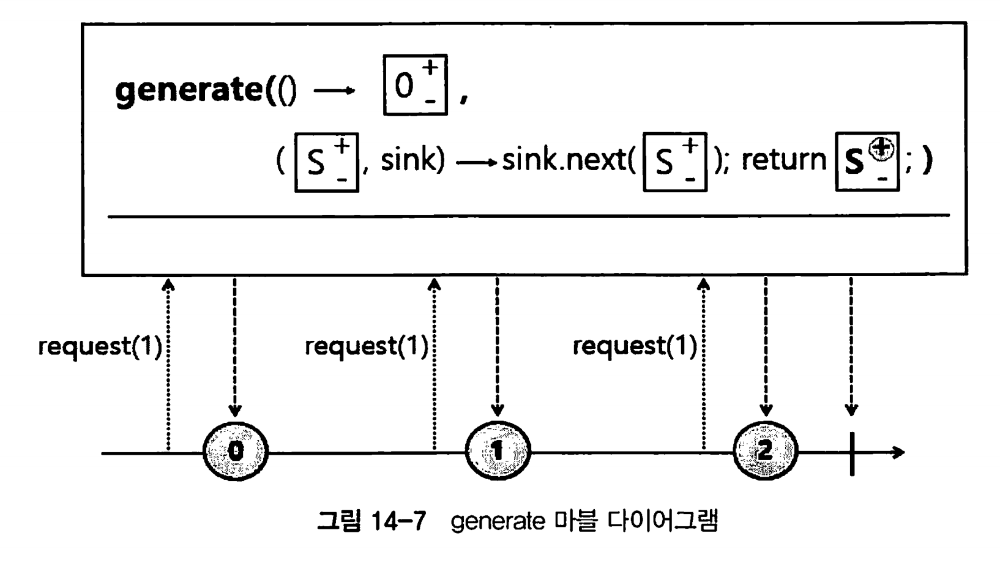

1. generate()의 첫 파라미터는 emit할 숫자의 초깃값. 음수 양수 모두 가능
2. S는 State의 약자로, 초깃값으로 지정한 숫자부터 emit하고 emit한 숫자를 증가시켜서 1씩 증가하는 숫자를 상태값으로 정의함

프로그래밍 방식으로 Signal 이벤트를 발생시키며, 동기적으로 데이터를 하나씩 순차적으로 emit해야 하는경우 사용된다

**동적 데이터 생성**: `generate()`는 상태를 초기화하고, 반복적으로 상태를 업데이트하면서 데이터를 생성.

**상태 관리**: 내부적으로 상태를 관리하며, 매번 새로운 데이터를 생성할 때 상태를 갱신.

**종료 조건**: 특정 조건에 도달하면 시퀀스를 종료할 수 있다.

### create

create Operator는 한번에 여러건의 데이터를 비동기적으로 emit할 수 있다.

`create()`는 `generate()`와 유사하지만, 더 복잡한 비동기 로직이나 콜백을 처리할 수 있다.

비동기 작업이나 콜백을 이용해서 데이터를 처리할 수 있으며, 백프레셔를 지원한다.

```java
@Slf4j
public class Example14_12 {
    static int SIZE = 0;
    static int COUNT = -1;
    final static List<Integer> DATA_SOURCE = Arrays.asList(1, 2, 3, 4, 5, 6, 7, 8, 9, 10);

    public static void main(String[] args) {
        log.info("# start");
        Flux.create((FluxSink<Integer> sink) -> {
            sink.onRequest(n -> {
                try {
                    Thread.sleep(1000L);
                    for (int i = 0; i < n; i++) {
                        if (COUNT >= 9) {
                            sink.complete();
                        } else {
                            COUNT++;
                            sink.next(DATA_SOURCE.get(COUNT));
                        }
                    }
                } catch (InterruptedException e) {}
            });

            sink.onDispose(() -> log.info("# clean up"));
        }).subscribe(new BaseSubscriber<>() {
            @Override
            protected void hookOnSubscribe(Subscription subscription) {
                request(2);
            }

            @Override
            protected void hookOnNext(Integer value) {
                SIZE++;
                log.info("# onNext: {}", value);
                if (SIZE == 2) {
                    request(2);
                    SIZE = 0;
                }
            }

            @Override
            protected void hookOnComplete() {
                log.info("# onComplete");
            }
        });
    }
}
```

* subscribe 발생시  BaseSubscriber의 hookOnSubscribe() 메서드 내부에서 request(2)를 호출하여 한 번에 두 개의 데이터를 요청
* Subscriber 쪽에서 request() 메서드를 호출하면 create() Operator 내부 에서 sinkonRequest() 메서드의 람다 표현식이 실행
* Subscriber가 요청한 개수만큼 데이터를 emit
* BaseSubscriber의 hookOnNext() 메서드 내부에서 emit된 데이터를 로그로 출력한 후, 다시 request(2)를 호출하여 두 개의 데이터를 요청
* 2에서 4의 과정이 반복되다가 dataSource List의 숫자를 모두 emit하면 onComplete Signal을 발생
* BaseSubscriber의 hookOnComplete() 메서드 내부에서 종료 로그를 출력


백프레셔 동작과정

1. 구독자가 처음에 `request(2)`를 호출하여 2개의 데이터를 요청
2. `onRequest` 핸들러가 호출되어 2개의 데이터를 생성하고 `sink.next`를 통해 구독자에게 전송
3. 구독자가 데이터를 수신하고 `hookOnNext` 메서드가 호출
4. 구독자가 2개의 데이터를 처리하면 다시 `request(2)`를 호출하여 추가로 2개의 데이터를 요청
5. 이 과정이 반복되며, 구독자가 요청한 만큼의 데이터만 생성되고 전송

## Sequence Filtering

`filter` 연산자는 조건에 맞지 않는 데이터를 걸러내는 데 사용

```java
Flux.range(1, 20)
    .filter(num -> num % 2 != 0) // 홀수만  
    .subscribe(data -> log.info("# onNext: {}", data));

// filterWhen 연산자는 각 백신 이름에 대해 비동기 필터링을 수행
// publishOn(Schedulers.parallel())은 이 필터링 작업을 병렬 스케줄러에서 실행
Flux
    .fromIterable(SampleData.coronaVaccineNames)
    .filterWhen(vaccine -> Mono
                            .just(vaccineMap.get(vaccine).getT2() >= 3_000_000)
                            .publishOn(Schedulers.parallel()))
    .subscribe(data -> log.info("# onNext: {}", data));
```

`skip` 연산자는 스트림의 처음 N개의 요소를 건너뛰는 데 사용되며, 처음 몇 개의 요소를 생략하고 나머지 요소만을 처리하고자 할 때 유용

```java
Flux.interval(Duration.ofSeconds(1)) // 0, 1 제외
    .skip(2)
    .subscribe(data -> log.info("# onNext: {}", data));
```

`take` 연산자는 스트림의 처음 N개의 요소만을 가져오는 데 사용. 특정 개수의 요소만을 처리하고자 할 때 유용

```java
Flux.interval(Duration.ofSeconds(1))
    .take(3) // 3개만 가져옴 
    .subscribe(data -> log.info("# onNext: {}", data));
```

takeLast로 마지막 n개만 emit할수도 있다.

```java
Flux.fromIterable(SampleData.btcTopPricesPerYear)
    .takeLast(2)
    .subscribe(tuple -> log.info("# onNext: {}, {}",
                                    tuple.getT1(), tuple.getT2()));
```

`next`는 스트림에 새로운 데이터를 전달 첫번째 데이터만 emit하는 역할을 한다.

```java
Flux.fromIterable(SampleData.btcTopPricesPerYear)
  .next()
  .subscribe(tuple -> log.info("# onNext: {}, {}", tuple.getT1(), tuple.getT2()));
```

* Upstream에서 emit되는 데이터가 empty면 emptyMono를 emit

## Sequence 변환 Operator

map() Operator는 Upstream에서 emit된 데이터를 mapper Function을 사용 하여 변환한 후, Downstream으로 emit한다.

```java
Flux.just("1-Circle", "3-Circle", "5-Circle")
  .map(circle -> circle.replace("Circle", "Rectangle")) // Rectangle로 변환 
  .subscribe(data -> log.info("# onNext: {}", data));
```

`flatMap`은 각 요소를 비동기적으로 처리할 수 있는 Publisher로 변환한 후, 이러한 Publisher들을 병합하여 하나의 큰 Publisher로 만든다. 내부 InnerSequence에서 평탄화 (flat)하는 과정을 거쳐 하나의 sequence로 병합(merge)되어 요소들을 다운스트림으로 보낸다.

```java
Flux.just("Good", "Bad")
    .flatMap(feeling -> Flux.just("Morning", "Afternoon", "Evening")
                            .map(time -> feeling + " " + time))
    .subscribe(log::info);
```

* good, bad 플럭스 요소가, 내부 이너 시퀀스에서 총 3번씩 연산되어 더해져 6개가 방출된다. 

`concat` 연산자는 여러 Publisher를 순차적으로 결합하여 순차적으로 emit한다. (순서 보장)

먼저 입력된 publisher의 sequence가 종료될때까지 나머지는 대기하게 된다.

```java
Flux.concat(Flux.just(1, 2, 3), Flux.just(4, 5))
  .subscribe(data -> log.info("# onNext: {}", data));
```

* 123이 다 방출되기전엔 45는 방출 안됌

`merge` 연산자는 여러 Publisher를 병합하여 동시에 데이터를 방출하며 concat과 달리 순서는 보장되지 않는다.

merge는 emit된 데이터를 인터리빙 방식으로 병합한다.

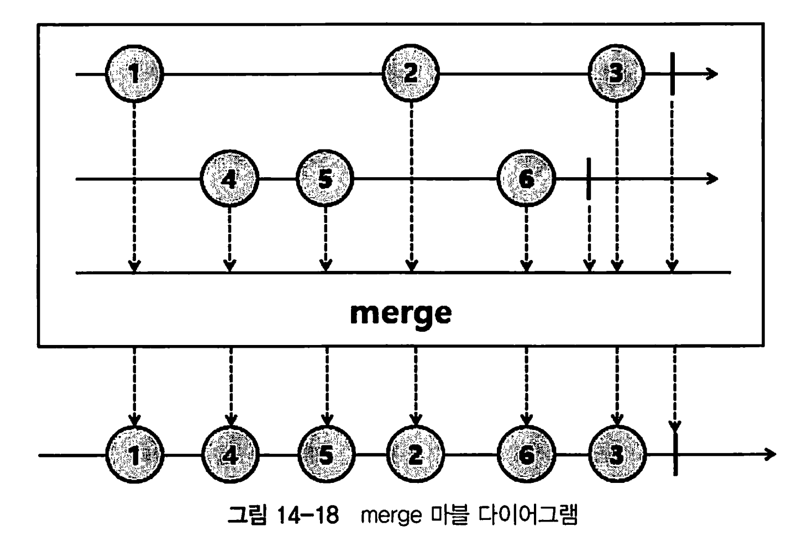

* 인터리브 : 교차로 배차하다. merge의 마블 다이어그램을 보면 서로 교차되는 방식으로 merge됌 
* 그렇다고 번갈아가면서 되는건 아니고, 시간순서대로 먼저 emit된 요소가 먼저 merge됌 

또한 concat과 달리, 나머지 publisher의 sequence과 subscribe 되지 않고 대기하는것이 아니라 즉시 subscribe 된다.

```java
Flux.merge(
            Flux.just(1, 2, 3, 4).delayElements(Duration.ofMillis(300L)),
            Flux.just(5, 6, 7).delayElements(Duration.ofMillis(500L))
    )
    .subscribe(data -> log.info("# onNext: {}", data));
// 결과는 순서보장 되지 않음 
```

* 결과를 보면 각 flux publisher가 emit하는 시간이 빠른 데이터부터 차례대로 emit함 

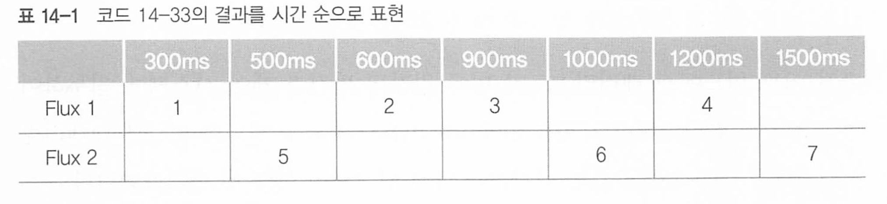

`zip` 연산자는 여러 Publisher의 요소를 조합하여 새로운 요소를 생성한다. 

각 Publisher의 동일한 순서의 요소들이 하나로 결합된다.

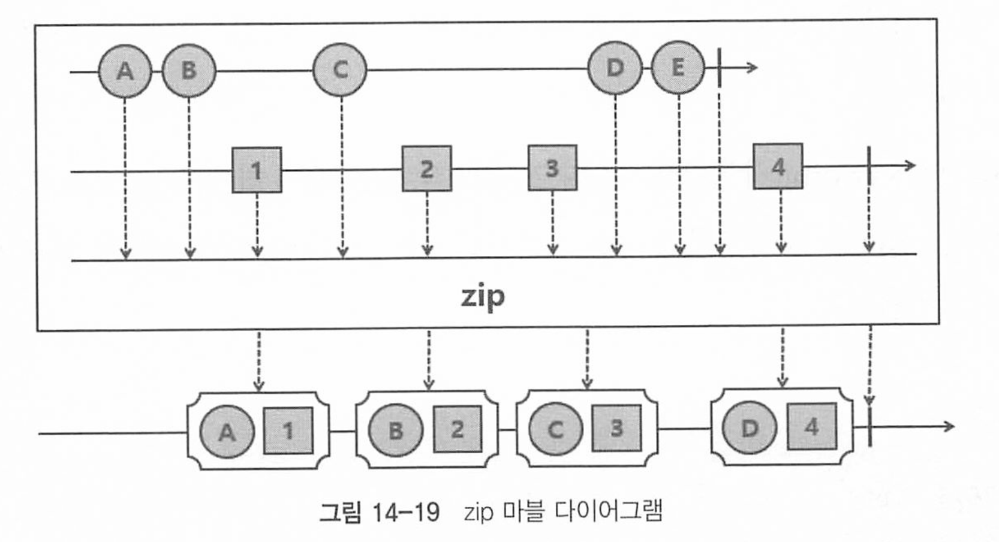

각 Publisher가 데이터를 하나씩 emit할 때까지 기다렸다가 결합하게 된다.

```java
Flux.zip(
            Flux.just(1, 2, 3).delayElements(Duration.ofMillis(300L)),
            Flux.just(4, 5, 6).delayElements(Duration.ofMillis(500L))
    )
    .subscribe(tuple2 -> log.info("# onNext: {}", tuple2));
```

* 두개의 Flux가 emit하는 시간이 다르지만, 각 flux에서 하나씩 emit할때까지 기다렷다가 묶어서 subscriber에게 전달한다.
* 뭐 bff 등에서 많이 쓰일거같다

`and` 연산자는 두 Publisher가 모두 완료될 때까지 기다린다. 이 연산자는 주로 두 작업의 완료를 동기화하는 데 사용된다

결과적으로 Subscriber에게 onComplete Signal만 전달되고, Upstream에서 emit된 데이터는 전달되지 않는다. 즉, and() Operator는 모든 Sequence가 종료되길 기다렸다가 최종적으로 onComplete Signal만 전송된다.

```java
Mono.just("Task 1")
	.delayElement(Duration.ofSeconds(1))
	.doOnNext(data -> log.info("# Mono doOnNext: {}", data))
	.and(
		Flux
			.just("Task 2", "Task 3")
			.delayElements(Duration.ofMillis(600))
			.doOnNext(data -> log.info("# Flux doOnNext: {}", data))
	)
	.subscribe(
		data -> log.info("# onNext: {}", data),
		error -> log.error("# onError:", error),
		() -> log.info("# onComplete")
	);
// 결과
INFO - # Flux doOnNext: Task 2
INFO - # Mono doOnNext: Task 1
INFO - # Flux doOnNext: Task 3
INFO - # onComplete
```

* doOnNext를 통해 emit되는것을 볼 순 있지만, 최종적으로 Subscriber에게는 onComplete Signal만 전송되었음을 알 수 있다.

and() Operator는 모든 작업이 끝난 시점에 최종적으로 후처리 작업을 수행하기 적합한 Operator이다.

`collectList` 연산자는 Publisher의 모든 요소를 하나의 리스트로 수집한다. 스트림이 완료될 때까지 기다린 후 리스트를 생성한다.

 만약 비어있다면 emptyList를 emit한다

```java
@Slf4j
public class Example14_40 {
    public static void main(String[] args) {
        Flux
            .just("...", "---", "...")
            .map(Example14_40::transformMorseCode)
            .collectList()
            .subscribe(list -> log.info(list.stream().collect(Collectors.joining())));
    }

    public static String transformMorseCode(String morseCode) {
        return SampleData.morseCodeMap.get(morseCode);
    }
}
```


## Sequence 내부 동작 확인을 위한 Operator

Upstream Publisher에서 emit되는 데이터의 변경없이, 부수 효과만을 수행하기 위한 Operator가 있다.

그것이 doOnXXXX()오퍼레이터들이다.

doOnXxxx()으로 시작하는 Operator는 Consumer 또는 Runnable 타입의 함 수형 인터페이스를 파라미터로 가지기 때문에 별도의 리턴 값이 없다. 

로그 출력, 에러발생시 에러알림 등 에 많이 사용된다.

연산자들

| Operator           | 설명                                                         |
| ------------------ | ------------------------------------------------------------ |
| doOnSubscribe()    | Publisher가 구독 중일 때 트리거되는 동작을 추가할 수 있다.   |
| doOnRequest()      | Publisher가 요청을 수신할 때 트리거되는 동작을 추가할 수 있다. |
| doOnNext()         | Publisher가 데이터를 emit할 때 트리거되는 동작을 추가할 수 있다. |
| doOnComplete()     | Publisher가 성공적으로 완료되었을 때 트리거되는 동작을 추가할 수 있다. |
| doOnError()        | Publisher가 에러가 발생한 상태로 종료되었을 때 트리거되는 동작을 추가할 수 있다. |
| doOnCancel()       | Publisher가 취소되었을 때 트리거되는 동작을 추가할 수 있다.  |
| doOnTerminate()    | Publisher가 성공적으로 완료되었을 때 또는 에러가 발생한 상태로 종료되었을 때 트리거되는 동작을 추가할 수 있다. |
| doOnEach()         | Publisher가 데이터를 emit할 때, 성공적으로 완료되었을 때, 에러가 발생한 상태로 종료되었을 때 트리거되는 동작을 추가할 수 있다. |
| doOnDiscard()      | Upstream에 있는 전체 Operator 체인의 동작 중에서 Operator에 의해 폐기되는 요소를 조건부로 정리할 수 있다. |
| doAfterTerminate() | Downstream을 성공적으로 완료한 직후 또는 에러가 발생하여 Publisher가 종료된 직후에 트리거되는 동작을 추가할 수 있다. |
| doFirst()          | Publisher가 구독되기 전에 트리거되는 동작을 추가할 수 있다.  |
| doFinally()        | 에러를 포함해서 어떤 이유이든 간에 Publisher가 종료된 후 트리거되는 동작을 추가할 수 있다. |

## 에러처리를 위한 Operator

**error()** Operator는 파라미터로 지정된 에러로 종료하는 Flux를 생성한다.

주로 checked exception을 캐치해서 다시 던져야 하는 경우 사용할 수 있다.

```java
Flux.range(1, 5)
    .flatMap(num -> {
        if ((num * 2) % 3 == 0) {
            return Flux.error(
                    new IllegalArgumentException("Not allowed multiple of 3")
        } else {
            return Mono.just(num * 2);
        }
    })
    .subscribe(data -> log.info("# onNext: {}", data),
            error -> log.error("# onError: ", error));
```

해당 error가 반환되면 onErrorSignal이 전송된다 


`onErrorReturn` 연산자는 오류가 발생했을 때 대체 값을 반환하여 스트림을 계속 실행할 수 있게 한다.

```java
Flux.fromIterable(SampleData.books)
        .map(book -> book.getPenName().toUpperCase())
        .onErrorReturn("No pen name")
        .subscribe(log::info);
// 또는 에러타입별로도 가능
Flux.fromIterable(SampleData.books)
        .map(book -> book.getPenName().toUpperCase())
        .onErrorReturn(NullPointerException.class, "no pen name")
        .onErrorReturn(IllegalFormatException.class, "Illegal pen name")
        .subscribe(log::info);
```

* 특정 예외 타입 발생시에만 추적도 가능하다

`onErrorResume` 연산자는 에러 이벤트가 발생했을 때 대체 Publisher로 전환하여 스트림을 계속 실행할 수 있게한다.

```java
/**
 * error 처리 예제
 *  - onErrorResume Operator
 *      - 예외가 발생했을 때, error 이벤트를 발생시키지 않고, 대체 Publisher로 데이터를 emit하고자 할 경우
 *      - try ~ catch 문의 경우, catch해서 return default value 하는 것과 같다.
 */
@Slf4j
public class Example14_47 {
    public static void main(String[] args) {
        final String keyword = "DDD";
        getBooksFromCache(keyword)
                .onErrorResume(error -> getBooksFromDatabase(keyword))
                .subscribe(data -> log.info("# onNext: {}", data.getBookName()),
                        error -> log.error("# onError: ", error));
    }

    public static Flux<Book> getBooksFromCache(final String keyword) {
        return Flux
                .fromIterable(SampleData.books)
                .filter(book -> book.getBookName().contains(keyword))
                .switchIfEmpty(Flux.error(new NoSuchBookException("No such Book")));
    }

    public static Flux<Book> getBooksFromDatabase(final String keyword) {
        List<Book> books = new ArrayList<>(SampleData.books);
        books.add(new Book("DDD: Domain Driven Design",
                "Joy", "ddd-man", 35000, 200));
        return Flux
                .fromIterable(books)
                .filter(book -> book.getBookName().contains(keyword))
                .switchIfEmpty(Flux.error(new NoSuchBookException("No such Book")));
    }

    private static class NoSuchBookException extends RuntimeException {
        NoSuchBookException(String message) {
            super(message);
        }
    }

}
```

* NoSuchBookException이 발생하면 getBooksFromDatabase에서 대체 스트림을 반환한다. 

`onErrorContinue` 연산자는 오류가 발생했을 때 해당 오류를 무시하고 스트림을 계속 실행할 수 있게 한다.

에러 발생시, 에러 영역 내에있는 데이터는 제거하고, Upstream에서 후속 데이터를 emit하는 방식으로 에러를 복구할 수 있게 해준다 

에러발생시 emit된 데이터를 로그를 출력하고 넘어갈 수 있다.

```java
Flux.just(1, 2, 4, 0, 6, 12)
    .map(num -> 12 / num)
    .onErrorContinue((error, num) ->
            log.error("error: {}, num: {}", error, num))
    .subscribe(data -> log.info("# onNext: {}", data),
                error -> log.error("# onError: ", error));
```

* onErrorContinuer는 명확하지 않은 동작으로 의도하지 않은 상황을 발생할 수 있기 때문에, 해당 오퍼레이터 대신 doOnError로 로그를 기록하고, onErrorResume으로 처리하는것이 좋다. 

`retry` 연산자는 오류가 발생했을 때 특정 횟수만큼 재시도할 수 있게 한다.

만약 파라미터로 Long MAX_VALUE를 입력하면 재구독을 무한 반복한다.

```java
final int[] count = {1};
Flux
    .range(1, 3)
    .delayElements(Duration.ofSeconds(1))
    .map(num -> {
        try {
            if (num == 3 && count[0] == 1) {
                count[0]++;
                Thread.sleep(1000);
            }
        } catch (InterruptedException e) {}
        return num;
    })
    .timeout(Duration.ofMillis(1500)) // 1.5초동안 emit되는 데이터가 없으면 TimeoutException이 발생하도록 함
    .retry(1)
    .subscribe(data -> log.info("# onNext: {}", data),
            (error -> log.error("# onError: ", error)),
            () -> log.info("# onComplete"));

Thread.sleep(7000);
//
[parallel-1] INFO - # onNext: 1
[parallel-4] INFO - # onNext: 2
 [parallel-6] DEBUG- onNextDropped: 3
[parallel-7] INFO - # onNext: 1
[parallel-10] INFO - # onNext: 2
[parallel-2] INFO - # onNext: 3
[parallel-2] INFO - # onComplete
```

* 에러 발생시 1회 재구독 하도록 함


## Sequence의 동작 시간 측정을 위한 Operator

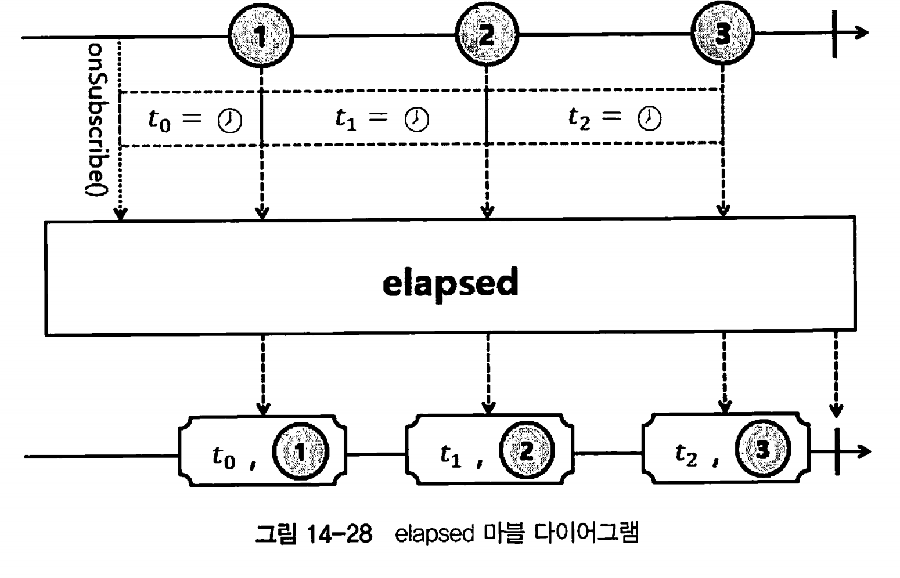

`elapsed` 연산자는각 항목이 스트림에 방출되기까지 소요된 시간을 측정할 수 있다. 이를 통해 각 항목의 방출 간격을 모니터링하고 성능을 분석하는 데 유용하다.

elapsed() Operator는 emit된 데이터 사이의 경과 시간을 측정해서 Tuple<Long, T> 형태로 Downstream에 emit 한다.

```java
Flux.range(1, 5)
    .delayElements(Duration.ofSeconds(1))
    .elapsed()
    .subscribe(data -> log.info("# onNext: {}, time: {}",
                                        data.getT2(), data.getT1()));
```

* **시간 측정**: 각 항목이 방출되기까지의 시간을 밀리초 단위로 측정
* T2는 아이템, T1은 밀리초 시간이다. 


## Flux Sequence 분할을 위한 Operator

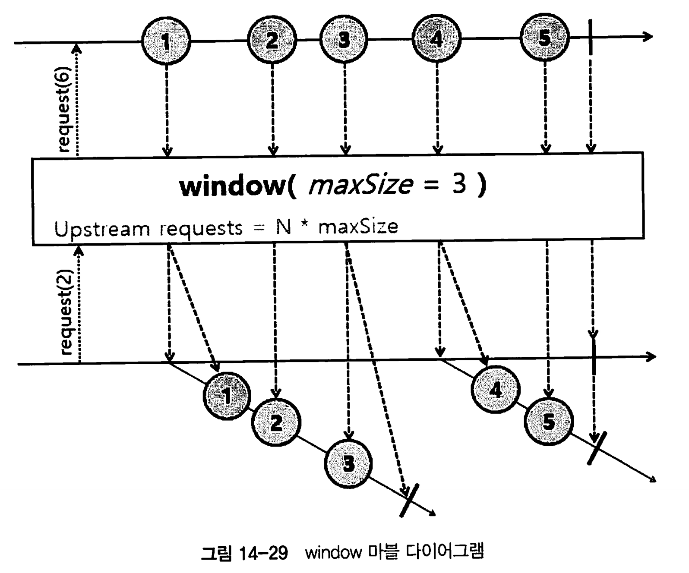

`window` 연산자는 데이터 스트림을 고정 크기 또는 동적으로 정의된 크기의 하위 스트림으로 나누는 데 사용되는 연산자이다.

해당 마블 다이어그램을 보면, maxSize = 3이기 때문에 Downstream 요청 갯수 2(N) x 3(maxSize) = 6 만큼의 데이터를 Upstream에 요청하고, 요청 개수만큼 방출되는 데이터는 maxSize만큼 분할되어서 윈도우에 포함된다.

* 그림을 보면 123 이 방출되고 이후 45가 방출된다. 3씩 나뉘니까 

대량의 데이터를 작은 덩어리로 나누어 처리할 때 유용하다.

```java
 Flux.fromIterable(SampleData.monthlyBookSales2021)
         .window(3) // 3개씩 쪼갬 
         .flatMap(flux -> MathFlux.sumInt(flux)) // flux 라이브러리. 
         .subscribe(new BaseSubscriber<>() {
             @Override
             protected void hookOnSubscribe(Subscription subscription) {
                 subscription.request(2); // 2개씩 요청함 
             }
             @Override
             protected void hookOnNext(Integer value) {
                 log.info("# onNext: {}", value);
                 request(2);
             }
         });
```

아래와 같은 윈도우도 있다.

**고정 크기 윈도우**: 지정된 크기마다 스트림을 분할(위 예제)

**시간 기반 윈도우**: 지정된 시간 간격마다 스트림을 분할

```java
public class WindowExample {
    public static void main(String[] args) throws InterruptedException {
        Flux<Long> flux = Flux.interval(Duration.ofMillis(500))
                              .take(10)
                              .window(Duration.ofSeconds(2)); // 2초마다 나눔

        flux.subscribe(window -> {
            window.collectList().subscribe(list -> System.out.println("Window: " + list));
        });

        // 프로그램이 종료되지 않도록 잠시 대기
        Thread.sleep(10000);
    }
}
```

**조건 기반 윈도우**: 특정 조건이 충족될 때마다 스트림을 분할

#### 장점

1. **데이터 분할**: 대량의 데이터를 작은 덩어리로 나누어 처리할 수 있어 메모리 사용량을 줄일 수 있다.
2. **유연성**: 크기, 시간, 조건 기반으로 윈도우를 설정할 수 있어 다양한 요구사항에 맞게 적용할 수 있다.
3. **효율적인 처리**: 스트림을 나누어 병렬로 처리하거나, 각 윈도우별로 별도의 처리를 수행할 수 있다.

#### 단점

1. **복잡성 증가**: 윈도우를 사용하는 로직이 복잡해질 수 있으며, 각 윈도우의 종료 조건을 정확히 정의해야 한다.
2. **오버헤드**: 윈도우를 생성하고 관리하는 과정에서 약간의 오버헤드가 발생할 수 있다. -> 오버하는거 아니면 문제 x 

### 참고 문서

더 자세한 내용은 Reactor 및 RxJava의 공식 문서를 참조하세요:

- Reactor 공식 문서: Reactor Documentation
- RxJava 공식 문서: RxJava Documentation


`buffer` 연산자는 스트림의 데이터를 고정된 크기나 시간 간격으로 묶어서 버퍼로 처리할 수 있게 한다.

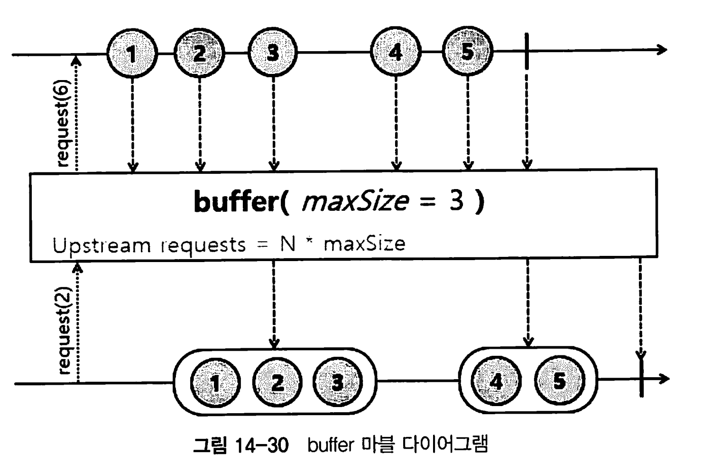

Upstream에서 emit되는 첫 번째 데이터부터 maxSize 숫자만큼의 데이터를 List 버퍼로 한 번에 emit한다. 

마지막 버퍼에 포함된 데이터의 개수는 maxSize 보다 더 적거나 같다.

```java
Flux.range(1, 95)
        .buffer(10)
        .subscribe(buffer -> log.info("# onNext: {}", buffer)); // 10개씩 팡팡!
```

**고정 크기 버퍼**: 지정된 크기만큼의 요소를 모아서 리스트로 반환 (위 예제)

**시간 기반 버퍼**: 지정된 시간 간격마다 요소를 모아서 리스트로 반환

```java
public class BufferExample {
    public static void main(String[] args) throws InterruptedException {
        Flux<Long> flux = Flux.interval(Duration.ofMillis(500))
                              .take(10)
                              .buffer(Duration.ofSeconds(2)); // 2초마다 묶음

        flux.subscribe(System.out::println);

        // 프로그램이 종료되지 않도록 잠시 대기
        Thread.sleep(5000);
    }
}
```

**슬라이딩 버퍼**: 지정된 크기만큼의 요소를 모으되, 지정된 간격으로 슬라이딩하며 버퍼를 생성

```java
import reactor.core.publisher.Flux;

public class BufferExample {
    public static void main(String[] args) {
        Flux<Integer> flux = Flux.range(1, 10)
                                 .buffer(3, 1); // 3개씩 묶되, 1개씩 슬라이딩

        flux.subscribe(System.out::println);
    }
}
```

`bufferTimeout` 연산자는 스트림의 요소를 버퍼로 모을 때 지정된 크기와 시간 제한을 동시에 적용할 수 있게 한다

* maxSize 숫자만큼의 데이터 또는 maxTime 내에 emit된 데이 터를 List 버퍼로 한 번에 emit한다. 
* 또한 maxSize나 maxTime 중에서 먼저 조건에 부합할 때까지 emit된 데이터를 List 버퍼로 emit 한다.

```java
Flux
    .range(1, 20)
    .map(num -> {
        try {
            if (num < 10) {
                Thread.sleep(100L);
            } else {
                Thread.sleep(300L);
            }
        } catch (InterruptedException e) {}
        return num;
    })
    .bufferTimeout(3, Duration.ofMillis(400L))
    .subscribe(buffer -> log.info("# onNext: {}", buffer));

//
[main] INFO - # onNext: [1, 2, 3]
[main] INFO - # onNext: [4, 5, 6]
[main] INFO - # onNext: [7, 8, 9]
[parallel-1] INFO - # onNext: [10, 11]
[parallel-1] INFO - # onNext: [12, 13]
[parallel-1] INFO - # onNext: [14, 15]
[parallel-1] INFO - # onNext: [16, 17]
[parallel-1] INFO - # onNext: [18, 19]
[main] INFO - # onNext: [20]
```

* 10보다 작으면 10보다 큰 숫자에 대해 더 빨리 emit 된다.
* 400ms 보다 작은것이 조건이다.
* 때문에 10보다 작으면 3개씩 전달되고, 10이상은 0.3초의 지연시간을 갖게되어 2개씩 (300 + 300 ) 방출하게 된다 

maxTime을 왜 쓰는것이 좋을까?

* 사이즈가 영원히 안차면 무한정 기다리기 때문에, 어느정도 제한시간을 두고 방출시킬 수 있도록 해야한다. 

 

`groupBy` 연산자는 스트림의 요소를 지정된 키에 따라 그룹으로 분할하는 데 사용된다.

마블 다이어그램이 상당히 복잡한데, 그냥 그룹화한 그룹별로 작업을 수행한다고 생각하면 된다.

```java
 Flux.fromIterable(SampleData.books)
         .groupBy(Book::getAuthorName,
                 book -> book.getBookName() + "(" + book.getAuthorName() + ")")
         .flatMap(groupedFlux -> groupedFlux.collectList())
         .subscribe(bookByAuthor ->
                 log.info("# book by author: {}", bookByAuthor));
```

* groupBy 오퍼레이터에서 key, value로 방출하고, 그룹화된 데이터를 list로 방출한다.


## 다수의 Subscriber에게 Flux를 멀티캐스팅 하기위한 Operator

멀티캐스팅 -> 1대다로 여러 구독자에게 Flux를 방출한다.

이를 가능하게 해 주는 Operator들은 Cold Sequence를 Hot Sequence로 동작하게 하는 특징이 있다.


### publish

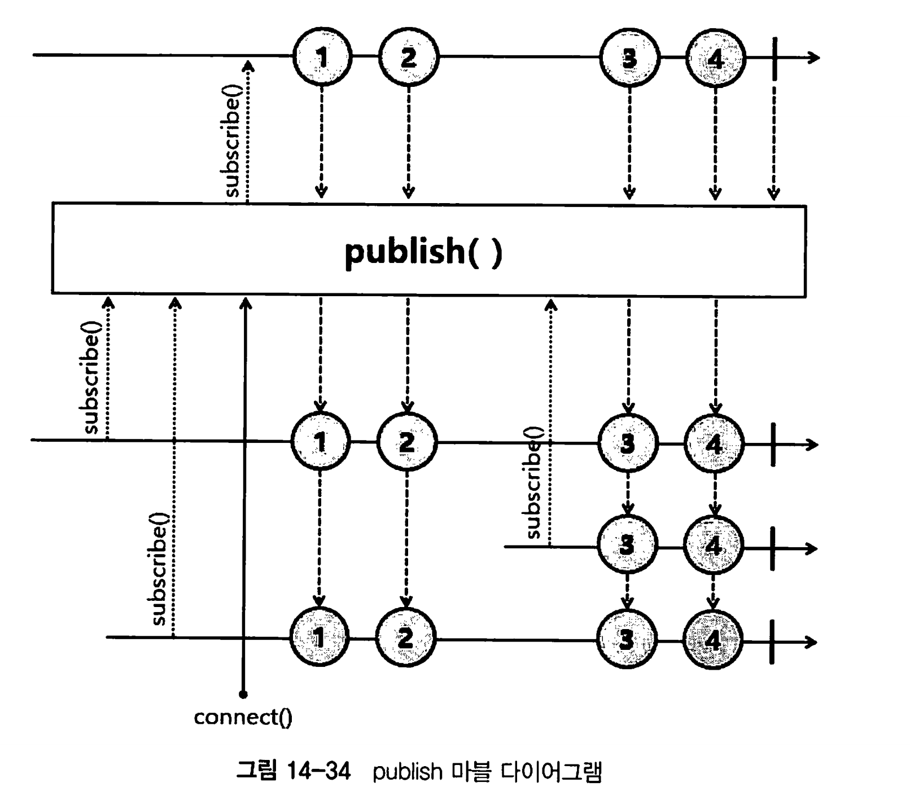

publish는 구독을 하더라도 구독 시점 즉시 emit하지않고, connect()를 호출하는 시점에 데이터를 emit 한다.

그리고 Hot Sequence로 변환되기 때문에 구독 시점 이후에 emit된 데이터만 전달받을 수 있다.

* 중간에 구독하면, 초기데이터 말고 그때부터 방출되는 데이터만 받을 수 있음.

### autoConnect

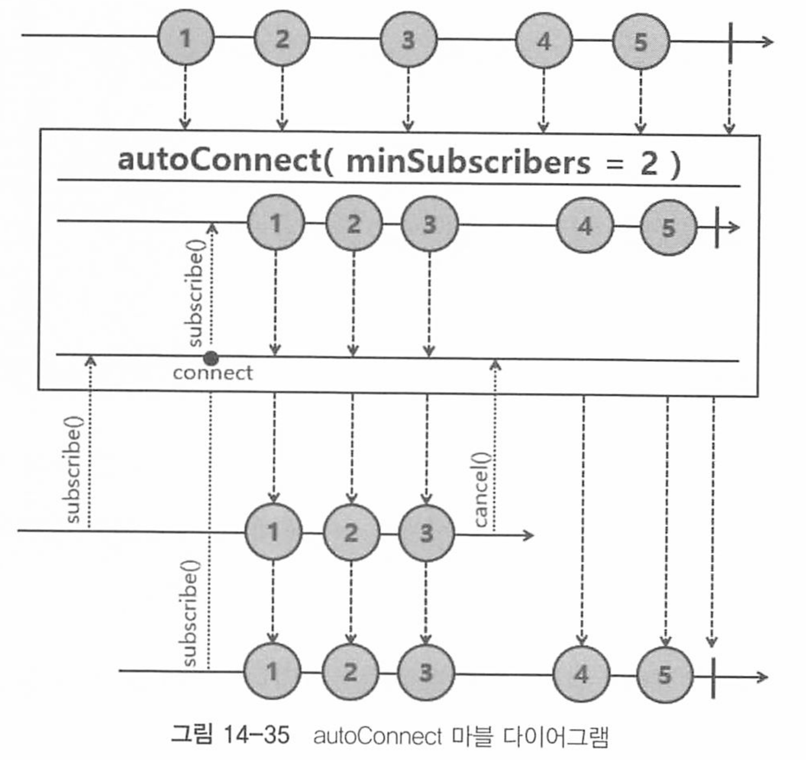

publish와 달리, autoConnect는 파라미터로 지정하는 숫자만큼(minSubscribers) 구독이 발생하는 시점 자동으로 emit이 되기 때문에 별도의 connect() 호출이 필요하지 않다

```java
//1. publish 

ConnectableFlux<Integer> flux =
        Flux
            .range(1, 5)
            .delayElements(Duration.ofMillis(300L))
            .publish();
Thread.sleep(500L);
flux.subscribe(data -> log.info("# subscriber1: {}", data));
Thread.sleep(200L);
flux.subscribe(data -> log.info("# subscriber2: {}", data));
flux.connect(); // connect 필요


// 2. autoConnect
Flux<String> publisher =
        Flux
            .just("Concert part1", "Concert part2", "Concert part3")
            .delayElements(Duration.ofMillis(300L))
            .publish()
            .autoConnect(2);
Thread.sleep(500L);
publisher.subscribe(data -> log.info("# audience 1 is watching {}", data));
Thread.sleep(500L);
publisher.subscribe(data -> log.info("# audience 2 is watching {}", data));
```

마찬가지로 hot Sequence로 동작한다.


### refCount

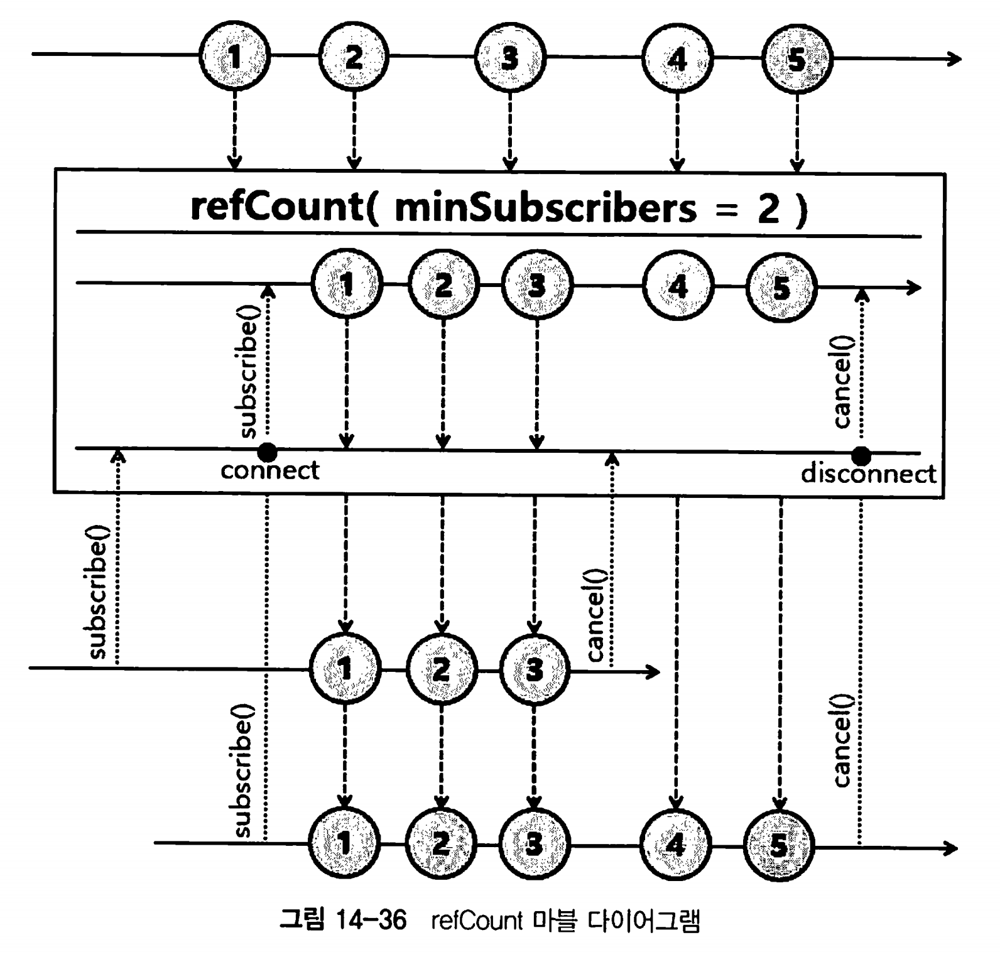

refCount는 파라미터로 입력된 숫자만큼의 구독이 발생하는 시점에 소스에 연결되며, 모든 구독이 취소되거나 emit이 종료되면 연결이 해제된다.

주로 무한스트림 상황에서 모든 구독이 취소될경우 연결을 해제하는데 사용할 수 있다.

`refCount`는 구독자가 있을 때만 소스 연결을 유지하고, 구독자가 없으면 연결을 해제하는 시나리오에 유용하며

`autoConnect`는 한 번 연결되면 소스 연결을 계속 유지하여 실시간 데이터를 처리해야 하는 시나리오에 적합하다.