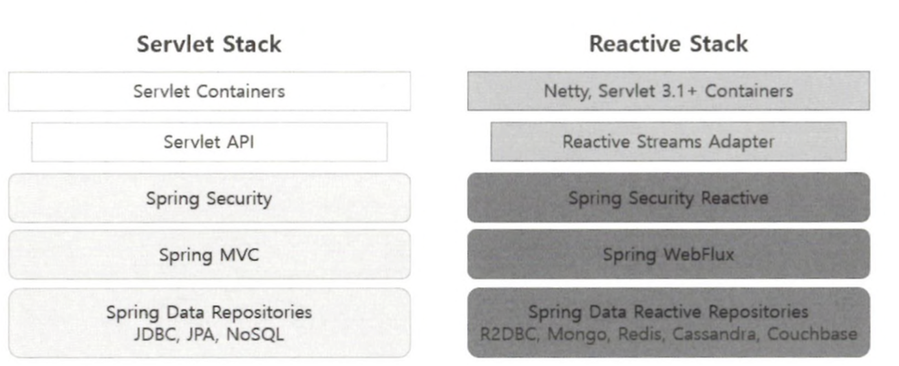
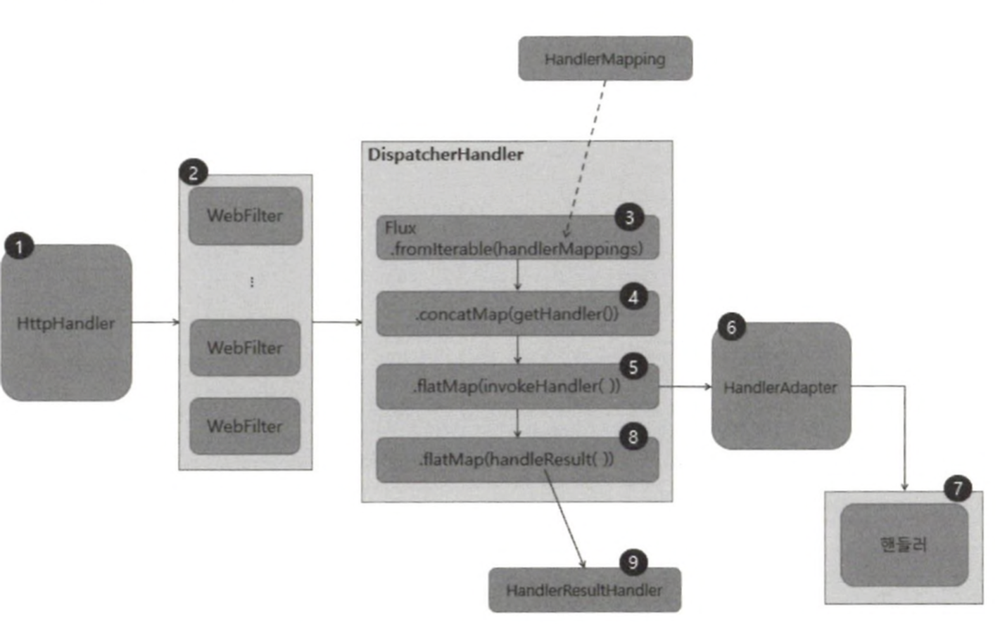
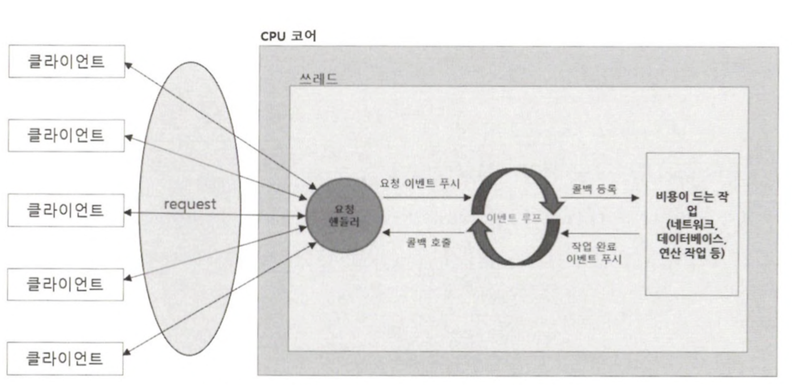

# Spring WebFlux 개요

## Spring WebFlux의 탄생 배경

Spring WebFlux는 리액티브 웹 애플리케이션 구현을 위해 Spring 5.0 부터 지원하는 리액티브 웹 프레임워크입니다.

기존에 사용하던 Spring MVC는 서블릿 기반의 Blocking I/O 방식이기 때문에 하나의 요청을 처리하기 위해 하나의 스레드를 사용하고, 해당 스레드의 작업이 끝나기 전까지는 스레드가 차단됩니다.

이런 방식으로 인해 대량의 요청 트래픽을 Spring MVC 방식이 처리하지 못하는 상황이 잦아짐에 따라 적은 수의 스레드로 대량의 요청을 안정적으로 처리할 수 있는 비동기 Non-Blocking I/O 방식의
Spring WebFlux가 탄생하게 되었습니다.

## Spring Web Flux의 기술 스택



### 서버

- Spring MVC
    - 서블릿 기반의 프레임워크
    - 아파치 톰캣이나 서블릿 컨테이너에서 Blocking I/O 방식으로 동작
- Spring WebFlux
    - Netty 같은 서버 엔진에서 Non-Blocking I/O 방식으로 동작

### 서버 API

- Spring MVC
    - 서블릿 기반의 프레임워크이기 때문에 서블릿 API를 사용
- Spring WebFlux
    - 기본 서버 엔진이 Netty 이지만 Jetty나 Undertow 같은 서버 엔진에서 지원하는 리액티브 스트림즈 어댑터를 통해 리액티브 스트림즈를 지원합니다.

### 보안

- Spring MVC
    - 표준 서블릿 필터를 사용하는 Spring Security가 서블릿 컨테이너와 통합 툅니다.
- Spring WebFlux
    - WebFilter를 이용해 Spring Security를 Spring WebFlux에서 사용합니다.

### 데이터 액세스

- Spring MVC
    - Blocking I/O 방식인 Spring Data JDBC, Spring Data JPA, Spring Data MongoDB 같은 데이터 액세스 기술을 사용합니다.
- Spring WebFlux는 데이터 액세스 계층까지 완벽하게 Non-Blocking I/O를 지원할 수 있도록 Spring Data R2DBC 및 Non-Blocking I/O를 지원하는 NoSQL 모듈을
  사용합니다.

## Spring WebFlux의 요청 처리 흐름

Spring WebFlux는 다음과 같은 순서로 요청을 처리하게 됩니다.


1. 최초에 클라이언트로부터 요청이 들어오면 Netty 등의 서버 엔진을 거쳐 HttpHandler가 들어오는 요청을 전달받습니다.

   HttpHandler는 Netty 이외의 다양한 서버 엔진에서 지원하는 서버 API를 사용할 수 있도록 서버 API를 추상화해 주는 역할을 합니다.

   따라서 각 서버 엔진마다 주어지는 ServerHttpRequest와 ServerHttpResponse를 포함하는 ServerWebExchange를 생성 후, WebFilter 체인으로 전달합니다.

2. ServerWebExchange는 WebFilter 체인에서 전 처리 과정을 거친 후, WebHandler 인터페이스의 구현체인 DispatcherHandler에게 전달됩니다.
3. Spring MVC의 DispatcherServlet과 유사한 역할을 하는 DispatcherHandler에서는 HandlerMapping List를 원본 Flux의 소스로 전달 받습니다.
4. ServerWebExchange를 처리할 핸들러를 조회합니다.
5. 조회한 핸들러의 호출을 HandlerAdapter에게 위임합니다.
6. HandlerAdpater는 ServerWebExchange를 처리할 핸들러를 호출합니다.
7. Controller 또는 HandlerFunction 형태의 핸들러에서 요청을 처리한 후, 응답 데이터를 리턴합니다.
8. 핸들러로부터 리턴받은 응답 데이터를 처리할 HandlerResultHandler를 조회합니다.
9. 조회한 HandlerResultHandler가 응답 데이터를 적절하게 처리한 후, response로 리턴합니다.

<aside>
💡 Spring WebFlux의 요청 처리 흐름을 설명하면서 편의상 핸들러에서 응답 데이터를 리턴한다는 표현을 사용했습니다.
하지만 실제 핸들러에서 리턴되는 것은 응답 데이터를 포함하고 있는 Flux 또는 Mono Sequence이기 때문에 메서드 호출을 통해 리턴된 Reactor Sequence가 즉시 어떤 작업을 수행한다는 의미가 아닙니다.

</aside>

## Spring WebFlux의 핵심 컴포넌트

### HttpHandler

HttpHandler는 다른 유형의 HTTP 서버 API로 request와 response를 처리하기 위해 추상화된 단 하나의 메서드만 가집니다.

```java
public interface HttpHandler {
    Mono<Void> handle(ServerHttpRequest request, ServerHttpResponse response);
}
```

다음은 이를 구현하는 HttpWebHandlerAdapter의 코드 일부입니다.

```java
public Mono<Void> handle(ServerHttpRequest request, ServerHttpResponse response) {
  ...
  ...
    ServerWebExchange exchange = this.createExchange(request, response);
  ...
  ...
}
```

HttpWebHandlerAdapter 클래스는 handle() 메서드의 파리미터로 전달받은 ServerHttpRequest와 ServerHttpResponse로 ServerWebExchnage를 생성한 후
WebHandler를 호출하는 역할을 합니다.

### WebFilter

WebFilter는 Spring MVC의 서블릿 필터 처럼 핸들러가 요청을 처리하기 전에 전처리 작업을 할 수 있도록 해줍니다.

WebFilter는 주로 보안이나 세션 타임아웃 처리 등 애플리케이션에서 공통으로 필요한 전처리에 사용됩니다.

```java
public interface WebFilter {
    Mono<Void> filter(ServerWebExchange exchange, WebFilterChain chain);
}
```

다음은 WebFilter를 구현한 예시입니다.

```java

@Component
public class BookLogFilter implements WebFilter {

    @Override
    public Mono<Void> filter(ServerWebExchange exchange, WebFilterChain chain) {
        String path = exchange.getRequest().getURI().getPath();
        return chain.filter(exchange).doAfterTerminate(() -> {
            if (path.contains("books")) {
                System.out.println("path : " + path + ", status : " + exchange.getResponse().getStatusCode());
            }
        })
    }
}
```

예제는 doAfterTerminate() Operator를 이용해 종료 이벤트 (onComplete, onError) 발생 시, 요청 URI Path에 “books”가 포함되어 있다면 Book 리소스에 대한
요청이라고 간주하고 로그를 출력하도록 했습니다.

<aside>
💡 Spring WebFlux는 클라이언트의 요청부터 응답까지 Reactor의 두 가지 타입인 Mono나 Flux의 Operator 체인으로 구성된 하나의 길다란 Sequence라고 생각하면 좀 더 쉽게 접근할 수 있습니다.

따라서 Spring WebFlux에서 사용할 수 있는 Filter 역시 Reactor Sequence의 일부가 된다는 사실 역시 기억하면 좋습니다.

</aside>

### HandlerFilterFunction

HandlerFilterFunction은 함수형 기반의 요청 핸들러에 적용할 수 있는 Filter 입니다.

```java

@FunctionalInterface
public interface HandlerFilterFunction<T extends ServerResponse, R extends ServerResponse> {
    Mono<R> filter(ServerRequest request, HandlerFunction<T> next);
}
```

다음은 HandlerFilterFunction의 구현 예시입니다.

```java
public class BookRouterFunctionFilter implements HandlerFilterFunction {
    @Override
    public Mono<ServerResponse> filter(ServerRequest request, HandlerFunction next) {
        String path = request.requestPath().value();

        return next.handle(request).doAfterTerminate(() -> {
            System.out.println("path : " + path + ", status: " + request.exchange().getResponse().getStatusCode());
        });
    }
}
```

WebFilter의 구현체는 Spring Bean으로 등록되는 반면, HandlerFilterFunction 구현체는 애너테이션 기반의 핸들러가 아닌 함수형 기반의 요청 핸들러에서 함수형태로 사용되기 때문에
Spring Bean으로 등록되지 않는다는 차이가 있습니다.

### WebFilter와 HandlerFilterFunction의 차이점

WebFilter는 애플리케이션 내에 정의된 모든 핸들러에 공통으로 동작합니다. 따라서 애너테이션 기반의 요청 핸들러와 함수형 기반의 요청 핸들러에서 모두 동작합니다.

반면에 HandlerFilterFunction은 함수형 기반의 핸들러에서만 동작하기 때문에 함수형 기반의 핸들러에서만 제한적으로 필터링 작업을 수행하고 싶다면 HandlerFilterFunction을 구현해서
사용하면 됩니다.

### DispatcherHanlder

DispatcherHandler는 WebHandler 인터페이스의 구현체로서 Spring MVC에 Front Controller 패턴이 적용된 DispatcherServlet 처럼 중앙에서 먼저 요청을 전달받은 후에
다른 컴포넌트에 요청 처리를 위임합니다.

DispatcherHandler 자체가 Spring Bean으로 등록되도록 설계되었으며, ApplicationContext에서 HandlerMapping, HandlerAdapter,
HandlerResultHandler 등의 요청 처리를 위한 위임 컴포넌트를 검색합니다.

주요 메서드는 다음과 같습니다.

- initStrategies(ApplicationContext context)
    - BeanFactoryUtils를 이용해 ApplicationContext로부터 HandlerMapping Bean, HandlerAdapter Bean, HandlerResultHandler Bean을
      검색한 후에 각각 List<HandlerMapping>, List<HandlerAdapter>, List<HandlerResultHandler> 객체를 생성합니다.
- handle(ServerWebExchange exchange)
    - handle(ServerWebExchange exchange)는 List<HandlerMapping>을 Flux.fromIterable() Operator의 원본 데이터 소스로 입력받은 후에
      getHandler() 메서드를 통해 매치되는 Handler 중에서 첫 번째 핸들러를 사용합니다.
    - invokeHandler(ServerWebExchange exchange, Object handler)를 통해 핸들러 호출을 위임합니다.
        - 실제 핸들러 호출은 invokeHandler() 내부에서 Handler 객체와 매핑되는 HandlerAdapter를 통해서 이루어집니다.
    - handleResult(ServerWebExchange exchange, HandlerResult result)를 통해 응답 처리를 윙미합니다.
        - 실제 응답 처리는 handleResult() 내부에서 호출한 getResultHandler()에서 HandlerResult 객체와 매핑되는 HandlerResultHandler를 통해서
          이루어집니다.

### HandlerMapping

Spring MVC와 마찬가지로 request와 handler object에 대한 매핑을 정의하는 인터페이스입니다.

```java
public interface HandlerMapping {
    Mono<Object> getHandler(ServerWebExchange exchange);
}
```

### HandlerAdapter

HandlerAdapter는 HandlerMapping을 통해 얻은 핸들러를 직접적으로 호출하는 역할을 하며, 응답 결과로 Mono<HandlerResult>를 리턴 받습니다.

```java
public interface HandlerAdapter {
    boolean supports(Object handler);

    Mono<HandlerResult> handle(ServerWebExchange exchange, Object handler);
}
```

- supports(Object handler)
    - 파라미터로 전달받은 handler object를 지원하는지 체크합니다.
- handle(ServerWebExchange exchange, Object handler)
    - 파라미터로 전달받은 handler object를 통해 핸들러 메서드를 호출합니다.

## Spring WebFlux의 Non-Blocking 프로세스 구조

Spring MVC와 Spring WebFlux는 동시성 모델과 스레드에 대한 기본 전략에서 많은 차이점을 보입니다.

Blocking I/O 방식의 Spring MVC는 요청을 처리하는 스레드가 차단될 수 있기 때문에 기본적으로 대용량의 스레드 풀을 사용해서 하나의 요청을 하나의 스레드가 처리합니다.

반면에 Non-Blocking I/O 방식의 Spring WebFlux는 스레드가 차단되지 않기 때문에 적은 수의 고정된 스레드 풀을 사용해서 더 많은 요청을 처리합니다.

이처럼 Spring WebFlux가 스레드 차단 없이 더 많은 요청을 처리할 수 있는 이유는 요청 처리 방식으로 이벤트 루프 방식을 사용하기 때문입니다.

Spring WebFlux의 Non-Blocking 프로세스는 다음과 같습니다.

1. 클라이언트로부터 들어오는 요청을 요청 핸들러가 전달받습니다.
2. 전달받은 요청을 이벤트 루프에 푸시합니다.
3. 이벤트 루프는 네트워크, 데이터베이스 연결 작업 등 비용이 드는 작업에 대한 콜백을 등록합니다.
4. 작업이 완료되면 완료 이벤트를 이벤트 루프에 푸시합니다.
5. 등록한 콜백을 호출해 처리 결과를 전달합니다.

이벤트 루프는 단일 스레드에서 계속 실행되며, 클라이언트의 요청이나 데이터베이스 I/O, 네트워크 I/O 등 모든 작업들이 이벤트로 처리되기 때문에, 이벤트 발생 시 해당 이벤트에 대한 콜백을 등록함과 동시에 다음
이벤트 처리로 넘어갑니다.

결과적으로 Spring WebFlux가 이벤트 루프 방식을 도입함으로써 적은 수의 스레드로 많은 수의 요청을 Non-Blocking 프로세스로 처리할 수 있게 되었습니다.

## Spring WebFlux의 스레드 모델

Spring MVC는 다음과 같은 스레드 모델을 사용합니다.

- 클라이언ㅌ의 요청이 들어올 때마다 서블릿 컨테이너의 스레드 풀에 미리 생성되어 있는 스레드가 요청을 처리하고 요청 처리를 완료하면 스레드 풀에 반납하는 스레드 모델을 사용합니다.
- 클라이언트의 요청당 하나의 스레드를 사용하기 때문에 많은 수의 스레드가 필요하게 됩니다.

반면에 Spring WebFlux는 Non-Blocking I/O를 지원하는 Netty 등의 서버 엔진에서 적은 수의 고정된 크기의 스레드를 생성해서 대량의 요청을 처리합니다.

### 서버 측에서 복잡한 연산을 처리하는 등의 CPU 집약적인 작업을 하는 경우

서버 측에서 CPU 집약적인 작업을 하는 경우나 클라이언트의 요청부터 응답 처리 전 과정 안에 Blocking되는 지점이 존재한다면 오히려 성능이 저하될 수 있습니다.

이러한 성능 저하를 보완하고자 클라이트의 요청을 처리하기 위해 서버 엔진에서 제공하는 스레드 풀이 아닌 다른 스레드 풀을 사용할 수 있는 메커니즘을 제공하는데, 이게 스케줄러입니다.