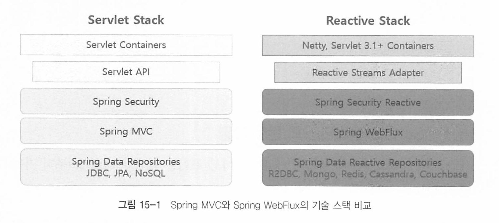
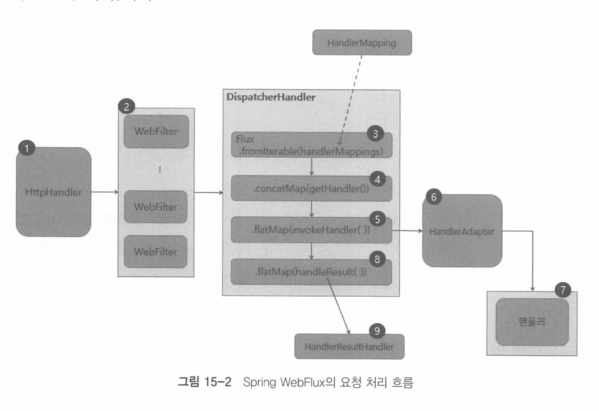
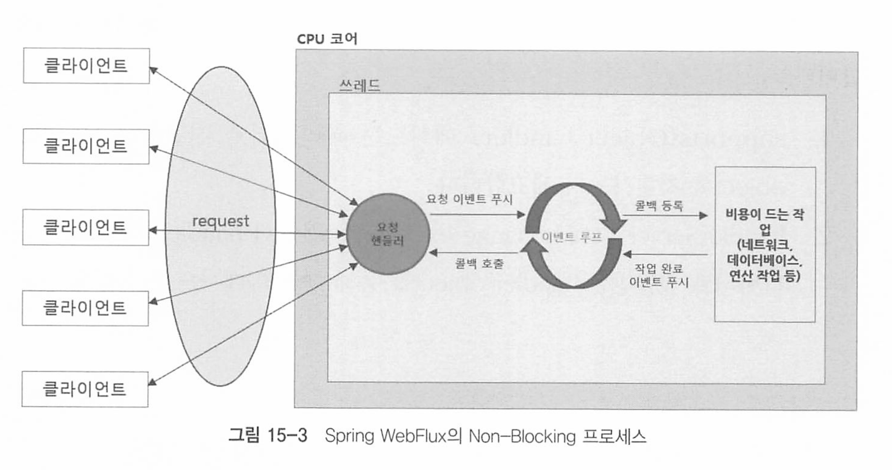

# Chapter 15 Spring WebFlux 개요

SpringWebflux는 기존 Spring MVC 서블릿 기반의 blocking I/O (Thread per request) 방식의 처리량보다 높이기 위해 

적은수의 스레드로 대량의 요청을 처리할 수 있게 만든 비동기 nonblocking 방식의 라이브러리이다.

## Spring WebFlux의 기술 스택



* webflux는 nettry 또는 jetty, undertow같은 서버에서 지원하는 리액티브 스트림즈로 동작한다
* Spring Webflux는 WebFilter를 통해 Security를 지원한다
* Spring Webflux는 R2dbc와 nonblocking nosql 모듈을 사용한다 


## Spring Webflux의 요청 처리 흐름



1. 요청이 들어오면 netty 등의 엔진을 거쳐 HttpHandler가 요청을 전달받는다. HttpHandler는 netty이외에도 다양한 서버 엔진을 사용할 수 있도록 서버 API를 추상화해주는 역할을 한다. 각 서버 엔진마다 ServerHttpRequest, ServerHttpResponse를 포함하는 ServerWebExchange를 생성한 후 WebFilter 체인으로 전달한다.
   * ServerHttpRequest : 클라이언트로부터의 HTTP 요청을 나타내며, 요청 메서드, URL, 헤더, 바디 등과 같은 요청 정보를 제
   * ServerHttpResponse : 서버에서 클라이언트로 보내는 HTTP 응답을 나타내며, 응답 상태, 헤더, 바디 등을 설정
   * ServerWebExchange : 요청과 응답을 모두 포함하는 객체로, 필터 및 핸들러에서 공통적으로 사용하는 컨테이너 역할
2. ServerWebExchange는 WebFilter에서 전처리 과정을 거친 후 WebHandler 인터페이스의 구현체인 DispatcherHandler에게 전달된다.
   * WebFilter : 요청을 처리하기 전에 전처리하거나 응답을 후처리하는 컴포넌트. 체인 형태로 여러 필터를 연결할 수 있다.

3. Spring MVC의 DispatcherServet과 유사한 역할을 하는 DispatcherHandler에서는 HandlerMapping List를 원본 Flux의 소스로 전달받는다 
   * DispatcherHandler : Spring WebFlux의 중앙 요청 처리 컴포넌트로, 요청을 적절한 핸들러로 라우팅하고 처리 결과를 응답으로 반환
   * **주요 기능**:
     - HandlerMapping을 사용하여 요청에 적합한 핸들러 찾기.
     - HandlerAdapter를 통해 핸들러 호출.
     - HandlerResultHandler를 통해 처리 결과를 응답으로 변환.
4. Server WebExchange를 처리할 핸들러를 조회한다.
5. 조회한 핸들러의 호출을 HandlerAdapter에게 위임한다.
   * HandlerAdapter : 다양한 타입의 핸들러를 통합적으로 호출할 수 있게 하는 어댑터
6. HandlerAdapter는 Server WebExchange를 처리할 핸들러를 호출한다.
7. Controller 또는 HandlerFunction 형태의 핸들러에서 요청을 처리한 후, 응답 데이터를 리턴한다
8. 핸들러로부터 리턴받은 응답 데이터를 처리할 HandlerResulthandler를 조회한다.
   * HandlerResultHandler : 핸들러의 처리 결과를 클라이언트에 대한 HTTP 응답으로 변환하는 역할
9. 조회한 HandlerResultHandler가 응답 데이터를 적절하게 처리한 후, response로 리턴한다.

## WebFlux의 핵심 컴포넌트

### HttpHandler

HttpHandler는 다른 유형의 HTTP 서버 APT로 request와 response를 처리하기 위해 추상화된 단 하나의 메서드만 가진다

```java
public interface HttpHandler {

	Mono<Void> handle(ServerHttpRequest request, ServerHttpResponse response);

}
```

HttpHandler의 구현체인 HttpWebHandlerAdatper는, handle() 메서드의 파라미터로 전달받은

ServerlIttpRequest와 ServerHItpResponse로 ServerWebExchange를 생성한 후에 WebHandler를 호출하는 역할을 한다. 

###  WebFilter

WebFilter는 Spring MVC의 서블릿 필터ServetFlier 처럼 핸들러가 요청을 처리하기 전에 전처리 작업을 할 수 있도록 해 준다 

WebFilter는 주로 보안이나 세션 타임아웃 처리 등 애플리케이션에서 공통으로 필요한 전처리에 사용된다.

```java
public interface WebFilter {

	Mono<Void> filter(ServerWebExchange exchange, WebFilterChain chain);

}
```

필터체인을 형성하여 원하는 만큼 필터를 추가할 수 있다.

```java
@Component
public class BookLogFilter implements WebFilter {
    @Override
    public Mono<Void> filter(ServerWebExchange exchange, WebFilterChain chain) {
        String path = exchange.getRequest().getURI().getPath();
 
        return chain.filter(exchange).doAfterTerminate(() -> {
            if (path.contains("books")) {
                System.out.println("path: " + path + ", status: " +
                        exchange.getResponse().getStatusCode());
            }
        });
    }
}
```


인터셉터는 없나? -> 핸들러 인터셉터는 동기방식이다. 

 WebFlux는 비동기 논블로킹 구조를 가지므로 전통적인 서블릿 기반의 `HandlerInterceptor` 대신 WebFilter를 사용하여 처리한다.

### HandlerFilterFunction

HandlerFilterFuncion은 함수형 기반의 요청 핸들러에 적용할 수 있는 Filter이다.

라우터 기능과 결합하여 특정 경로에 대한 필터를 적용할 수 있다.

```java
@FunctionalInterface
public interface HandlerFilterFunction<T extends ServerResponse, R extends ServerResponse> {
	Mono<R> filter(ServerRequest request, HandlerFunction<T> next);
}
```

```java
public class BookRouterFunctionFilter implements HandlerFilterFunction {
    @Override
    public Mono<ServerResponse> filter(ServerRequest request, HandlerFunction next) {
        String path = request.requestPath().value();

        return next.handle(request).doAfterTerminate(() -> {
            System.out.println("path: " + path + ", status: " +
                    request.exchange().getResponse().getStatusCode());
        });
    }
}

```


WebFilter의 구현체는 Spring Bean으로 등록되는 반면, 

HandlerFilterFunction 구현체는 애너테이션 기반의 핸들러가 아닌 함수형 기반의 요청 핸들러에서 함수 형태로 사용되기 때문에 Spring Bean으로 등록되지 않는다.

적용 예

```java
@Configuration
public class BookRouterFunction {
    @Bean
    public RouterFunction routerFunction() {
        return RouterFunctions
                .route(GET("/v1/router/books/{book-id}"),
                        (ServerRequest request) -> this.getBook(request))
                .filter(new BookRouterFunctionFilter()); // 빈 말고 그냥 등록함 
    }
}
```

#### WebFilter와 HandlerFilterFunction의 차이점

webFiter는 애플리케이션 내에 정의된 모든 핸들러에 공통으로 동작합니다. 따라서 애너 테이션 기반의 요청 핸들러와 함수형 기반의 요청 핸들러에서 모두 동작한다. 

반면에 HandlerFilterFunction은 함수형 기반의 핸들러에서만 동작하기 때문에 함수형 기 반의 핸들러에서만 제한적으로 필터링 작업을 수행하고 싶다면 HandlerFiterFunction을 구현해서 사용하면 된다.

### DispatcherHandler

spring mvc의 dispatcherServlet과 비슷하게, 요청이 오면 다른 적절한 컴포넌트로 요청을 위임한다.

### HandlerMapping

Spring MVC와 마찬가지로 request와 handler에 대한 매핑을 정의하는 인터페이스이다.

구현 클래스로는 RequestMappingH landlerMapping, RouterFunctionMapping 등이 있다. 

* RequestMappingHandlerMapping는 어노테이션 기반 매핑
* RouterFunctionMapping는 라우터 함수형 기반 매핑 

### HandlerAdapter

HandlerMapping을 통해 얻은 핸들러를 직접 호출하고 결과인 `Mono<HandlerResult>`를 받는다. 

구현체로 RequestMappingHandlerAdapter, HandlerFunctionAdapter, Simple HandlerAdapter, WebSocketHandlerAdapter가 있다. 


## Spring WebFlux의 Non-blocking 프로세스 구조

적은수의 고정된 스레드 풀과 이벤트 루프를 이용해서 요청을 처리한다. 



1. 클라이언트로부터 들어오는 요청을 요청 핸들러가 전달받습니다.
2. 전달받은 요청을 이벤트 루프에 푸시합니다.
3. 이벤트 루프는 네트워크, 데이터베이스 연결 작업 등 비용이 드는 작업에 대한 콜백을 등록합니다.
4. 작업이 완료되면 완료 이벤트를 이벤트 루프에 푸시합니다.
5. 등록한 콜백을 호출해 처리 결과를 전달합니다.

이벤트 루프는 단일 스레드에서 실행되며, 요청, 네트워크 디비 I/O등 모든 작업이 이벤트로 처리되기 때문에 이벤트 발생 시 해당 이벤트에 대한 콜백을 등록함과 동시에 다음 이벤트 처리로 넘어간다 

##  Spring Webflux의 스레드 모델

일반적으로 이벤트 루프의 스레드는 갯수는 CPU 코어만큼의 스레드를 생성해서 대량의 요청을 처리한다.

```java
@FunctionalInterface
public interface LoopResources extends Disposable {

	/**
	 * Default worker thread count, fallback to available processor
	 * (but with a minimum value of 4).
	 */
	int DEFAULT_IO_WORKER_COUNT = Integer.parseInt(System.getProperty(
			ReactorNetty.IO_WORKER_COUNT,
			"" + Math.max(Runtime.getRuntime().availableProcessors(), 4)));

```

리액터 네티의 LoopResources 인터페이스 코드 일부다.

CPU 코어 수가 4보다 적은경우 최소 4개의 워커 스레드를 생성하고, 4보다 많다면 코어 갯수만큼 스레드를 생성한다.

그러나, CPU 바운드 작업이나 Blocking 되는 지점이 있다면 오히려 스레드가 블락되기때문에 블락되는만큼 요청을 처리할 수 없어 성능이 저하될 수 있다.