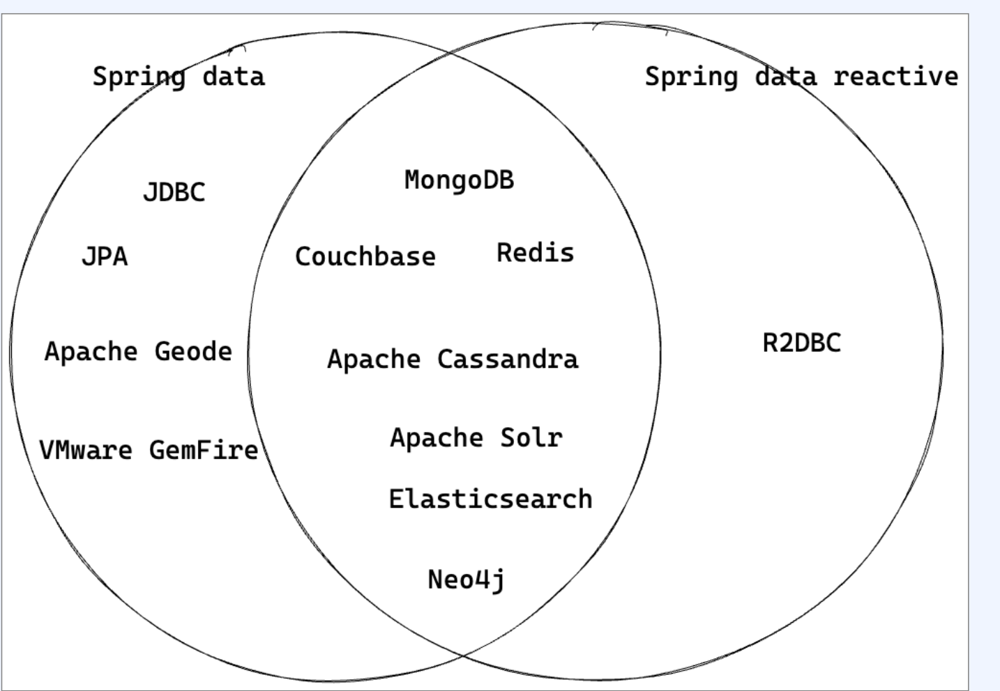
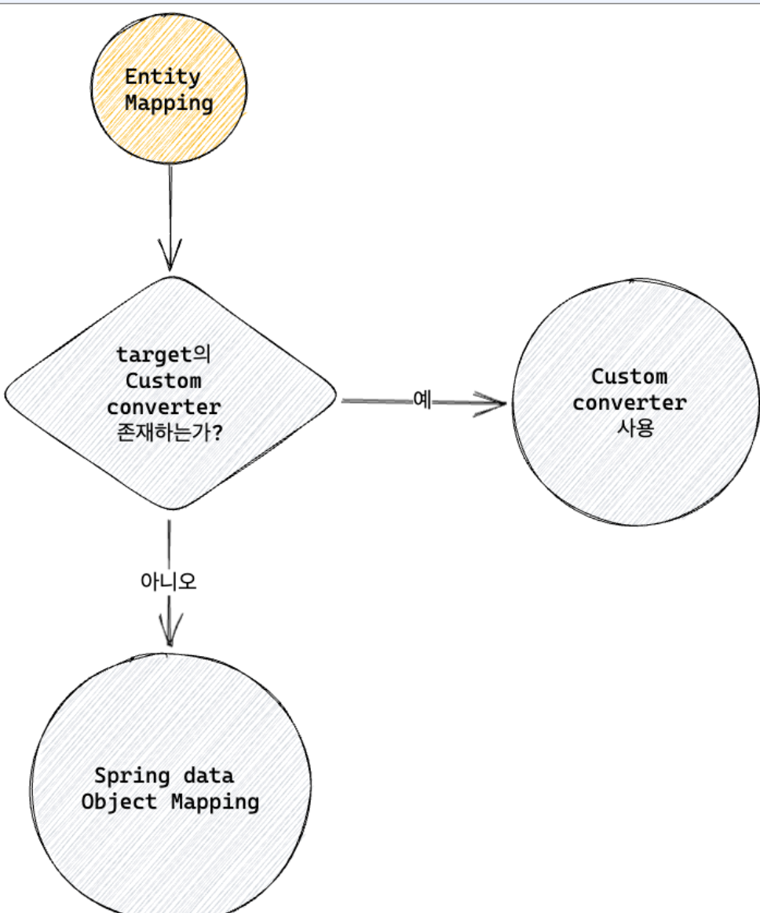
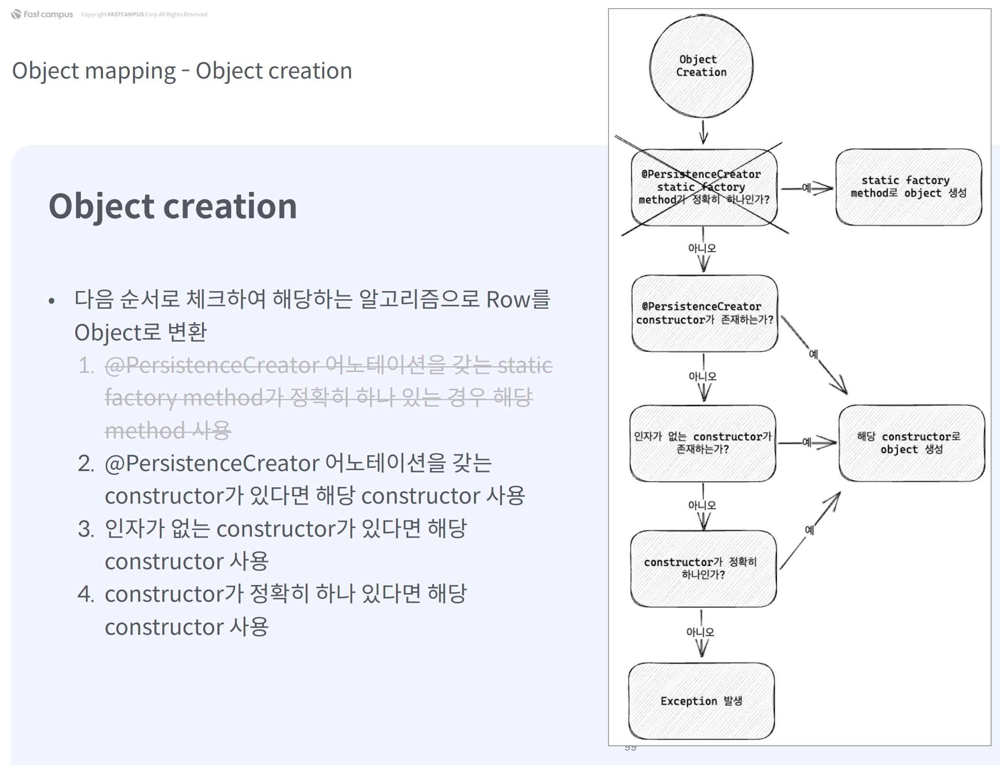

# Chapter 18 Spring Data R2DBC

spring data reactive는 다양한 벤더를 지원한다. 

까보면 내부적으로 Reactive streams, Reactor, Netty client,  Java NlO, Selector를 사용하여 비동기 non-blocking을 지원한다.

r2dbc는 RDB에  리액티브프로그래밍을 지원하는 Spec이면서 클라이언트가 사용하기 위한 SPI이다
* Service Provider Interface (SPI): 소프트웨어에서 특정 서비스나 기능을 구현하기 위해 제공되는 인터페이스

JDBC API 자체가 Blocking API이기 떄문에 완전한  Non Blocking을 지원하는것이 불가능했찌만 R2dbc로 인해 지원하게 되었다.
- JDBC는 동기 blocking I/0 기반으로 설계
- Socket에 대한 연결과 쿼리 실행 모두 동기 blocking 으로 동작
- 이미 널리 사용되고 있기 때문에 JDBC를 수정 하는 것은 사실상 불가능

## Spring Data R2DBC란

Spring Data 프로젝트 일부로써, Spring처럼 추상화가 잘 되어있다.

JPA같은 ORM 특징인 캐싱, 지연로딩 등 ORM은 지원하지 않지만, 단순하고 심플하게 사용할 수 있다.

crudRepository등을 지원하기 때문에 보일러 플레이트 코드도 대량 줄일 수 있다 

- 2017년 Pivotal 사에서 개발이 시작되어 2018년부터 공식 프로젝트로 후원

- 비동기, non-blocking 관계형 데이터베이스 드라이버
- Reactive streams 스펙을 제공하며 Project reactor 기반으로 구현

r2dbc MySQl 같은 경우,
- 이전에는 github.com/mirromutth/r2dbc-mysql 에서 제공
- 2020년 5월부터 업데이트 X
- github.com/asyncer-io/r2dbc-mysq|로 포크 진행
- r2dbc-spi 1.0.0.RELEASE TIE

## Spring Data R2DBC 설정

build.gradle 추가한다

```java
dependencies {
    implementation 'org.springframework.boot:spring-boot-starter-webflux'
    implementation 'org.springframework.boot:spring-boot-starter-data-r2dbc'

    testImplementation 'org.springframework.boot:spring-boot-starter-test'
    testImplementation 'io.projectreactor:reactor-test'
    runtimeOnly 'io.r2dbc:r2dbc-h2'
}

```

### 테이블 스키마 정의

JPA처럼 엔티티에 정의된 매핑정보로 테이블을 자동 생성해주는 기능이 없다. 테이블 스크립트를 직접 작성해서 테이블을 생성해야 한다.

src/main/resources/db/h2 에 schema.sql 파일을 생성하고, yml에 다음과 같이 설정한다

```yaml
spring:
  sql:
    init:
      schema-locations: classpath*:db/h2/schema.sql
      data-locations: classpath*:db/h2/data.sql
logging:
  level:
    org:
      springframework:
        r2dbc: DEBUG
```

### R2DBCRepository와 Auditing 기능 활성화

어노테이션을 이용해서 먼저 활성화 해야한다

* EnableR2dbcRepositories, EnableR2dbcAuditing

```java
@EnableR2dbcRepositories
@EnableR2dbcAuditing
@SpringBootApplication
public class Chapter18Application {

    public static void main(String[] args) {
        SpringApplication.run(Chapter18Application.class, args);
    }

}

```

* 이런 부분은, 테스트 용이성과 설정 관리 용이성으로 인해 사실은 Config 클래스를 따로 만들어주는것이 좋다.

### 도메인 엔티티 클래스 매핑

```java
import org.springframework.data.annotation.CreatedDate;
import org.springframework.data.annotation.Id;
import org.springframework.data.annotation.LastModifiedDate;
import org.springframework.data.relational.core.mapping.Column;

@Getter
@AllArgsConstructor
@NoArgsConstructor
@Setter
public class Book {
    @Id
    private long bookId;
    private String titleKorean;
    private String titleEnglish;
    private String description;
    private String author;
    private String isbn;
    private String publishDate;

    @CreatedDate
    private LocalDateTime createdAt;

    @LastModifiedDate
    @Column("last_modified_at")
    private LocalDateTime modifiedAt;
}

```

* 식별자를 위해 @Id 어노테이션을 추가 

* @Table 어노테이션을 생략하면, 클래스 이름을 테이블 이름으로 사용한다
* audit을 위해 @CreatedDate와 @LastModifedDate를 사용한다. 


### R2DBC Repository를 이용한 액세스

```java
@Repository("bookRepositoryV5")
public interface BookRepository extends ReactiveCrudRepository<Book, Long> {
    Mono<Book> findByIsbn(String isbn);
}
```

* 기본적으로 쿼리 메서드를 지원한다. 
* 리턴타입은 리액티브 타입인  Mono, Flux다

crud는 다음처럼 사용하면 된다

```java
@Service("bookServiceV5")
@RequiredArgsConstructor
public class BookService {
    private final @NonNull BookRepository bookRepository;
    private final @NonNull CustomBeanUtils<Book> beanUtils;

    public Mono<Book> saveBook(Book book) {
        return verifyExistIsbn(book.getIsbn())
                .then(bookRepository.save(book));
    }

    public Mono<Book> updateBook(Book book) {
        return findVerifiedBook(book.getBookId())
                .map(findBook -> beanUtils.copyNonNullProperties(book, findBook))
                .flatMap(updatingBook -> bookRepository.save(updatingBook));
    }

    public Mono<Book> findBook(long bookId) {
        return findVerifiedBook(bookId);
    }

    public Mono<List<Book>> findBooks() {
        return bookRepository.findAll().collectList();
    }

    private Mono<Void> verifyExistIsbn(String isbn) {
        return bookRepository.findByIsbn(isbn)
                .flatMap(findBook -> {
                    if (findBook != null) {
                        return Mono.error(new BusinessLogicException(
                                                    ExceptionCode.BOOK_EXISTS));
                    }
                    return Mono.empty();
                });
    }

    private Mono<Book> findVerifiedBook(long bookId) {
        return bookRepository
                .findById(bookId)
                .switchIfEmpty(Mono.error(new BusinessLogicException(
                                                    ExceptionCode.BOOK_NOT_FOUND)));
    }
    
}
```

## R2dbcEntityTemplete 을 이용한 데이터 액세스

R2DBCRepository외에도 접근할 수 있는 방법이 있다.

템플릿/콜백 패턴이 적용된 JdbcTemplate처럼 R2dbcEntityTemplete을 사용할 수 있다.

```java
public class R2dbcEntityTemplate implements R2dbcEntityOperations, BeanFactoryAware, ApplicationContextAware {

	private final DatabaseClient databaseClient;

	private final ReactiveDataAccessStrategy dataAccessStrategy;

	private final R2dbcConverter converter;

	private final MappingContext<? extends RelationalPersistentEntity<?>, ? extends RelationalPersistentProperty> mappingContext;

	private final SpelAwareProxyProjectionFactory projectionFactory;

	private @Nullable ReactiveEntityCallbacks entityCallbacks;

  ...
}
```

```java
@Slf4j
@Service("bookServiceV6")
@RequiredArgsConstructor
public class BookService {
    private final @NonNull R2dbcEntityTemplate template;
    private final @NonNull CustomBeanUtils<Book> beanUtils;

    public Mono<Book> saveBook(Book book) {
        return verifyExistIsbn(book.getIsbn())
                .then(template.insert(book));
    }

    public Mono<Book> updateBook(Book book) {
        return findVerifiedBook(book.getBookId())
                .map(findBook -> beanUtils.copyNonNullProperties(book, findBook))
                .flatMap(updatingBook -> template.update(updatingBook));
    }

    public Mono<Book> findBook(long bookId) {
        return findVerifiedBook(bookId);
    }

    public Mono<List<Book>> findBooks() {
        return template.select(Book.class).all().collectList();
    }

 // ----------------------------
    private Mono<Void> verifyExistIsbn(String isbn) {
        return template.selectOne(query(where("ISBN").is(isbn)), Book.class)
                .flatMap(findBook -> {
                    if (findBook != null) {
                        return Mono.error(new BusinessLogicException(
                                ExceptionCode.BOOK_EXISTS));
                    }
                    return Mono.empty();
                });
    }

    private Mono<Book> findVerifiedBook(long bookId) {
        return template.selectOne(query(where("BOOK_ID").is(bookId))
                                                                        , Book.class)
                .switchIfEmpty(Mono.error(new BusinessLogicException(
                                                ExceptionCode.BOOK_NOT_FOUND)));
    }
}
```

* selectOne 메소드는 1건의 데이터를 조회하는데 사용되며, Query 객체(Criteria 포함)와 엔티티 클래스의 Class 객체를 파라미터로 가진다. 
  * where() 메서드는  WHERE절을 표현하는 Creteria 객체이다
  * is() 메서드는 쿼리문에서 equal을 표현한다 
* select(Book.class).all()은 모든 정보를 반환한다.

### Terminating method

select()와 함께 사용할 수 있는 메소드들이다.

| 메서드   | 설명                                                         |
| -------- | ------------------------------------------------------------ |
| first()  | 조건에 일치하는 result row 중에서 첫 번째 row를 얻고자 할 경우 사용할 수 있습니다. 조건에 일치하는 row가 없다면 `Mono<Void>`를 리턴합니다. |
| one()    | 조건에 일치하는 result row가 단 하나일 경우 사용할 수 있습니다. 조건에 일치하는 row가 없다면 `Mono<Void>`를 리턴하며, result row가 한 건보다 많을 경우 예외가 발생합니다. |
| all()    | 조건에 일치하는 모든 result row를 얻고자 할 경우 사용할 수 있습니다. |
| count()  | 조건에 일치하는 데이터의 건수만 조회할 경우 사용할 수 있습니다. 리턴 타입은 `Mono<Long>`입니다. |
| exists() | 조건에 일치하는 result row가 존재하는지 여부를 확인하고자 할 경우 사용할 수 있습니다. 리턴 타입은 `Mono<Boolean>`입니다. |

### Creteria method

SQL 연산자에 해당하는 다양한 Creteria method를 지원한다

| 메서드                                                  | 설명                                                         |
| ------------------------------------------------------- | ------------------------------------------------------------ |
| and(String column)                                      | SQL 쿼리문에서 'AND' 연산자에 해당하며, 파라미터로 주어지는 컬럼명에 해당하는 Criteria를 추가한 새로운 Criteria를 리턴합니다. |
| or(String column)                                       | SQL 쿼리문에서 'OR' 연산자에 해당하며, 파라미터로 주어지는 컬럼명에 해당하는 Criteria를 추가한 새로운 Criteria를 리턴합니다. |
| greaterThan(Object o)                                   | SQL 쿼리문에서 '>' 연산자에 해당하며, 'greater-than' Criteria를 추가한 새로운 Criteria를 리턴합니다. |
| greaterThanOrEquals(Object o)                           | SQL 쿼리문에서 '>=' 연산자에 해당하며, 'greater-than or equal to' Criteria를 추가한 새로운 Criteria를 리턴합니다. |
| in(Object... o) 또는 in(Collection<?> collection)       | SQL 쿼리문에서 'IN' 연산자에 해당하는 Criteria를 추가한 새로운 Criteria를 리턴합니다. |
| is(Object o)                                            | SQL 쿼리문에서 '=' 연산자에 해당하는 Criteria를 추가한 새로운 Criteria를 리턴합니다. |
| isNull()                                                | SQL 쿼리문에서 'IS NULL' 연산자에 해당하는 Criteria를 추가한 새로운 Criteria를 리턴합니다. |
| isNotNull()                                             | SQL 쿼리문에서 'IS NOT NULL' 연산자에 해당하는 Criteria를 추가한 새로운 Criteria를 리턴합니다. |
| lessThan(Object o)                                      | SQL 쿼리문에서 '<' 연산자에 해당하며, 'less-than' Criteria를 추가한 새로운 Criteria를 리턴합니다. |
| lessThanOrEquals(Object o)                              | SQL 쿼리문에서 '<=' 연산자에 해당하며, 'less-than or equal to' Criteria를 추가한 새로운 Criteria를 리턴합니다. |
| like(Object o)                                          | SQL 쿼리문에서 'LIKE' 연산자에 해당하는 Criteria를 추가한 새로운 Criteria를 리턴합니다. |
| not(Object o)                                           | SQL 쿼리문에서 'NOT' 연산자에 해당하는 Criteria를 추가한 새로운 Criteria를 리턴합니다. |
| notIn(Object... o) 또는 notIn(Collection<?> collection) | SQL 쿼리문에서 'NOT IN' 연산자에 해당하는 Criteria를 추가한 새로운 Criteria를 리턴합니다. |

## R2dbcConverter


`Converter`는 데이터베이스와 애플리케이션 간의 데이터 변환을 담당하는 구성 요소. 주로 데이터베이스에서 읽어온 데이터를 애플리케이션의 도메인 객체로 변환하거나, 애플리케이션에서 사용하는 도메인 객체를 데이터베이스에 저장하기 위해 변환하는 역할을 한다.

* EntityReader와 EntityWriter를 상속

* 구현체로 MappingR2dbcConverter



- 다양한 전략을 통해서 Object를 데이터베이스 의 rOW로, 데이터베이스의 row를 Object로 변환
    - custom converter로 mapping
    - Spring data의 object mapping
    - convention 기반의 mapping
    - metadata 기반의 mapping

어떻게?

- 우선 Configuration을 통해서 converter들을  등록
- Target 클래스를 지원하는 converter를 탐색
- 이를 위해서 두 개의 Converter가 필요
- row를 Target 클래스로 변환하는 Converter
- Target 클래스를 OutboundRow로 변환하는 Converter

Read, Writer 컨버터가 필요하다 

```java
@ReadingConverter
public class PersonReadConverter implements Converter<Row, Person> {
    
    @Override
    public Person convert(Row source) {
        // Row 객체에서 데이터를 읽어와 Person 객체로 변환합니다.
        Long id = source.get("id", Long.class);
        String name = source.get("name", String.class);
        Integer age = source.get("age", Integer.class);
        String gender = source.get("gender", String.class);
        return new Person(id, name, age, gender);
    }
}
```

- Row를 source로 Entity를 target으로 하는 converter
- ROW로부터 name 혹은 index로 column에 접근할 수 있고, 변환하고자 하는 type을 Class 로 전달

```java
@WritingConverter
public class PersonWriteConverter implements Converter<Person, OutboundRow> {
    
    @Override
    public OutboundRow convert(Person source) {
        // Person 객체의 데이터를 OutboundRow 객체로 변환합니다.
        OutboundRow row = new OutboundRow();
        row.put("id", Parameter.from(source.getId()));
        row.put("name", Parameter.from(source.getName()));
        row.put("age", Parameter.from(source.getAge()));
        row.put("gender", Parameter.from(source.getGender()));
        return row;
    }
}
```

- Entity를 source로 RoW를 target으로 하는  converter
- OutboundRow에 값을 추가
- key에는 column의 이름, value에는 Parameter.from을 이용해서 entity의 속성 을 전달
    DefaultDatabaseClient에서   OutboundRow를 이용해서 SQL 생성

등록은 어떻게 할까?

```java
@Configuration
public class R2dbcConfig extends AbstractR2dbcConfiguration {

    /**
     * 커스텀 컨버터를 제공하는 메서드입니다.
     * 
     * @return 커스텀 컨버터들의 리스트를 반환합니다.
     */
    @Override
    protected List<Object> getCustomConverters() {
        return List.of(
            new PersonReadConverter(), 
            new PersonWriteConverter()
        );
    }
}
```

# ObjectMapping

만약 지원하는 converter가 없다면  MappingR2dbcConverter는 다음 과정을 거 쳐서 Row를 entity로 변환

1. Object creation: constructor, factory method 등을 이용해서 RoW의 column 들로 Object 생성
2. Property population: direct set,  setter, with..메소드 등을 이용해서 ROW 의 column을 Object에 주입

## 객체 생성 - Object createion 순서



## 객체 생성 - PersistenceCreator constructor 어노테이션

@PersistenceCreator을 갖는 constructor가 존재 한다면 해당 constructor를 사용

- 여러 개가 존재한다면 가장 마지막 PersistenceCreator가 붙은 constructor를 사용
- 하지만 혼동을 피하기 위해서 가능한  PersistenceCreator constructor는 하나만
- NoArgsConstructor,AllArgsConstructor 전부 패스

```java
public class Person {

    private final Long id;
    private final String name;
    private final Integer age;
    private final String gender;

    // PersistenceCreator 어노테이션을 사용하여 생성자를 지정합니다.
    @PersistenceCreator
    public Person(Long id, String name, Integer age, String gender) {
        this.id = id;
        this.name = name;
        this.age = age;
        this.gender = gender;
    }
}
```

## 객체 생성 - NoArgsconstructor

- No-args constructor가 존재한다면 해당  constructor를 사용
- 다른 constructor 전부 패스


## 객체 생성 - 하나의 constructor

 오직 하나의 constructor가 존재한다면 해당 constructor를 사용

## 객체 생성 - 두 개 이상의 constructor가 있다면?

만약 @PersistenceCreator를 갖는 constructor도 No-args constructor도 없다면? exception 발생

## 객체 생성 - Property population 

 공식 문서에서는 with 메소드를 사용하는 법, setter를 사용하는 법을 언급하고 있지만.. 

* r2dbc에서는 property가 mutable할때만 property population 적용 
* Object creation '하나의 constructor' 조건에 따라 서 id와 name에만 값을 추가 
* property를 순회하며 mutable한 경우에만 reflection을 사용해서 값 주입 
* property가 immutable인 경우, 현재는 방법이 없다

## Object mapping 최적화

- 객체를 가능한한 Immutable하게
- 모든 property를 인자로 갖는 All-args 제공
- property population이 발생하지 않고, constructor만 호출하기 때문에 30% 정 도 성능이 좋다
- 코드 중복을 방지하기 위해서 lombok을 사용하기


# Metadata Mapping - 어노테이션 엔티티 매핑

```java
import org.springframework.data.annotation.Id;
import org.springframework.data.annotation.Transient;
import org.springframework.data.annotation.Version;
import org.springframework.data.annotation.PersistenceConstructor;
import org.springframework.data.relational.core.mapping.Table;
import org.springframework.data.relational.core.mapping.Column;

@Table("person") // 테이블 이름을 "person"으로 설정
public class Person {

    @Id
    private Long id; // primary key

    @Column("name")
    private String name; // 컬럼 이름을 "name"으로 설정

    @Column("age")
    private Integer age; // 컬럼 이름을 "age"로 설정

    @Column("gender")
    private String gender; // 컬럼 이름을 "gender"로 설정

    @Version
    private Long version; // 낙관적 잠금을 위한 버전 필드

    @Transient
    private String temporaryField; // 매핑에서 제외되는 필드

    // @PersistenceConstructor: 객체 생성 시 사용되는 생성자
    @PersistenceConstructor
    public Person(Long id, String name, Integer age, String gender, Long version) {
        this.id = id;
        this.name = name;
        this.age = age;
        this.gender = gender;
        this.version = version;
    }

    // 기본 생성자
    public Person() {
    }

}

```

- Entity 클래스에 어노테이션을 추가하여 데이터베이스와 관련된 설정들을 주입
- @ld: primary key에 해당하는 필드에 적용
- @Table: entity class에 적용. Table 이름을 변경 가능
- @Transient: 기본적으로 모든 필드는 mapping 대상. @Transient가 붙은 필드는 mapping 에서 제외.
- @Column: entity의 property 필드에 적용. Column이 붙은 필드에 대해서는 convention 기반 대신 Column에 주어진 name으로 적용
- @Version: 낙관적 잠금 (Optimistic Lock)에 이용. entity가 update 될 때마다 자동으로 update
- @PersistenceConstructor: 특정 constructor에 대해서 Obiect creation 할 때 사용하게끔
    지정. constructor의 argument 이름에 따라서 mapping

## Spring Data R2DBC의 페이지네이션 처리

### Repository의 페이지네이션

JPA 등에서 사용하던 Pageable 객체를 그대로 사용한다

```java
@Repository("bookRepositoryV7")
public interface BookRepository extends ReactiveCrudRepository<Book, Long> {
    Mono<Book> findByIsbn(String isbn);
    Flux<Book> findAllBy(Pageable pageable);
}
```

```java
public Mono<List<Book>> findBooks(@Positive int page,
                                  @Positive int size) {
    return bookRepository
            .findAllBy(PageRequest.of(page - 1, size,
                                                Sort.by("memberId").descending()))
            .collectList();
}
```

page나 slice를 구현하고 싶으면 다음처럼 오퍼레이터를 이용한다

```java
@Service
public class BookService {
    private final BookRepository bookRepository;

    public Mono<Page<Book>> findBooks(int page, int size) {
        Pageable pageable = PageRequest.of(page - 1, size, Sort.by("memberId").descending());

        return bookRepository.findAllBy(pageable)
                .collectList()
                .zipWith(bookRepository.count())
                .map(tuple -> new PageImpl<>(tuple.getT1(), pageable, tuple.getT2()));
    }

  public Mono<Slice<Book>> findBooks(int page, int size) {
    Pageable pageable = PageRequest.of(page - 1, size, Sort.by("memberId").descending());

    return bookRepository.findAllBy(pageable)
            .collectList()
            .map(list -> new SliceImpl<>(list, pageable, list.size() == size));
	}
  
}
```

### R2dbcEntityTemplete에서의 페이지네이션 처리

RadbcEntityTemplate은 limit(), offset(), sort() 등의 쿼리 빌드 메서드를 조 합하면 페이지네이션 처리를 간단히 적용할 수 있다.

```java
@Slf4j
@Validated
@Service("bookServiceV8")
@RequiredArgsConstructor
public class BookService {
    private final @NonNull R2dbcEntityTemplate template;
    private final @NonNull CustomBeanUtils<Book> beanUtils;

    public Mono<List<Book>> findBooks(@Positive long page, @Positive long size) {

        return template
                .select(Book.class)
                .count()
                .flatMap(total -> {
                    Tuple2<Long, Long> skipAndTake = getSkipAndTake(total, page, size);
                    return template
                            .select(Book.class)
                            .all()
                            .skip(skipAndTake.getT1())
                            .take(skipAndTake.getT2())
                            .collectSortedList((Book b1, Book b2) ->
                                    (int) (b2.getBookId() - b1.getBookId()));
                });
    }


    private Tuple2<Long, Long> getSkipAndTake(long total, long movePage, long size) {
        long totalPages = (long) Math.ceil((double) total / size);
        long page = movePage > totalPages ? totalPages : movePage;
        long skip = total - (page * size) < 0 ? 0 : total - (page * size);
        long take = total - (page * size) < 0 ? total - ((page - 1) * size) : size;

        return Tuples.of(skip, take);
    }
}

```

* count() Operator로 저장된 도서의 총 개수를 구한 뒤에, flatMap() Operator 내부에서 페이지네이션 처리를 수행

* skip() Operator는 findBooks()의 파라미터로 전달받은 페이지의 시작 지점 으로 이동하기 위해 페이지 수만큼 emit된 데이터를 건너뛰는 역할을 수행

* take() Operator는 findBooks()의 파라미터로 전달받은 페이지의 데이터 개수(size)만큼 데이터를 가져오는 역할을 수행

* getSkipAndTakeltotal, page, Size) 메서드는 데이터의 총 개수로 전체 페이지 수 를 구하고, 이동할 페이지의 데이터 시작 지점 전까지 건너뛸 데이터 개수와 가 져올 데이터 개수를 계산한다.

> 너무 복잡하다.. 

아래처럼 더 간단하게 할 수도 있다.

```java
@Slf4j
@Validated
@Service("bookServiceV8")
@RequiredArgsConstructor
public class BookService {
    private final @NonNull R2dbcEntityTemplate template;

    public Mono<Page<Book>> findBooks(@Positive int page, @Positive int size) {
        Pageable pageable = PageRequest.of(page - 1, size);

        return template.select(Book.class)
                .matching(Query.empty().with(pageable))
                .all()
                .collectList()
                .zipWith(template.select(Book.class).matching(Query.empty()).count())
                .map(tuple -> new PageImpl<>(tuple.getT1(), pageable, tuple.getT2()));
    }
}
```

## insert와 업데이트 구분방법


new entity 확인 전략

* @Id에 해당하는 필드를 확인. 만약 @Id 필드가 null이거나 0이라면 새로운 entity로 간주

## R2dbcRepository의 한계

- R2dbcRepository는 기본적으로 CRUD를 수행할 수 있는 메소드를 제공
- 모두 혹은 id 기반으로 CRUD를 제공
- 특정 필드로 탐색을 하거나 상위 n개만 조회 등의 기능은 제공되지 않는다
- join이나 집계와 관련된 함수들은 제공되지 않는다


## r2dbcRepository 쿼리 메소드 (query method

- R2dbCRepository를 상속한
    repository interface에 메소드를 추가
- 메소드의 이름을 기반으로 Query 생성
- 조회, 삭제 지원
- @Query 어노테이션을 사용해서 복잡 한 쿼리나 update 문도 실행 가능

### delete

- 다른 필드를 이용해서 삭제 가능
- 여러 반환 타입 지원
- Integer: 영향을 받은 rOW 수 반환
- Boolean: 삭제되었는지 여부 반환
- Void: 반환값보다는 completion이 중요한 경우


# Transaction

- @Transactional를 사용하여 여러 query를 묶어서 진행
- 새로운 Entity를 만들어서 save하고 update한후
- findAll을 통해서 모든 roW 반환

## TransactionalOperator (1)

* transactional 메소드를 통해서 주어진 Flux 혹은 Mono를 transaction 안에서 실행

```java
public interface TransactionalOperator {

    /**
     * 주어진 Flux를 트랜잭션 내에서 실행합니다.
     * 
     * @param flux 트랜잭션 내에서 실행할 Flux
     * @return 트랜잭션이 적용된 Flux
     */
    default <T> Flux<T> transactional(Flux<T> flux) {
        return execute(it -> flux);
    }

    /**
     * 주어진 Mono를 트랜잭션 내에서 실행합니다.
     * 
     * @param mono 트랜잭션 내에서 실행할 Mono
     * @return 트랜잭션이 적용된 Mono
     */
    <T> Mono<T> transactional(Mono<T> mono);

    /**
     * 주어진 트랜잭션 콜백을 실행합니다.
     * 
     * @param action 실행할 트랜잭션 콜백
     * @return 실행된 트랜잭션 콜백의 결과를 포함하는 Flux
     * @throws TransactionException 트랜잭션 실행 중 발생할 수 있는 예외
     */
    <T> Flux<T> execute(TransactionCallback<T> action) throws TransactionException;
}

```

사용 예시

```java
public Flux<PersonEntity> savePerson2() {
    // 새로운 PersonEntity 객체 생성
    var person = new PersonEntity(null, "peter", 50, "M");
    
    // PersonEntity 객체를 저장하고 업데이트한 후 모든 PersonEntity 객체를 조회하는 작업 정의
    var jobs = personRepository.save(person)
        .flatMap(savedPerson -> {
            var personToUpdate = savedPerson.withAge(30);
            return personRepository.save(personToUpdate);
        })
        .thenMany(personRepository.findAll());

    // 트랜잭션을 적용하여 작업 실행
    return transactionalOperator.transactional(jobs);
}

public Flux<PersonEntity> savePerson3() {
    // 새로운 PersonEntity 객체 생성
    var person = new PersonEntity(null, "peter", 50, "M");
    
    // PersonEntity 객체를 저장하고 업데이트한 후 모든 PersonEntity 객체를 조회하는 작업 정의
    var jobs = personRepository.save(person)
        .flatMap(savedPerson -> {
            var personToUpdate = savedPerson.withAge(30);
            return personRepository.save(personToUpdate);
        })
        .thenMany(personRepository.findAll());

    // 트랜잭션을 적용하여 작업 실행
    return transactionalOperator.execute(status -> jobs);
}
```

- flux를 바로 반환하지 않고 transactionalOperator의   transactional로 wrapping 하여 전달
- 혹은 execute를 통해서  Transaction Callback 형태로 실행